Working known devices / digitizers

| OS                                        | Device                    | Pen                    | Notes                                                                                                                                                      |
|-------------------------------------------|---------------------------|------------------------|------------------------------------------------------------------------------------------------------------------------------------------------------------|
| iOS                                       | iPad Pro 10.5 (2017)      | Apple Pencil (1st gen) | __Works!__                                                                                                                                                     |
| Android                                   | Samsung Note 10           | S Pen                  | __Works!__  
| Windows 11                                | ThinkVision M14t (Gen 1)  | Pen                    | __Works!__  
| macOS and SideCar                         | iPad Pro 10.5 (2017)      | Apple Pencil (1st gen) | Pressure sensitivity supported. Apple Pencil isn't detected as a stylus in Qt, but works with `PointerDevice.Unknown`. [QTBUG-80072](https://bugreports.qt.io/browse/QTBUG-80072) |
| __Setups that DON'T work__
| Android < 9.0                             | Samsung Note 4            | S Pen                  | Uses Android 6.0, which is too old and unsupported by Qt 6.8.3 (needs android >= 9)                                                                |
| macOS                                     | ThinkVision M14t (Gen 1)  | Pen                    | Fails. – Pen tracks, but pen tip doesn’t draw. Problem exists across all applications.                                                              |
| Windows 11 (ARM) via Parallels on macOs   | ThinkVision M14t (Gen 1)  | Pen                    | Fails. – Pen tracks, but pen tip doesn’t draw. Problem exists across all applications.                                                              |

# Building CaveWhere Sketch in QtCreator 

## Conan Package Manager Installation

Conan >2.0 is required for managing packages and dependencies. If you have Conan installed, skip this step. 

```bash
pip install conan
pip ensurepath
```

Restart your terminal or you'll get:

```bash
bash: conan: command not found
```

## Building CaveWhere in QtCreator

1. **Clone the Repository and Prepare the Environment**

   Clone the CaveWhere repository and checkout the correct branch (assuming `master` in this case). Initialize and update the submodules:

```bash
git clone git@github.com:Cavewhere/cavewhere-sketch.git
cd cavewhere
git submodule update --init --recursive
```

2. **Download and install Qt >6.8.0**

    You'll have to make a Qt account, but it's free for open-source projects like CaveWhere Sketch
https://www.qt.io/download-qt-installer-oss 

    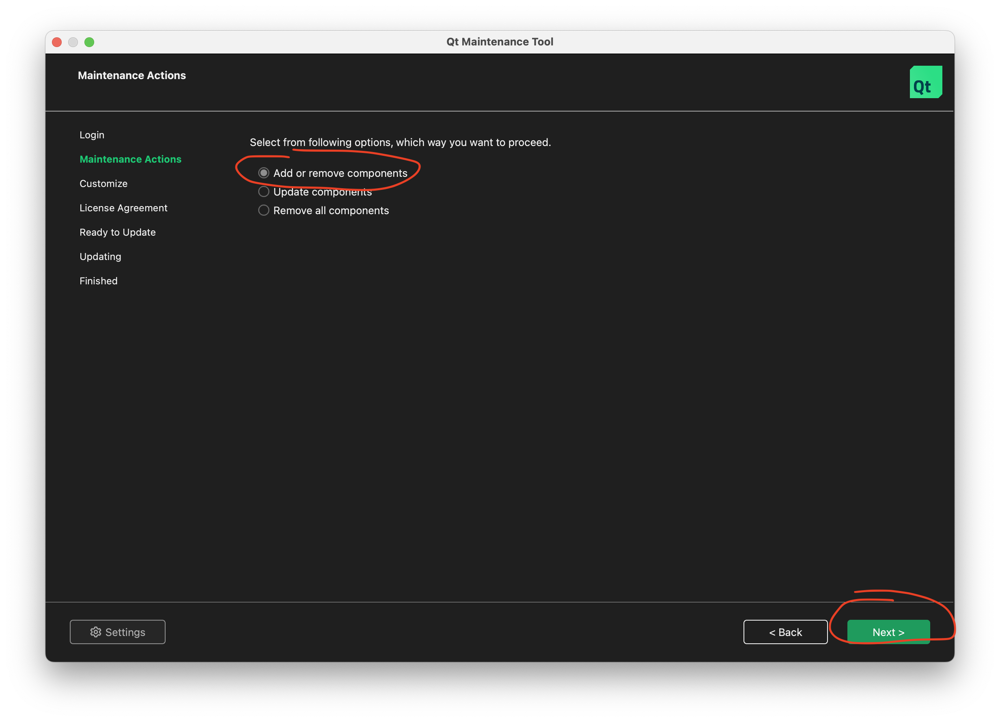

    Make sure you install for the platform you want to build for: Desktop, iOS, Android. Also install QtCreator through the installer:

    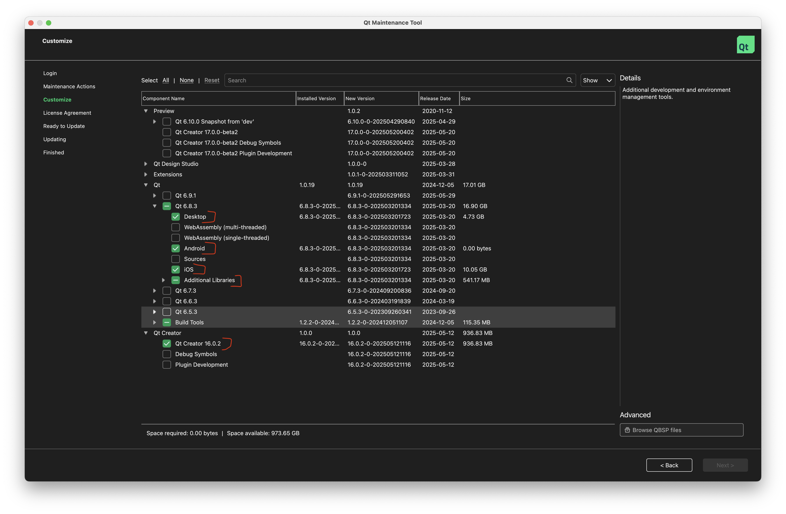

    CaveWhere Sketch uses some additional Qt libraries
    - Qt Image Formats
    - Qt Shader Tools
    
    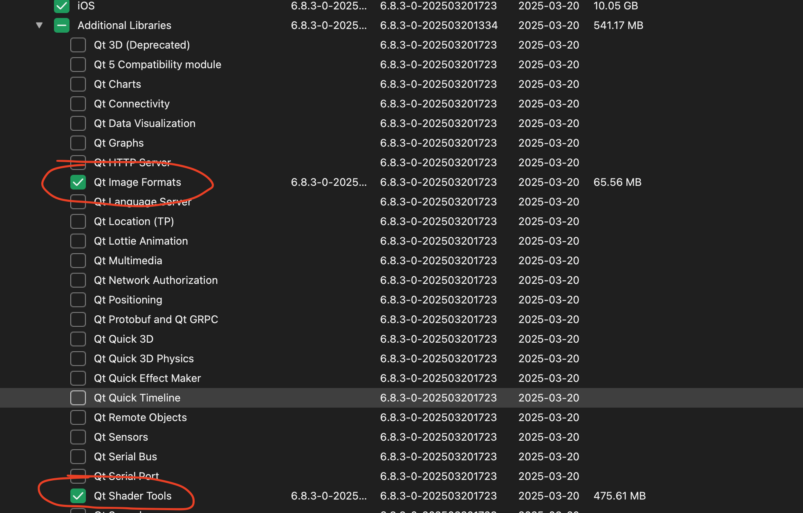
    

3. **Open CaveWhere Sketch project in QtCreator**

    File -> Open File or Project -> CMakeLists.txt
    
    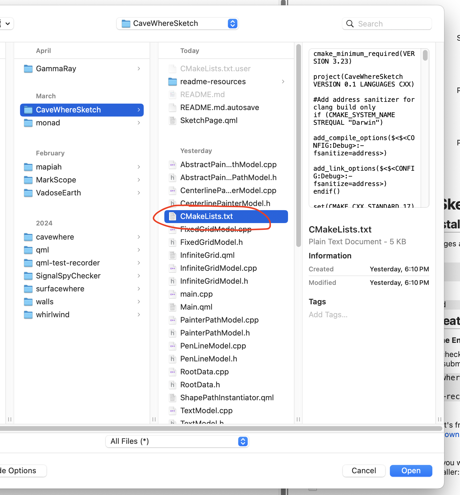
    
4. **Configuring**

    Depending on the platform, CaveWhere Sketch will likely not configure correctly when opening the CMakeLists.txt. You can get to the configuration page clicking on Project. You can select which platform you want to configure using the lower project context button. 
    
    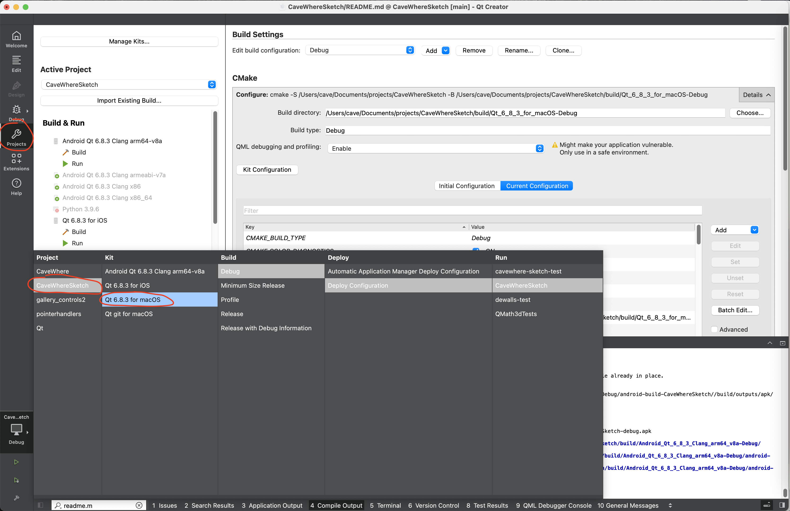
    
5. **Configuring for Desktop - MacOS build and MacOS run (host)**

    To make conan run correctly, the following build enviroment should be setup:
    
    ```    
        SDKROOT=/Library/Developer/CommandLineTools/SDKs/MacOSX.sdk
        PATH=/usr/bin:/bin:/usr/sbin:/sbin:/Users/cave/Qtcom/Tools/Ninja:/Users/cave/Library/Python/3.9/bin
    ```  
    
    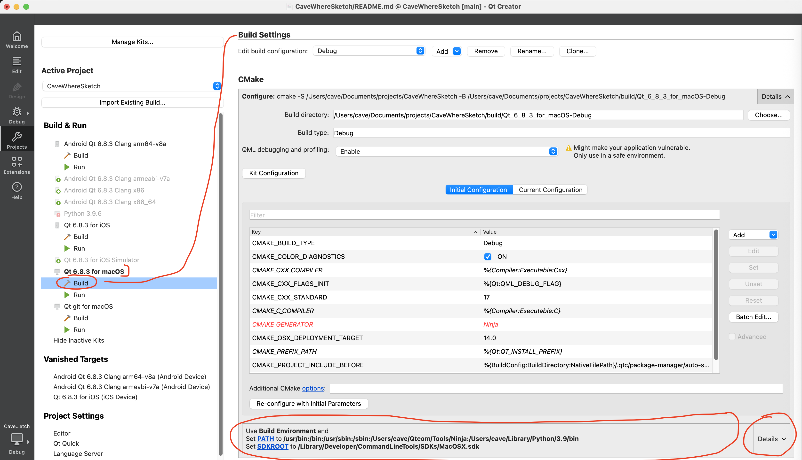
    
    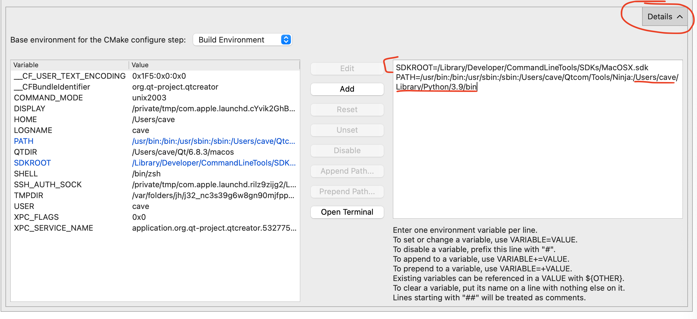
    
    *Note
    It's important that ```/Users/cave/Library/Python/3.9/bin``` is in the PATH because this allows QtCreator to find ```conan```*
    
    CaveWhere Sketch also needs the following cmake variables for initial configuration
    
    ```
        CMAKE_CXX_STANDARD:STRING=17
        CMAKE_OSX_DEPLOYMENT_TARGET:STRING=14.0
    ```
    
    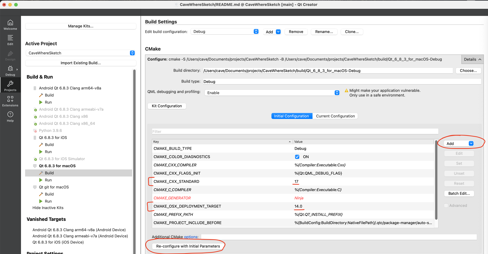
    
6. **Configuring for Android - MacOS build and Android run (host)**

    You need to install java and android's ndk on your system. Documentation on this here:
    https://doc.qt.io/qt-6/android-getting-started.html
    

    To make conan run correctly, the following build enviroment should be setup:
    
    ```    
        SDKROOT=/Library/Developer/CommandLineTools/SDKs/MacOSX.sdk
        PATH=/usr/bin:/bin:/usr/sbin:/sbin:/Users/cave/Qtcom/Tools/Ninja:/Users/cave/Library/Python/3.9/bin
    ```  
    
    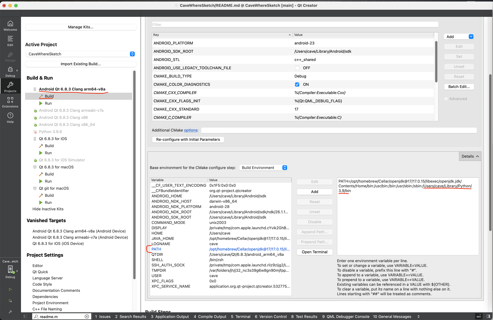
    
    *Note
    It's important that ```/Users/cave/Library/Python/3.9/bin``` is in the PATH because this allows QtCreator to find ```conan```*
    
    CaveWhere Sketch also needs the following cmake variables for initial configuration.
    
    ```
        CMAKE_CXX_STANDARD:STRING=17
        CMAKE_PROJECT_INCLUDE_BEFORE:FILEPATH=YOUR_PATH_TO/CaveWhereSketch/conan/auto-setup-cross.cmake
    ```
    
    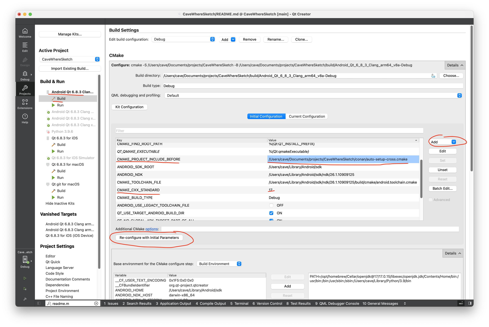
    
    You'll have to hit **Re-configure** once you finished making changes
    
7. **Configuring for iOS - MacOS build and iOS run (host)**

    Qt iOS documentation on this here:
    https://doc.qt.io/qt-6/ios.html
    
    
    To make conan run correctly, the following build enviroment should be setup:
    
    ```    
        PATH=/usr/bin:/bin:/usr/sbin:/sbin:/Users/cave/Qtcom/Tools/Ninja:/Users/cave/Library/Python/3.9/bin
    ```  

    

    
    
    *Note
    It's important that ```/Users/cave/Library/Python/3.9/bin``` is in the PATH because this allows QtCreator to find ```conan```*
    
    CaveWhere Sketch also needs the following cmake variables for initial configuration.
    
    ```
        CMAKE_CXX_STANDARD:STRING=17
        CMAKE_PROJECT_INCLUDE_BEFORE:FILEPATH=YOUR_PATH_TO/CaveWhereSketch/conan/auto-setup-cross.cmake
    ```
    
    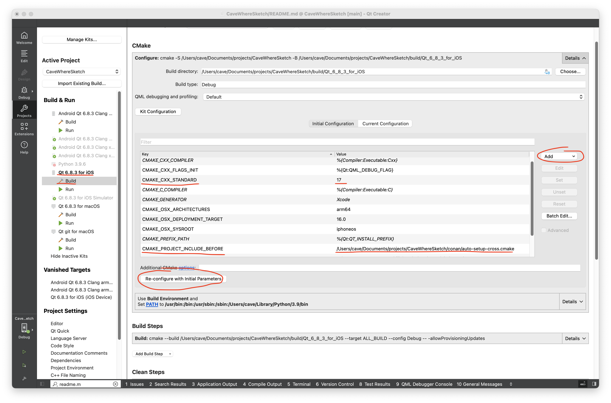
    
    You'll have to hit **Re-configure** once you finished making changes
    
8. **Building CaveWhere Sketch**
    Command-R
    
    or     
    
    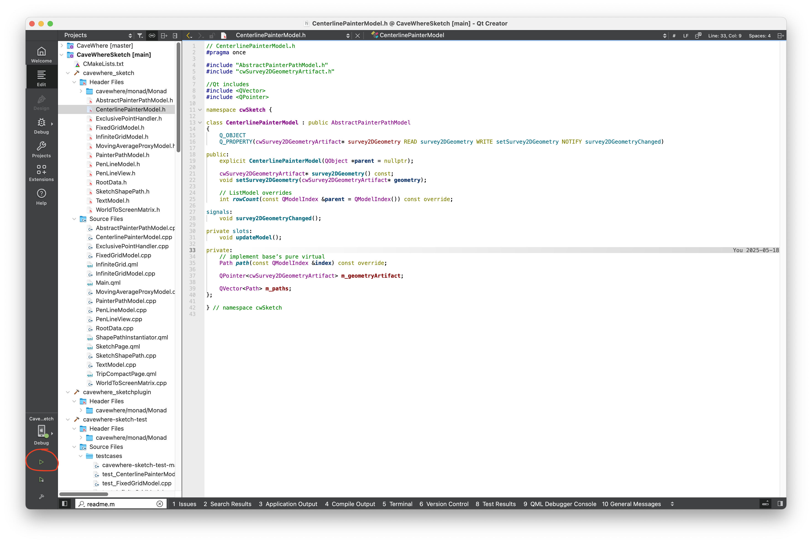
    
    


    
    
    


