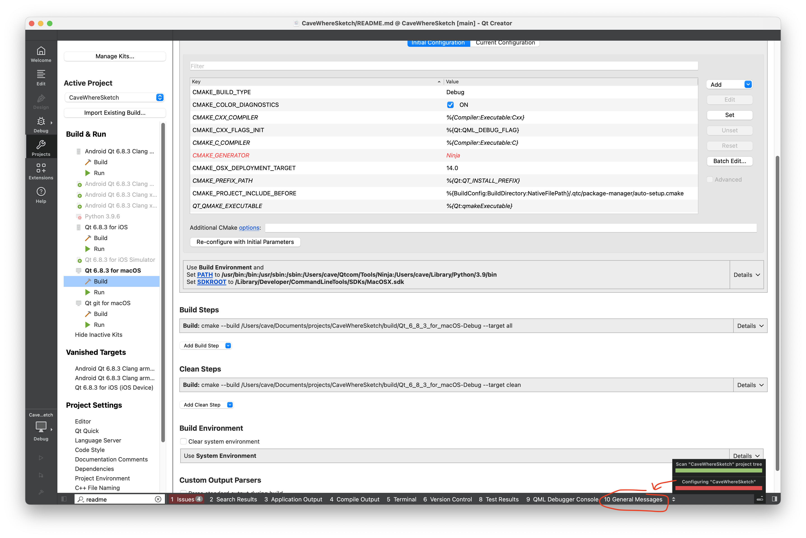

Known working devices / digitizers

| OS                      | Device                   | Pen                    | Notes                                                                                                                                                      |
|-------------------------|--------------------------|------------------------|------------------------------------------------------------------------------------------------------------------------------------------------------------|
| iOS                     | iPad Pro 10.5 (2017)     | Apple Pencil (1st gen) | **Works!**                                                                                                                                                  |
| Android                 | Samsung Note 10          | S Pen                  | **Works!**                                                                                                                                                  |
| Windows 11              | ThinkVision M14t (Gen 1) | Pen                    | **Works!**                                                                                                                                                  |
| macOS with Sidecar      | iPad Pro 10.5 (2017)     | Apple Pencil (1st gen) | Pressure sensitivity is supported. The Apple Pencil isn’t detected as a stylus in Qt, but works with `PointerDevice.Unknown`. [QTBUG-80072](https://bugreports.qt.io/browse/QTBUG-80072) |

__Setups that DON'T work__

| OS                                 | Device                   | Pen                    | Notes                                                                                                       |
|------------------------------------|--------------------------|------------------------|-------------------------------------------------------------------------------------------------------------|
| Android < 9.0                      | Samsung Note 4           | S Pen                  | Uses Android 6.0, which is too old and unsupported by Qt 6.8.3 (requires Android >= 9).                     |
| macOS                              | ThinkVision M14t (Gen 1) | Pen                    | Fails – pen tracks, but the pen tip doesn’t draw. The problem exists across all applications.             |
| Windows 11 (ARM) via Parallels on macOS | ThinkVision M14t (Gen 1) | Pen                    | Fails – pen tracks, but the pen tip doesn’t draw. The problem exists across all applications.             |

# Building CaveWhere Sketch in QtCreator 

## Conan Package Manager Installation

Conan > 2.0 is required for managing packages and dependencies. If you already have Conan installed, skip this step. 

```bash
pip install conan
pip ensurepath
```

Restart your terminal or you’ll get:

```bash
bash: conan: command not found
```

*CaveWhere Sketch uses Conan to manage dependencies, allowing it to handle complex dependency trees that can be cross-compiled for multiple platforms and architectures. While setting up Conan can sometimes be a bit of a headache, once configured, it eliminates much of the hassle of manual dependency management.*

*One key advantage of Conan is its use of hashing to track the exact configuration of each dependency. This ensures that all dependencies are built consistently and correctly for CaveWhere Sketch, avoiding subtle bugs caused by mismatched builds or misconfigured environments.*

## Building CaveWhere in QtCreator

1. **Clone the Repository and Prepare the Environment**

   Clone the CaveWhere repository and check out the correct branch (assuming `master` in this case). Initialize and update the submodules:

   ```bash
   git clone git@github.com:Cavewhere/cavewhere-sketch.git
   cd cavewhere
   git submodule update --init --recursive
   ```

2. **Download and install Qt > 6.8.0**

   You’ll need a Qt account, but it’s free for open-source projects like CaveWhere Sketch:
   https://www.qt.io/download-qt-installer-oss 

   

   Make sure you install for the platform you want to build for: Desktop, iOS, or Android. Also install QtCreator through the installer:

   

   CaveWhere Sketch uses some additional Qt libraries:
   - Qt Image Formats
   - Qt Shader Tools

   

3. **Open the CaveWhere Sketch project in QtCreator**

   Go to File → Open File or Project → `CMakeLists.txt`.

   

4. **Configuring**

   Depending on the platform, CaveWhere Sketch might not configure correctly when you first open `CMakeLists.txt`. Go to the Projects pane and select the platform you want using the dropdown at the top.

   

5. **Configuring for Desktop – macOS build and macOS run (host)**

   To make Conan run correctly, set up the following build environment:

   ```bash
   SDKROOT=/Library/Developer/CommandLineTools/SDKs/MacOSX.sdk
   PATH=/usr/bin:/bin:/usr/sbin:/sbin:/Users/cave/Qtcom/Tools/Ninja:/Users/cave/Library/Python/3.9/bin
   ```

   

   

   **Note**  
   It’s important that `/Users/cave/Library/Python/3.9/bin` is in the `PATH` so QtCreator can find `conan`.

   CaveWhere Sketch also needs the following CMake variables for initial configuration:

   ```text
   CMAKE_CXX_STANDARD:STRING=17
   CMAKE_OSX_DEPLOYMENT_TARGET:STRING=14.0
   ```

   

6. **Configuring for Android – macOS build and Android run (host)**

   You need to install Java and the Android NDK on your system. Documentation is here:
   https://doc.qt.io/qt-6/android-getting-started.html

   To make Conan run correctly, set up the following build environment:

   ```bash
   SDKROOT=/Library/Developer/CommandLineTools/SDKs/MacOSX.sdk
   PATH=/usr/bin:/bin:/usr/sbin:/sbin:/Users/cave/Qtcom/Tools/Ninja:/Users/cave/Library/Python/3.9/bin
   ```

   

   **Note**  
   It’s important that `/Users/cave/Library/Python/3.9/bin` is in the `PATH` so QtCreator can find `conan`.

   CaveWhere Sketch also needs the following CMake variables for initial configuration:

   ```text
   CMAKE_CXX_STANDARD:STRING=17
   CMAKE_PROJECT_INCLUDE_BEFORE:FILEPATH=YOUR_PATH_TO/CaveWhereSketch/conan/auto-setup-cross.cmake
   ```

   

   You’ll need to hit **Re-configure** after making changes.

7. **Configuring for iOS – macOS build and iOS run (host)**

   Qt iOS documentation is here:
   https://doc.qt.io/qt-6/ios.html

   To make Conan run correctly, set up the following build environment:

   ```bash
   PATH=/usr/bin:/bin:/usr/sbin:/sbin:/Users/cave/Qtcom/Tools/Ninja:/Users/cave/Library/Python/3.9/bin
   ```

   

   

   **Note**  
   It’s important that `/Users/cave/Library/Python/3.9/bin` is in the `PATH` so QtCreator can find `conan`.

   CaveWhere Sketch also needs the following CMake variables for initial configuration:

   ```text
   CMAKE_CXX_STANDARD:STRING=17
   CMAKE_OSX_DEPLOYMENT_TARGET:STRING=16.0
   CMAKE_OSX_ARCHITECTURES:STRING=arm64
   CMAKE_PROJECT_INCLUDE_BEFORE:FILEPATH=YOUR_PATH_TO/CaveWhereSketch/conan/auto-setup-cross.cmake
   ```

   

   You’ll need to hit **Re-configure** after making changes.

8. **Building CaveWhere Sketch**

   Press **⌘R** (Command-R) in QtCreator.

   

## Troubleshooting the build ##

If you see a configuration error, you should look out the raw cmake output located in the **General Messages** tab. 



### Common configuration errors ###

### Conan failed run correctly ### 
Error message:
```
[cmake] -- Configuring done (3.5s)
[cmake] CMake Error at cavewhere/cavewherelib/CMakeLists.txt:35 (target_link_libraries):
[cmake]   Target "cavewherelib" links to:
[cmake] 
[cmake]     protobuf::protobuf
[cmake] 
[cmake]   but the target was not found.  Possible reasons include:
[cmake] 
[cmake]     * There is a typo in the target name.
[cmake]     * A find_package call is missing for an IMPORTED target.
[cmake]     * An ALIAS target is missing.
[cmake] 
[cmake] 
[cmake] 
[cmake] CMake Error:
[cmake]   Running
[cmake] 
[cmake]    '/Users/cave/Qtcom/Tools/Ninja/ninja' '-C' '/Users/cave/Documents/projects/CaveWhereSketch/build/Qt_6_8_3_for_macOS-Debug' '-t' 'recompact'
[cmake] 
[cmake]   failed with:
[cmake] 
[cmake]    ninja: error: build.ninja:35: loading 'CMakeFiles/rules.ninja': No such file or directory
[cmake] 
[cmake]   include CMakeFiles/rules.ninja
[cmake] 
[cmake]                                 ^ near here

```
Generally, this means conan didn't run and failed. Scroll to the top of the message and look for conan errors.

#### Common Conan failures ####

Error message (search for these in the output):
```
[cmake]   Qt Creator: conan executable not found.  Package manager auto-setup will be
[cmake]   skipped.  To disable this warning set QT_CREATOR_SKIP_CONAN_SETUP to ON.
```

Cause:
conan isn't in the PATH enviroment variable.

Solution:
Make sure conan is in your PATH. Make sure you click "Re-configure with initial Paramaters", this will clear the cmake cache. 


Error message (search for these in the output):

```
[cmake] ERROR: There are invalid packages:
[cmake] abseil/20250127.0: Invalid: The compiler.cppstd is not defined for this configuration
[cmake] protobuf/5.29.3: Invalid: Protobuf and abseil must be built with the same compiler.cppstd setting
[cmake] CMake Error at /Users/cave/Documents/projects/CaveWhereSketch/build/Qt_6_8_3_for_macOS-Debug/.qtc/package-manager/conan_provider.cmake:461 (message):
[cmake]   Conan install failed='6'
[cmake] Call Stack (most recent call first):
[cmake]   CMakeLists.txt:19 (conan_install)
```

Cause:
The problem arises because the host profile doesn’t have ```compiler.cppstd=17``` set.

Solution:
Add **CMAKE_CXX_STANDARD=17 to the Initial Configuration**, it should fix the issue. ```auto-setup.cmake``` is run before ```CMakeLists.txt```; it calls conan install and sets up the host profile based on the current CMake settings (passed via command-line arguments). Host profile is the target you're going to run CaveWhere Sketch on, and build profile is the platform CaveWhere Sketch is compiled by. For macos compiling for macos, the host and build profiles should be pretty much the same. 

auto-setup.cmake is invoked because QtCreator, by default, sets ```CMAKE_PROJECT_INCLUDE_BEFORE``` to point to it. However, since auto-setup.cmake runs before CMakeLists.txt, it can’t see ```CMAKE_CXX_STANDARD``` defined in CMakeLists.txt.
