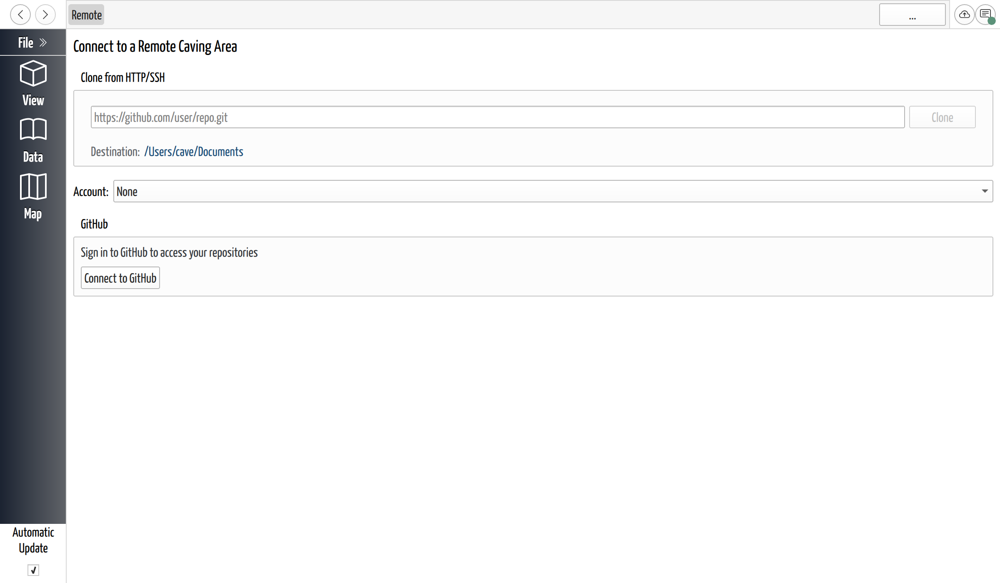

# Open a Shared Project

## Why / when you need this

The other side of [sharing](share-a-project.md) is receiving: a survey partner
sends you a link to the cave, or you want a project you host on GitHub to appear on
a second computer. Either way you **clone** it — download a full copy, with its
history, to your own disk — and from then on it's a normal local project you can
edit and [sync](sync-your-changes.md).

There are two ways in, depending on what you're starting from: a link someone sent
you, or your own list of GitHub repositories.

## Open from a link someone sent you

If you have a share link (or a plain repository URL), use **File → Open from
Link…**. Paste it into the field — *"Paste a CaveWhere share link or repository
URL"* — and click **Open**. CaveWhere accepts any of:

- a CaveWhere share link, `https://cavewhere.com/open?repo=…`;
- the `cavewhere://open?repo=…` form a browser hands over on macOS and Windows;
- a plain clone URL like `https://github.com/user/cave.git`.

On **macOS and Windows** you usually don't open this dialog yourself — clicking the
link in your browser or email hands it to CaveWhere directly. On **Linux**,
Open from Link is how you feed CaveWhere the link by hand. (This is exactly the
route the [example cave](../getting-started/open-the-example-cave.md) uses.)

## Open from your own repositories

If the project is one of *your* GitHub repositories, **File → Open from Online…**
(`Ctrl+Shift+O`) lets you browse and pick it instead of hunting for a link. This
page needs you to be [signed in](sign-in-to-github.md); once you are, it lists your
repositories with a **Public**/**Private** badge and a filter box. Click one to
fill in its address, then click **Clone**. (There's also a **Clone from HTTP/SSH**
box on the same page for pasting a URL directly.)

*The Online projects page, reached with File → Open from Online…. Before you sign
in it shows the Connect to GitHub panel; once you're signed in, your repositories
list here.*

The difference is just where the address comes from: **Open from Link** takes a
single link someone gave you; **Open from Online** lets you pick from your own list.

## The Clone Repository dialog

However you got here, CaveWhere shows the **Clone Repository** dialog:

- It names the repository as **host / path** — e.g. `github.com / your-org/your-cave`.
- **Destination** is the folder the download will live in on your disk. Click the
  path to choose a different folder, or leave the default.
- The **Account** picker matters only for a **private** repository: pick the
  [GitHub account](sign-in-to-github.md) that has access. A **public** repository
  clones with no sign-in — leave the picker alone.
- Click **Clone & Open**. A progress bar tracks the download, and when it finishes
  CaveWhere opens the cave.

### If it's private and you don't have access

Cloning is tried without sign-in first, so if the repository is private you may get
an access error — CaveWhere then shows the sign-in panel so you can connect the
account that has access, and retries automatically. If you still can't reach it,
the message points at the likely cause: the repository doesn't exist for your
account, or *"you were invited as a collaborator"* but haven't accepted the
invitation on GitHub yet. Accept it there, then try again.

## What happens to the project you had open

Because CaveWhere [holds one project at a time](../projects-and-files/open-a-project.md),
downloading a cave first deals with whatever's currently open — asking what to do
with it exactly as **Open** does — before it loads the new one.

The cloned cave arrives as a normal editable project on your disk, and it already
has its [remote](share-a-project.md) set, so it's ready to
[sync](sync-your-changes.md) from the first edit. It also joins your
[recent projects list](../projects-and-files/open-a-project.md#reopen-a-recent-project),
one click from anywhere.

## Next steps

- [Sync Your Changes](sync-your-changes.md) — send your edits up and pull the
  team's down.
- [Review Project History](review-history.md) — see what everyone has changed.
- [Open a Project](../projects-and-files/open-a-project.md) — opening local caves,
  and the recent projects list.
