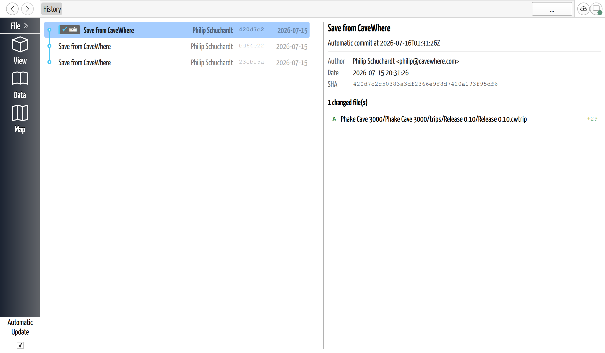

# Review Project History

## Why / when you need this

Every [save](../projects-and-files/save-a-project.md) is a version, and once a team
is [syncing](sync-your-changes.md), those versions pile up from everyone. The
**History page** is where you read that record: what changed, when, and by whom —
and where you go to roll the project back to how it was at an earlier version.

## Opening the History page

**Right-click the Sync button** (top-right) and choose **History…**. That's the way
in — there's no sidebar button for it.

*The History page lists every saved version. Because CaveWhere titles them all
"Save from CaveWhere," it's the date, author, and changed-file list — not the
message — that tell versions apart.*

## Reading the list of versions

Versions run newest-first down the left. Each row shows the version's **message**,
its **author**, a short **code** identifying it, and its **date** (day only). One
thing to know up front: CaveWhere titles every ordinary save **"Save from
CaveWhere,"** so the messages are all identical. What actually distinguishes one
version from another is the **author**, the **date**, and — most usefully — the
**list of files it changed**, which you read in the panel on the right.

Small labels on a row mark where a branch points, with tooltips that translate the
Git terms into plain language: a **remote** label is *"the latest commits pushed to
the server,"* a **local** label is *"commits saved on your device."* Seeing the
local label sitting above the remote one is the same story the Sync button's
[↑ badge](sync-your-changes.md#reading-the-badge) tells — you have versions the team
hasn't received yet.

## Seeing what a version changed

Select any version and the right panel shows its details — author, full date and
time, and the list headed **"N changed file(s)."** Each file carries a letter for
what happened to it (**A**dded, **M**odified, **D**eleted) and a count of lines
added and removed.

Click a changed file to open its **diff** — a line-by-line before-and-after of that
file. This is genuinely readable for survey data: CaveWhere stores caves, trips,
and shots as text, so the diff shows you the actual values that changed from one
version to the next. Files that aren't text — a note's image, a point cloud — are
marked **binary** and can't be shown as a line diff.

Changed **note images** get their own view instead: a side-by-side **Before** and
**After** comparison with a divider you can drag to sweep between the two versions,
so you can see how a scan or scanned sketch changed.

*A changed note image opens as a Before/After comparison. Drag the divider left or
right to reveal more of the earlier or the current version.*

## Committing pending edits

If you have edits you've made but not yet saved as a version, the History page shows
them as a special row at the very top, marked with a pencil. Select it and the right
panel becomes **"Uncommitted Changes,"** listing those files. **Commit All Changes**
saves them as a version — and here, unlike an ordinary Save, you can type your own
subject and description instead of "Save from CaveWhere." (The same panel's
**Discard All** button is the discard covered under
[Reverting changes](#reverting-changes) below.)

## Reverting changes

Two things in CaveWhere both count as "undo," and they take you back to different
points:

- **Discard** returns you to your **last save**, throwing away the edits you've made
  since.
- **Restore** returns you to an **earlier save** of your choosing, further back in
  the history.

### Discard: back to your last save

To abandon the changes you've made since your last save, select the pencil-marked
**Uncommitted Changes** row and click **Discard All**. CaveWhere confirms —
*"Discard All Changes? This will permanently delete all uncommitted changes
including untracked files. This cannot be undone."* — and on **Discard All Changes**
resets the project to your last saved version.

This only clears work you haven't saved yet; every saved version stays in the
history. It's the same action as the **Discard** button on the prompt when you
[quit or switch projects](../projects-and-files/save-a-project.md#when-you-quit) —
both return you to your last save.

### Restore: back to an earlier version

To go further back — to a save from before your last one — **right-click that
version** in the list and choose **Restore to here** (it's disabled on the version
you're already on). CaveWhere confirms with *"Restore to this version? This will
create a new save that restores the project to… All history will be preserved."*

Restoring is **not** destructive. Rather than erasing the versions since, it adds a
**new** version whose contents match the chosen one, on top of the current history —
so everything in between stays in the list and you can roll forward again just as
easily. It restores the **whole project** to that point, and replaces any unsaved
edits in the process, so save anything you want to keep before you restore.

There's no way *inside CaveWhere* to undo a single version in the middle while
keeping the ones after it: Restore always moves the entire project back to the
point you pick. If you're comfortable with Git, though, a
[`.cwproj` is a normal Git repository](../projects-and-files/project-formats.md#directory-cwproj),
so you can do that kind of surgery — undoing one commit, for instance — with Git on
the command line. Close the project in CaveWhere first: it expects to manage its own
history, so it's happiest reading your changes when it next opens the project, not
having them change underneath it.

## Next steps

- [Sync Your Changes](sync-your-changes.md) — how versions get shared in the first
  place.
- [Save a Project](../projects-and-files/save-a-project.md) — what a saved version
  is, and why Save marks one rather than flushing data.
