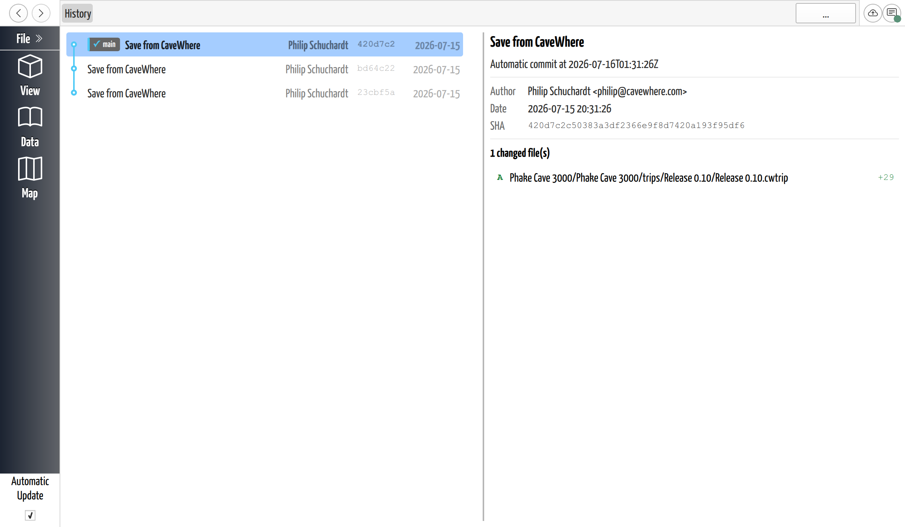
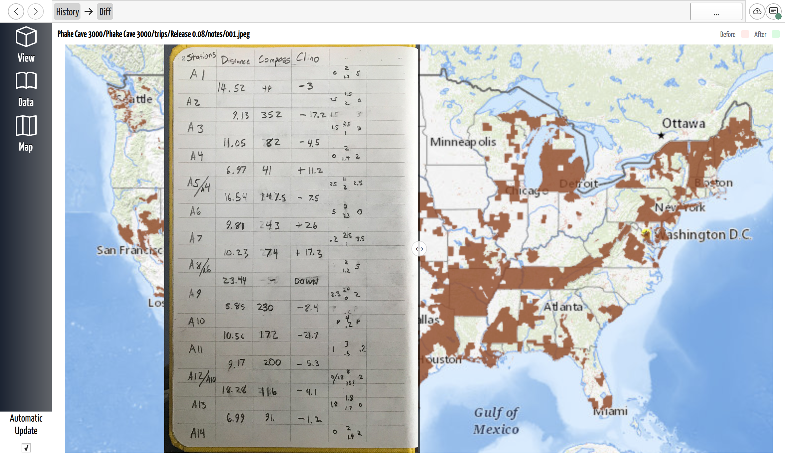

# Review Project History

## Why / when you need this

Every [save](../projects-and-files/save-a-project.md) is a version, and once a
team is [syncing](sync-your-changes.md), those versions pile up from everyone. The
**History page** reads that record back: what changed, when, by whom, and how to
return to any of it.

## Opening the History page

**Right-click the Sync button** (top-right) and choose **History…**. No sidebar
button opens it.

*The message is identical on all 3; author, date and changed files tell them
apart.*

## Reading the list of versions

Versions run newest-first down the left. Each row carries the version's
**message**, its **author**, a short **code**, the first 7 characters of the Git
SHA, and its **date**, day only, as 2026-07-15. Arrow keys move the selection.
CaveWhere titles every ordinary save **"Save from CaveWhere,"** so all 3 messages
shown above are identical; the author, the date and above all the **list of files
it changed** separate one version from the next.

A badge marks where a branch points, and it prints the branch's own name rather
than the word local or remote: `main` as shown above, `origin/main` for the copy
on the server. Any name with a slash in it is a *"Remote branch – the latest
commits pushed to the server,"* everything else a *"Local branch – commits saved
on your device."* A local badge sitting above the remote one tells the same story
as the Sync button's [↑ badge](sync-your-changes.md#reading-the-badge): you have
versions the team has not received.

## Seeing what a version changed

Select a version and the right panel gives you the author and their email, the
full date and time down to 2026-07-15 20:31:26, and the whole 40-character SHA.
Below that sits a list headed **"N changed file(s)."** Each file carries a letter
for what happened to it (**A**dded, **M**odified, **D**eleted) and its line
counts, which print only when they run above zero and may lag a moment behind. The
version selected above shows **1 changed file(s)** and **+29**: one new trip,
nothing removed. Right-click a file for **Copy File Path**.

Click a text file and its **diff** opens line by line, old line number beside new.
That reads well for survey data: CaveWhere stores caves, trips and shots as text,
so the diff shows the values that changed. Past 5,000 changed lines it gives up
and says *"Diff too large to display"*.

A changed **note image** opens as a **Before**/**After** compare instead. A point
cloud or any other binary file gets a gray **binary** tag in the list, and
clicking it fails silently, the one dead end on the page.

*Drag the divider to sweep between the earlier version and the current one.*

The compare shown above opens with the divider halfway across: the earlier image
sits left of it, the current one right, and dragging the handle trades one for
the other. On an image added in that version the left half reads *"No
previous version"*; on a deleted one the right half reads *"File was deleted."*

## Committing pending edits

Edits you have not saved yet show up as a pencil-marked row at the top of the
list. Select it and the right panel becomes **"Uncommitted Changes (N files)"**.
**Commit All Changes** saves them as a version and stays disabled until you fill
in **Commit subject (required)**, the one place you name a version yourself
instead of taking "Save from CaveWhere." A **Description (optional)** box sits
under it. The panel warns *"Note: All modified files will be committed."* You
cannot commit only some of them.

## Reverting changes

In CaveWhere, 2 things both count as "undo," and they land in different places:

- **Discard** returns you to your **last save**, throwing away the edits since.
- **Restore** returns you to an **earlier save** of your choosing, further back.

### Discard: back to your last save

Select the pencil-marked **Uncommitted Changes** row and click **Discard All**.
CaveWhere confirms with *"Discard All Changes? This will permanently delete all
uncommitted changes including untracked files. This cannot be undone."* and on
**Discard All Changes** resets the project to your last saved version. **Discard
All** grays out in a project with no saved version to land on.

Every saved version survives; only unsaved work goes. It matches the **Discard**
button on the prompt when you
[quit or switch projects](../projects-and-files/save-a-project.md#when-you-quit).

### Restore: back to an earlier version

**Right-click the version** you want and choose **Restore to here**, disabled on
the version you already sit on. CaveWhere confirms with *"Restore to this version?
This will create a new save that restores the project to:… All history will be
preserved."*

Your history survives it. Rather than erasing the versions since, Restore adds a
**new** version matching the one you picked, so everything in between stays and
you can roll forward again. That new version's subject reads **"Restored to:"**
plus the old subject, and its description names the versions it rolled back, up to
10 of them. It is the one row in the history that does not read "Save from
CaveWhere."

Your working copy does not survive it. Restore force-checks out the whole project
and deletes untracked files on the way through, so I recommend saving first.

Nothing inside CaveWhere undoes a single version in the middle while keeping the
ones after it, and no per-file restore exists either: Restore always moves the
entire project back to the point you pick. That limitation has one way around it.
A [`.cwproj` is a normal Git repository](../projects-and-files/project-formats.md#directory-cwproj),
so the surgery is a command away for anyone who knows Git. Close the project in
CaveWhere first. It expects to manage its own history, and picks up your changes
when it next opens.

## Next steps

- [Sync Your Changes](sync-your-changes.md): how versions get shared.
- [Save a Project](../projects-and-files/save-a-project.md): why Save marks a
  version rather than flushing data.
