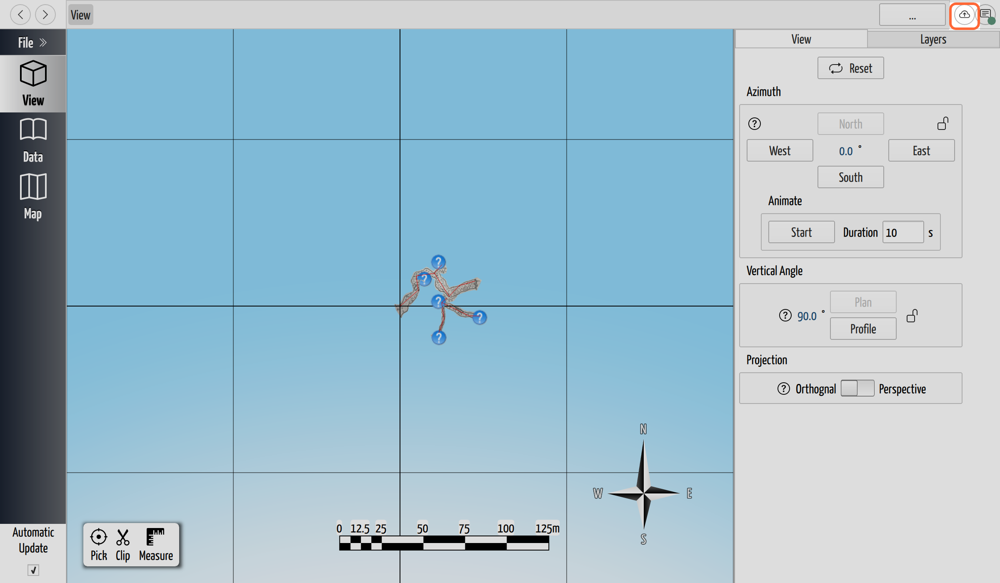

# Share a Project

## Why / when you need this

You've built a cave locally and now you want other people to have it — a survey
partner who'll add their trips, a club archive, or just an online backup you can
pull down on another machine. Sharing is two steps: give the project a
**remote** (its shared copy on GitHub), then send people a **link** to it.

If you haven't connected CaveWhere to GitHub yet, do that first —
[Sign In to GitHub](sign-in-to-github.md) — since both steps here need it.

## Step 1: give the project a remote

A brand-new project is local only. To share it you add a remote, which is the
copy on GitHub everyone syncs against (see
[How Collaboration Works](how-sync-works.md#the-shared-copy-is-called-a-remote)).
Start the **Set Up Remote** wizard from any of:

- the **Sync button** (top-right) — click it when it shows the upload-cloud icon,
  or pick **Set up remote…** from its right-click menu;
- **Remote Settings** (also on that menu) → **Add Remote**;
- the **Share** dialog's *"Add a remote repository to enable sharing"* link.


*Until a project has a remote, the Sync button shows an upload-cloud icon.
Clicking it starts the Set Up Remote wizard.*

A project has **one** remote, so the wizard is a one-time step per project.

### Let CaveWhere create the repository

The wizard opens on **Create repository**, and this is the easy path — CaveWhere
makes the GitHub repository for you, so you never leave the app or touch GitHub's
website:

1. **Repository name** — prefilled from your cave's name, with spaces turned to
   hyphens. Adjust it if you like.
2. **Visibility** — **Private** (the default) or **Public**:
   - *Private* — *"Only you and collaborators can see this repository.
     Recommended for cave survey data."* Cave locations are sensitive, so this is
     the right default: you choose exactly who gets access.
   - *Public* — *"Anyone on the internet can view this repository and its survey
     data."* Only for a cave you genuinely want the world to see.
3. Click **Create repository**. If the name is already taken you'll be told so and
   asked to pick another (or connect the existing one instead).

### Or connect a repository that already exists

If the repo already lives on GitHub (or another host), follow **Already have a
remote? →** to the connect screen:

- **GitHub repository** — pick from a filterable list of your repositories; a lock
  marks the private ones.
- **Custom URL** — paste any repository URL, `https://…` or SSH. For an SSH URL,
  make sure *"your SSH key is already configured"* — CaveWhere uses your system's
  key rather than a GitHub sign-in for those.

Click **Connect** to wire it as this project's remote.

Either way, the wizard finishes with *"Remote configured. Push your project to
GitHub to back it up."* Click **Sync now** to send your work up for the first
time (see [Sync Your Changes](sync-your-changes.md)), or **Close** and sync later.

## Step 2: send a share link

Once the project has a remote, **File → Share…** opens the **Share Project**
dialog with the link already built. Click **Copy link** and paste it wherever you
like — an email, a chat message, a wiki.

The link looks like this:

```
https://cavewhere.com/open?repo=https://github.com/your-org/your-cave.git
```

Anyone with CaveWhere can open it (see [Open a Shared Project](open-a-shared-project.md)
for what happens on their end). For a **private** repository, the note in the
dialog applies: *"Recipients need repository access for private repositories."* —
the link points at the repo, but GitHub still decides who may clone it, so invite
your collaborators on GitHub first. The dialog's **Invite collaborators** link
takes you straight to that page on GitHub.

The share link works with a repository hosted on **GitHub**. If your remote is
somewhere else, the dialog says so and Copy link stays disabled — push to GitHub
to enable sharing.

## How the link opens on each platform

The link is a *deep link* — clicking it is meant to open CaveWhere directly:

- **macOS and Windows** — installing CaveWhere registers the link, so a click in
  a browser or email hands it straight to the app.
- **Linux** — nothing registers the link, so the recipient opens it themselves:
  **File → Open from Link…**, paste the link, **Open**.

Either way it lands in CaveWhere's **Clone Repository** dialog, which downloads
the cave. That receiving side is covered in
[Open a Shared Project](open-a-shared-project.md).

## Next steps

- [Sync Your Changes](sync-your-changes.md) — push your work to the remote and
  pull your team's down.
- [Open a Shared Project](open-a-shared-project.md) — the other end of the link
  you just sent.
- [Review Project History](review-history.md) — see every version once the team
  starts syncing.
