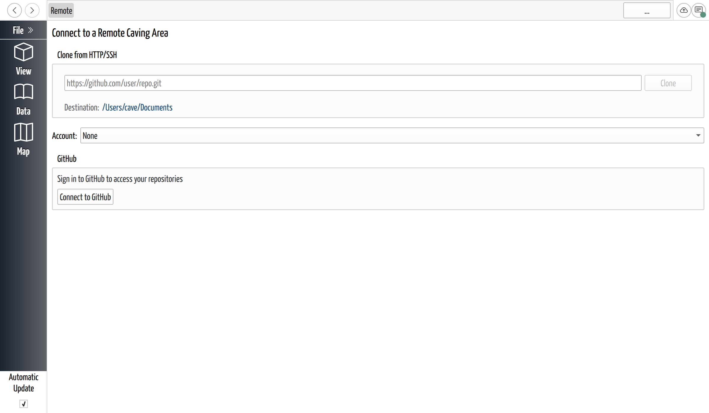

# Sign In to GitHub

## Why / when you need this

To sync, CaveWhere has to talk to GitHub as you: push your work up, pull your
team's down. Signing in gives it permission to do that, once.

You only need this when a step uses a remote: sharing a project, opening one your
team hosts, syncing. Opening a *public* project (like the
[example cave](../getting-started/open-the-example-cave.md)) needs no sign-in at
all.

## Your identity and your GitHub account are two different things

CaveWhere already asked for a name and email when you first ran it (see
[Set Up Your Identity](../getting-started/set-up-your-identity.md)). That
**identity signs your saves**: the author stamped on each version in the history,
like signing a survey book. It lives on your machine and needs no network.

Signing in to GitHub is a **separate** step that **authorizes the push**. Your
identity says *who made this version*; the sign-in is what lets CaveWhere upload
it to the shared copy. Set your identity, never sign in, and everything works
except sync.

## Signing in: the device code

CaveWhere never asks for your GitHub password. It uses GitHub's **device flow**:
CaveWhere shows a short code, you type it into GitHub in your browser, and GitHub
tells CaveWhere it is really you. The sign-in requests no OAuth scopes at all;
the CaveWhere GitHub app carries the permissions instead (next section).

The easiest place to start is the online-projects page: **File → Open from
Online…** (`Ctrl+Shift+O`), then **Add Account** in the **Account** picker, which
raises the GitHub panel. In the shot below the picker still reads **None**.

*The sign-in panel, reached with File → Open from Online…. Setting up a remote
raises the same panel.*

The steps never change:

1. Click **Connect to GitHub**. CaveWhere shows *"Requesting a sign-in code from
   GitHub…"* while it fetches one.
2. A short code appears in a read-only box, under *"Enter the code below at GitHub
   to finish signing in."*
3. Click **Copy and Open GitHub**. That copies the code, opens GitHub's device
   page, and starts the polling. Until you press it CaveWhere never checks, so
   approving in a browser you opened yourself leaves it waiting forever. I
   recommend the button.
4. Approve in the browser. CaveWhere retries every 5 s, counting down in *"Trying
   connection in 5 s"* and reporting *"Still waiting for you to authorize on
   GitHub."* between tries. If GitHub throttles it, the gap grows by 5 s and the
   line becomes *"GitHub asked us to slow down. Trying again in 10 s."*
5. You are signed in. The panel gets out of the way and shows what you were
   after: your repository list, the create-repo form, or the sync.

**Cancel** sits under the code for as long as CaveWhere waits.

## Install the CaveWhere app on GitHub

The first sign-in usually lands here:

> You're signed in, but CaveWhere isn't installed on any of your GitHub accounts
> yet. Install it to see your repositories.

Signing in proves who you are; **installing the CaveWhere GitHub app** is what
grants access to repositories, and you pick which ones rather than the whole
account. **Install CaveWhere on GitHub** opens
`https://github.com/apps/cavewhere/installations/new`. Finish there, and
CaveWhere rechecks every 3 s meanwhile: *"Waiting for the install to finish on
GitHub… this page will update automatically."*

It gives up after 3 minutes. An orange banner then says

> We didn't detect an install. Make sure you finished installing CaveWhere on the
> right GitHub account, then try again.

and the button becomes **Try again — Install CaveWhere on GitHub**.

## Where you sign in

CaveWhere has no single sign-in page; it raises the same panel in context, at the
moment a step needs it. Besides **File → Open from Online…** (above):

- The **Sync button** (top-right), which shows a lock icon and the tooltip
  *"Sign in to GitHub — click to sync"*.
- **Log in** on that button's right-click menu, which appears only for an
  `https://` remote ([Sync Your Changes](sync-your-changes.md)).
- **Setting up a remote** to [share a project](share-a-project.md).
- The **GitHub Access Expired** popup, see below.

## More than one account

CaveWhere supports **multiple GitHub accounts**: personal and caving-club, say.
The **Account** picker lists **None** first, then every signed-in account as
**GitHub (*username*)**, then **Add Account** at the bottom. Pick an account to
make it the one new work uses. One is active at a time.

## Your credentials are kept safely

GitHub hands CaveWhere an access token, which it writes to your **operating
system's keychain** (macOS Keychain, Windows Credential Manager, or the Linux
secret service) under the service name **CaveWhere**, one entry per account,
keyed `RemoteAccount/github/<uuid>/Credentials`. Nothing lands in
your project file, so handing someone a project never hands them your GitHub
access. You never type or paste a personal access token.

CaveWhere renews the token in the background once it comes within 60 s of
expiring. When renewal fails for good, the **GitHub Access Expired** popup
appears: *"Your GitHub session has expired. Reconnect to continue syncing."*
Click **Reconnect** and repeat the device-code step. After a failed attempt the
button reads **Reconnect to GitHub**.

## Signing out

To disconnect, use **Log out** (on the Sync button's right-click menu and on
each remote's card under **Remote Management**) or **Forget Account** on the
online-projects page. CaveWhere confirms first, under **Forget GitHub Account?**:
*"This will remove your saved GitHub account from CaveWhere on this device."* On
**Remove** it deletes the keychain entry and drops the account.

That is this machine only. Nothing changes on GitHub, the app stays installed,
and a project keeps its remote; unlinking one is a separate action on the
[Remote Management](sync-your-changes.md) page.

## Next steps

- [Share a Project](share-a-project.md): now that you are signed in, put a cave
  on GitHub and send your team a link.
- [Sync Your Changes](sync-your-changes.md): the Sync button and what it does.
- [Open a Shared Project](open-a-shared-project.md): download a cave from your
  repository list or a link.
