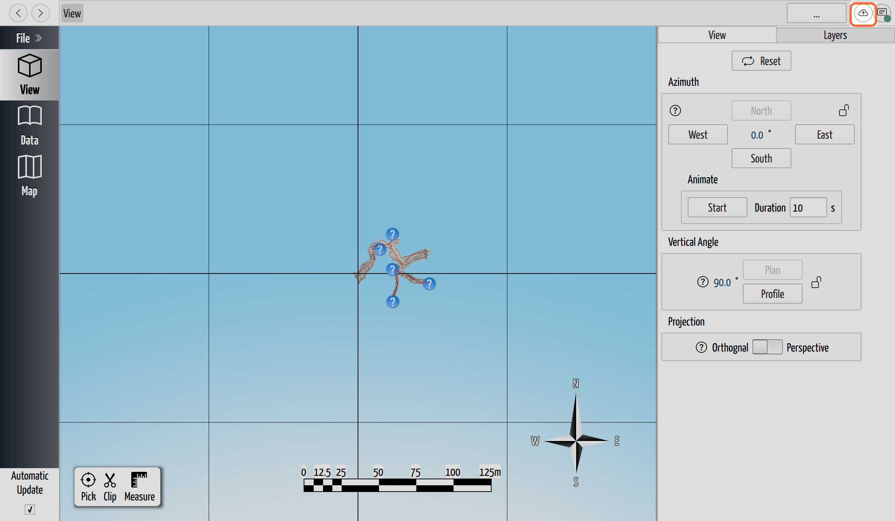

# Sync Your Changes

## Why / when you need this

Saving records your work on your own disk. **Syncing** moves it between you and
the rest of the team: your saved versions go up to the shared copy, your
teammates' come down. One button does both, once a project
[has a remote](share-a-project.md).

## Where the Sync button is

The **Sync button** sits near the right end of the breadcrumb bar, past the
back/forward arrows and the page address (at full width a Discord button sits
to its right). Its normal icon is a pair of circular arrows. Hover it and the
tooltip names where you stand right now.

Before a project has a remote the icon shows an upload cloud instead, and a
click starts [setting one up](share-a-project.md#step-1-give-the-project-a-remote).
That is the state ringed in orange, see below.

*The Sync button, before this project has a remote.*

## What one click does

Clicking Sync runs the whole exchange in order:

1. **Saves and commits.** CaveWhere flushes pending edits to disk and commits
   them as `Sync from CaveWhere`, so unsaved work reaches the history before
   anything touches the network.
2. **Fetches and pulls.** When only one side moved, CaveWhere merges or
   fast-forwards. When both sides gained versions, it **rebases** your commits
   onto the remote's, so your work lands at the end of the shared history rather
   than beside it. Progress reads Rebasing or Merging.
3. **Reconciles.** CaveWhere reads the pulled files back and folds them into the
   open project with the
   [data-model merge](how-sync-works.md#the-merge-understands-caves-not-just-text)
   that understands caves, trips, shots, and notes.
4. **Pushes** your commits up.

Because step 1 commits before the network runs, a failure later still leaves
your work recorded in the [history](review-history.md).

## Reading the badge

A small badge on the corner of the button summarizes where you stand:

- **↑2 ↓1**: 2 of your versions to send up, 1 of theirs to bring down. Both
  arrows always print together, so a purely local backlog reads `↑2 ↓0`.
- **↑2 ↓1 •**: the same, plus a trailing dot for edits not yet committed. With
  nothing to push or pull, the badge goes green and empty.
- **!** on orange: CaveWhere could not reach the remote or work out where you
  stand. Usually offline, sometimes a sign-in that wants refreshing.
- **...**: a sync is running.

No badge at all means up to date. CaveWhere rechecks the remote every 5 minutes,
and again after each commit or branch change, so a stale `!` clears itself once
you are back on the network.

## What the tooltip is telling you

Every tooltip that wants a click names the action at the end, in the shape of
*"Updates available — click to sync"*. The states:

| Tooltip | It means |
|------------|----------|
| **Up to date** | Nothing to send or receive. |
| **Updates available** | Teammates pushed versions you don't have. |
| **Commits ready to push** | You have saved versions the remote lacks. |
| **Commits to push and pull** | Both of the above. |
| **Unsaved changes** | Edits not yet saved. The click saves them, then syncs. |
| **Local edits pending** | Saved to disk, not yet committed. |
| **Syncing…** | An exchange is already running, so the button is disabled. |
| **Sync status unavailable** | The `!` badge, once nothing else applies. No action named, because a click can't help until the remote answers. |
| **Sign in to GitHub** | [Sign in](sign-in-to-github.md) first. |
| **GitHub access expired** | Your sign-in lapsed; the click starts a reconnect. |

## Save, or Save & Sync, when you close

CaveWhere never pushes behind your back, but it does offer at the moment you
step away. Quit or switch projects with unsaved work and the save prompt shows
**Discard**, **Cancel**, **Save**, and, when the project has a remote,
**Save & Sync**. Save records the version locally; Save &
Sync also pushes it.

Should the sync half fail there, the dialog swaps to the reason and offers
**Close anyway** or **Stay open**. A lapsed sign-in reads *"GitHub access has
expired. Your changes are saved locally."* Anything else reads *"Sync failed:"*
and the message. Your save already happened; only the upload waited.

## How merge conflicts are handled

Two people can work on one cave at once because syncing **combines** their edits.
No conflict-resolution screen appears, and no markers land in your data:

- **Edits to different things always merge.** You add a trip while a teammate
  fixes a shot in another trip, or you edit a note while they move a station:
  every change survives. Teams naturally divide a cave up, so this is the
  ordinary case.
- **Edits to the same value go your way.** Where the merge cannot combine two
  versions of one field, CaveWhere keeps the copy on the computer running the
  sync. Yours. Theirs does not land.

Silently is the word to sit with here. Nothing tells you it happened. Their
reading survives as their own version in the
[project history](review-history.md), so you can read what they entered and type
it back in, but you have to think to look. A word beforehand about who works
where costs less.

## When a sync fails

A sync that fails raises a modal dialog titled **"1 issue has occurred"**, with
the message and a **Copy All** button. The next sync clears the list.

Two failures retry themselves. If the remote gains a commit while you push, or
you edit the project mid-sync, CaveWhere throws the attempt away and starts over
from step 1. It retries 3 times, then gives up: *"Sync did not complete after 3
retries: remote advanced during push."* **I recommend keeping your hands off the
keyboard while the badge reads `...`**. Each edit during a sync can cost an
attempt.

A project saved by a newer CaveWhere disables the button outright, with the
tooltip *"Sync disabled — upgrade CaveWhere to v…"* naming the release you need.
This build reads project version 9 (CaveWhere 2026.4); a pull that brings
anything higher stops rather than quietly dropping fields it can't read.

The raw *"Merge Conflicts need to be resolved"* warning is a safety net you
rarely reach. Your committed work is untouched, and the fix is to **Sync
again**. For a clean slate first, [Discard](review-history.md#reverting-changes)
puts you back at your last save.

When the sign-in itself lapsed, the **GitHub Access Expired** popup appears
instead: *"Your GitHub session has expired. Reconnect to continue syncing."*
Click **Reconnect** and repeat the short
[device-code step](sign-in-to-github.md#signing-in-the-device-code).

## Files that have not downloaded yet

Note scans, PDFs, SVGs and LAZ point clouds ride in Git LFS, and opening a
project deliberately does not fetch them (that would demand your keychain
password before you had done anything). So a freshly cloned cave can arrive with
its notes missing. An orange banner says so, *"Some files haven't been downloaded
yet."*, and offers **Sync** or **Later**.

## The Sync button's menu

Right-click the button for everything else:

- **Sync now**: the same as a left-click.
- **Set up remote…**: only while the project has none.
- **Install CaveWhere on GitHub**: when your account still needs the
  [app installed](sign-in-to-github.md#install-the-cavewhere-app-on-github).
- **Remote settings…**: the **Remote Management** page, where you can see the
  remote and remove it. Removing one *"does not delete the remote repository —
  it only removes the link from this project."*
- **History…**: the [project history](review-history.md).
- **Log in** / **Log out**: only for an `https://` remote. An SSH remote
  authenticates with a key, so that item stays hidden.

## Next steps

- [Review Project History](review-history.md): every version you and your team
  have synced, and how to roll back.
- [Open a Shared Project](open-a-shared-project.md): download a cave a teammate
  shared.
- [Save a Project](../projects-and-files/save-a-project.md): what a save records
  locally, before any of this.
