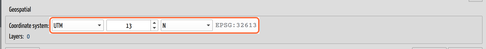
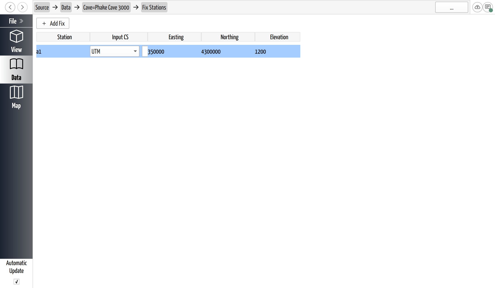
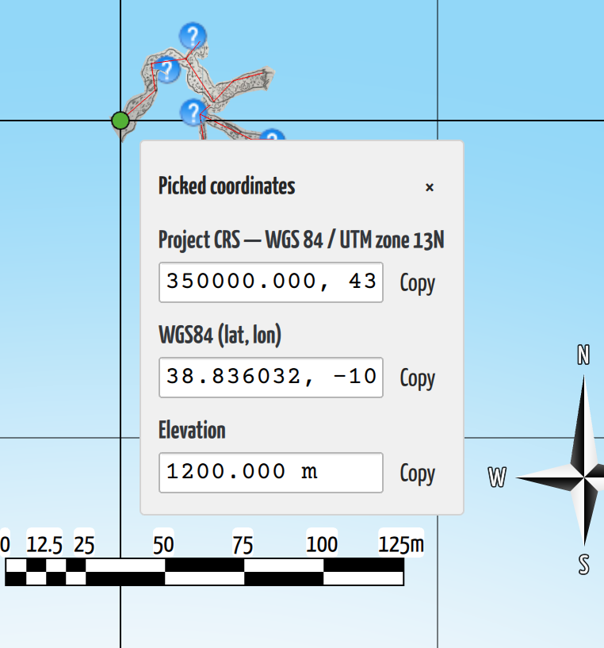

# Georeference a Cave

## Why / when you need this

A cave you've surveyed has the right *shape* but no *place*. Its stations sit in
CaveWhere's own local frame, floating: the survey is internally consistent, but
nothing has told CaveWhere where on Earth it is or which way is true north.

That's fine until the cave has to meet the outside world. Two things in
particular break until you place it:

- **Add a second cave and they overlap.** Every un-georeferenced cave is anchored
  at the *same* local origin, so a project with several caves piles them all on
  top of each other in the 3D view. Fixing each one to its real coordinates is
  what pushes them apart into their true relative positions.
- **[Auto declination](../survey-data/declination.md#let-cavewhere-work-it-out-auto)
  stays unavailable.** Computing declination from the IGRF model needs to know
  where the cave is; without a fixed station there's nothing to compute from.

Georeferencing also lets you overlay the cave on surface maps and imagery, drop
georeferenced [point clouds](../point-clouds/add-a-point-cloud.md) into the same
space, and hand real coordinates to anyone who needs them. This page is the
task; [Directions and Coordinate Systems](../concepts/coordinate-systems.md) is
the concept behind it.

## Two things to set

Georeferencing a project is two steps, and they live on two different pages:

1. **Choose the project's coordinate system** — the real-world grid the whole
   project is reported in. This is set once, on the **Data** page, and shared by
   every cave.
2. **Fix at least one station** to known coordinates — the anchor that pins the
   floating survey to that grid. This is per cave, on the cave's **Fix Stations**
   page.

Fixing a station is what actually moves a cave onto the map; the coordinate
system is the frame those coordinates — and the grid convergence, the 3D model,
and your exports — are expressed in. You'll normally set both.

## Choose the project's coordinate system

On the **Data** page, find the **Geospatial** box and the **Coordinate system**
control. It offers three kinds:

- **Local** — the default: no real-world grid, the cave floats. This is what
  "not georeferenced" means.
- **UTM** — pick a **zone** (1–60) and hemisphere (**N**/**S**). UTM is the usual
  choice for cave survey: it's a metric grid, and most surface data and GPS
  exports you'll meet are already in a UTM zone.
- **Custom…** — search the full EPSG catalog by name or code (for a national grid
  like the British National Grid, or any projection your other data uses).

*The project coordinate system on the Data page. Picking **UTM** reveals the zone
and hemisphere; the grey text confirms the EPSG code it resolves to.*

There's no **Lat/Lon** option here, and that's deliberate: CaveWhere solves the
survey with Survex's `cavern`, which can't work in a geographic (latitude/
longitude) system — it needs a projected grid with metric eastings and northings.
You can still *enter* a fix in latitude and longitude (see below); CaveWhere
converts it into the project grid for you.

**Pick the same coordinate system your other data uses.** The whole point is that
the cave, the surface map, and any point cloud all share one frame — matching the
system is what makes them line up.

## Fix a station

A **[fixed station](../concepts/glossary.md#fixed-station)** is a survey station
whose real-world coordinates you know — typically the entrance, tied in with a
GPS reading, a benchmark, or a surface survey.

Open a cave's page and find the **Fix stations** link (it shows the current count,
`0` on a cave that isn't yet georeferenced). Click it to open the **Fix Stations**
page, then click **Add Fix** to add a row. Each row has five fields:

- **Station** — the name of the real survey station you're fixing (for example
  `A1`). It has to match a station that exists in the cave, or the fix has nothing
  to anchor.
- **Input CS** — the coordinate system *the numbers you're typing* are in. This is
  independent of the project's coordinate system: if your GPS gave you latitude
  and longitude, set this row to **Lat/Lon (WGS84)** and type those, even in a UTM
  project — CaveWhere transforms it. Leave it on **UTM** (or match the project) if
  your numbers are already eastings and northings.
- **Easting**, **Northing**, **Elevation** — the coordinates themselves, in
  meters. (With a Lat/Lon input CS these fields hold longitude, latitude, and
  elevation instead.)

*One fixed station anchors the cave. The **Input CS** picker on the row lets you
enter each fix in whatever system you have the numbers in, regardless of the
project's system.*

Double-click a field to edit it; the change is applied when you finish. To remove
a fix, right-click its row. You can fix **more than one** station — the survey
then ties to every fixed point at once, and CaveWhere adjusts the network between
them the same way it closes any loop.

## What fixing does

The moment a cave has a valid fix, CaveWhere re-solves the survey anchored to
those real coordinates instead of the local origin — and from then on it lays the
3D model out on the project coordinate system's grid, so the map you see and
export is in that system. You'll see it move:

- **The cave jumps to its true position**, and if the project holds several caves,
  they separate out of the pile at the origin into their real relative layout.
- **[Grid convergence](grid-convergence.md)** starts reporting a value on the cave
  page, and the bearing correction folds it in automatically.
- **[Auto declination](../survey-data/declination.md#let-cavewhere-work-it-out-auto)**
  becomes available, because the cave now has a location to compute from.

CaveWhere keeps a **world origin** — an offset near the survey it draws relative
to, so the 3D scene stays centered even when your coordinates are hundreds of
kilometers from zero. It recomputes this automatically every time the survey
solves, so you never set it by hand; if you ever need to force it (after a large
change), the Data page's region menu has a **Recenter world origin**. The origin
is derived, not stored — CaveWhere works it out again each time you open the
project.

## Read coordinates back out

Once a cave is georeferenced, you can read the real-world coordinates of any point
on the model. In the **3D view**, turn on the coordinate picker from the toolbar
and click a point: a small panel reports the point in the **project coordinate
system**, in **WGS84 latitude/longitude**, and its **elevation**, each with a
**Copy** button. It's a quick way to grab an entrance coordinate for a permit, a
callout, or a landowner — and a good check that a fix landed where you meant it
to.

*The coordinate picker reads one point back out in three frames at once — the
project coordinate system, WGS84 lat/lon, and elevation.*

## Next steps

- [Understand Grid Convergence](grid-convergence.md) — the readout georeferencing
  turns on, and why your bearing correction is more than just declination.
- [Set the Declination](../survey-data/declination.md) — with a fixed station,
  switch it to Auto and let CaveWhere compute it.
- [Directions and Coordinate Systems](../concepts/coordinate-systems.md) — the
  three norths, datums, and projections behind all of this.
