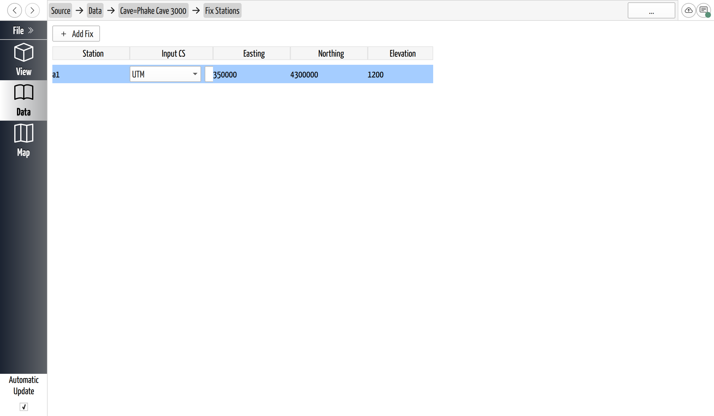
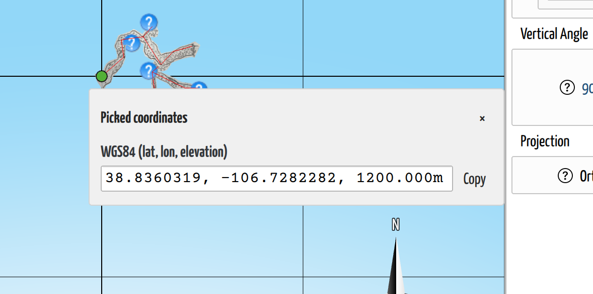

# Georeference a Cave

## Why / when you need this

A surveyed cave has the right *shape* but no *place*. Its stations sit in
CaveWhere's own local frame, internally consistent, with nothing to say where on
Earth they are or which way is true north.

Two things break until you place it:

- **Add a second cave and they overlap.** Every un-georeferenced cave anchors at
  the *same* local origin, so a project with several caves piles them on top of
  each other in the 3D view.
- **[Auto declination](../survey-data/declination.md#let-cavewhere-work-it-out-auto)
  stays unavailable.** IGRF-14 needs a location, and without a fixed station
  there is nothing to compute from.

Georeferencing also lets you drop georeferenced
[point clouds](../point-clouds/add-a-point-cloud.md) into the same space, and
hand real coordinates to whoever asks.

## One thing to set

Georeferencing a project is one step: **fix at least one station** to known
coordinates. That is the anchor that pins the floating survey to the real world,
and it is per cave, on the cave's **Fix Stations** page.

There is no project coordinate system to choose. CaveWhere works out the frame
the project is drawn in from the first thing that says where the project is — a
fixed station, or a georeferenced [point
cloud](../point-clouds/add-a-point-cloud.md) — and centers that frame on it. The
frame follows your data instead of you having to pick a grid for it, which also
means you can never pick the wrong one.

## Fix a station

A **[fixed station](../concepts/glossary.md#fixed-station)** is a station whose
real-world coordinates you know, usually the entrance, tied in with GPS, a
benchmark, or a surface survey.

Open a cave's page and click the **Fix stations:** count, `0` until you
georeference it. The page starts empty:

> No fix stations yet. Click **Add Fix** to anchor a station to absolute
> coordinates.

Each row **Add Fix** creates carries 5 fields:

- **Station**: the real survey station you are fixing, `a1` in the shot shown
  below. It has to match a station in the cave, or the fix has nothing to
  anchor.
- **Input CS**: the system *the numbers you are typing* sit in, and nothing else
  reads them. If your GPS gave latitude and longitude, set the row to **Lat/Lon
  (WGS84)** and type those; CaveWhere transforms them. Leave it on **UTM** for
  eastings and northings. Each row carries its own, so fixes entered in different
  systems live side by side.
- **Easting**, **Northing**, **Elevation**: the coordinates, in meters. Under a
  Lat/Lon input CS these 3 hold longitude, latitude, and elevation instead.

*One fixed station anchors the cave. The **Input CS** picker sits on the row, so
each fix is read under the system its numbers were taken in.*

Double-click a text field to edit; the change applies when you finish. Right-click
a row for **Remove** plus the station name, then confirm. Fix more than one and
the survey ties to every fixed point at once, adjusted between them the way
CaveWhere closes any loop.

Nothing warns you about a fix typed into the wrong UTM zone. The bad coordinate
drags the frame off the real data and inflates the scene bounds until the cave
renders as a sub-pixel dot.

## What fixing does

The moment a cave has a valid fix, CaveWhere re-solves the survey anchored to
those real coordinates instead of the local origin, and lays the 3D model out on
the project's frame. If the project had no frame yet, that first fix is also what
gives it one. You will see it move:

- **The cave jumps to its true position**, and several caves separate out of the
  pile at the origin into their real layout.
- **[Grid convergence](grid-convergence.md)** starts reporting a value on the
  cave page, `-1.08° at a1` for the cave shown above. Whether the solve *uses*
  it is a second question. CaveWhere applies the convergence only when the
  trip's declination is on **Auto**, the default on new trips. On Manual it
  writes a plain `*calibrate DECLINATION` line, which survex applies verbatim
  and never pairs with a convergence; a manual `0` writes no line at all.
- **[Auto declination](../survey-data/declination.md#let-cavewhere-work-it-out-auto)**
  becomes available, because the cave now has a location to compute from.

The frame CaveWhere derives is centered on that anchor, so the coordinates the
3D scene works in stay small no matter where on Earth the cave is — which is what
keeps the model precise hundreds of kilometers from any grid's zero. Refining the
anchor later moves the station, not the frame; only a correction big enough to
mean the project is somewhere else re-derives it. Exports still name a standard
system your reader can paste elsewhere.

## Read coordinates back out

In the **3D view**, click the crosshair **Pick** button in the bottom toolbar
(tooltip "Pick coordinates"), then click the model. A **Picked coordinates**
panel reports it as **WGS84 (lat, lon, elevation)** — one line, with a **Copy**
button, so a paste carries the height along with the position. The elevation is
in the project's units, `2206.890m` or `6000.000ft`. Escape puts the tool away.
It's a quick way to grab an entrance coordinate for a permit, a callout, or a
landowner.

**I recommend checking every new fix this way.** Pick the station you fixed and
confirm the latitude and longitude land on the entrance, as shown below.

*The coordinate picker reads one point back out as WGS84 lat/lon and elevation.*

Until something places the project, the panel has nothing to read the pick
against:

> This project isn't positioned yet, so the pick can't be shown in real-world
> coordinates.

An **Add a fix station or a geospatial layer** link says what to do about it.

## Next steps

- [Understand Grid Convergence](grid-convergence.md): the readout georeferencing
  turns on, its 4 `n/a` states, and the switch that decides whether the solve
  uses it.
- [Set the Declination](../survey-data/declination.md): with a fixed station,
  switch it to Auto and let CaveWhere compute it.
- [Directions and Coordinate Systems](../concepts/coordinate-systems.md): the
  three norths, datums, and projections behind all of this.
