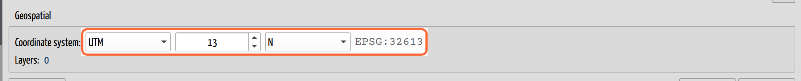

# Georeference a Cave

## Why / when you need this

A surveyed cave has the right *shape* but no *place*. Its stations sit in
CaveWhere's own local frame, internally consistent, with nothing to say where on
Earth they are or which way is true north.

Two things break until you place it:

- **Add a second cave and they overlap.** Every un-georeferenced cave anchors at
  the *same* local origin, so a project with several caves piles them on top of
  each other in the 3D view.
- **[Auto declination](../survey-data/declination.md#let-cavewhere-work-it-out-auto)
  stays unavailable.** IGRF-14 needs a location, and without a fixed station
  there is nothing to compute from.

Georeferencing also lets you drop georeferenced
[point clouds](../point-clouds/add-a-point-cloud.md) into the same space, and
hand real coordinates to whoever asks.

## Two things to set

1. **Choose the project's coordinate system**, the real-world grid the whole
   project reports in. Set once, on the **Data** page, shared by every cave.
2. **Fix at least one station** to known coordinates, the anchor that pins the
   floating survey to that grid. Per cave, on the cave's **Fix Stations** page.

Fixing a station moves the cave onto the map; the coordinate system is the frame
it lands in. You normally set both.

## Choose the project's coordinate system

On the **Data** page, the **Project** box lists **Coordinate system:** read-only
until you click its **Edit** pencil, which flips to **Done**. That extra click
is there because changing the units or the coordinate system on a project full
of data can wreck it.

In edit mode the picker offers 3 kinds:

- **Local**, the default: no real-world grid, the cave floats. This is what "not
  georeferenced" means.
- **UTM**: pick a **zone** (1 to 60) and a hemisphere, **N** or **S**. UTM is the
  usual choice for cave survey, a metric grid, and most surface data you will
  meet already sits in a zone. Zone 13 N resolves to
  `EPSG:32613`, printed gray beside the picker as shown below.
- **Custom...**: search the EPSG catalog by name or code (for a national grid
  such as the British National Grid). Before you type anything the dialog lists
  17 common projections. Pasting a whole `EPSG:nnnn` code works too. The dialog
  pulls roughly 7000 rows out of `proj.db`, so it is built on first use rather
  than with the page.

*The coordinate system, ringed. Picking **UTM** reveals the zone and hemisphere.*

No **Lat/Lon** option appears here, deliberately: CaveWhere solves with Survex's
`cavern`, which cannot emit a geographic system, so the project needs metric
eastings and northings. You can still *enter* a fix in latitude and longitude.

**Pick the system your other data already uses.** Matching it is what makes the
cave and any point cloud line up.

## Fix a station

A **[fixed station](../concepts/glossary.md#fixed-station)** is a station whose
real-world coordinates you know, usually the entrance, tied in with GPS, a
benchmark, or a surface survey.

Open a cave's page and click the **Fix stations:** count, `0` until you
georeference it. The page starts empty:

> No fix stations yet. Click **Add Fix** to anchor a station to absolute
> coordinates.

Each row **Add Fix** creates carries 5 fields:

- **Station**: the real survey station you are fixing, `a1` in the shot shown
  below. It has to match a station in the cave, or the fix has nothing to
  anchor.
- **Input CS**: the system *the numbers you are typing* sit in, independent of
  the project's. If your GPS gave latitude and longitude, set the row to
  **Lat/Lon (WGS84)** and type those even inside a UTM project; CaveWhere
  transforms them. Leave it on **UTM** for eastings and northings.
- **Easting**, **Northing**, **Elevation**: the coordinates, in meters. Under a
  Lat/Lon input CS these 3 hold longitude, latitude, and elevation instead.

*One fixed station anchors the cave. The **Input CS** picker sits on the row, not
on the project.*

Double-click a text field to edit; the change applies when you finish. Right-click
a row for **Remove** plus the station name, then confirm. Fix more than one and
the survey ties to every fixed point at once, adjusted between them the way
CaveWhere closes any loop.

Nothing warns you about a fix typed into the wrong UTM zone. The bad coordinate
drags the world origin off the real data and inflates the scene bounds until the
cave renders as a sub-pixel dot.

## What fixing does

The moment a cave has a valid fix, CaveWhere re-solves it anchored to those
coordinates instead of the local origin, and lays the 3D model out on the
project grid. You will see it move:

- **The cave jumps to its true position**, and several caves separate out of the
  pile at the origin into their real layout.
- **[Grid convergence](grid-convergence.md)** starts reporting a value on the
  cave page, `-1.08° at a1` for the cave shown above. Whether the solve *uses*
  it is a second question. CaveWhere applies the convergence only when the
  trip's declination is on **Auto**, the default on new trips. On Manual it
  writes a plain `*calibrate DECLINATION` line, which survex applies verbatim
  and never pairs with a convergence; a manual `0` writes no line at all.
- **[Auto declination](../survey-data/declination.md#let-cavewhere-work-it-out-auto)**
  becomes available, because the cave now has a location to compute from.

CaveWhere also keeps a **world origin**, an offset near the survey that the 3D
scene draws relative to. Vertex positions are 32-bit floats, and a 23-bit
mantissa holds render jitter under 1 cm only out to about 84 km, so raw UTM
coordinates would wobble visibly without the offset. The origin is the mean of
every valid fix in the project, computed on the first solve that finds one and
sticky after that, so editing a fix never jumps the whole scene. You do not set
it: the Data page's region menu offers **Cavern Output** and nothing else.
CaveWhere never saves it, and works it out again on each open.

## Read coordinates back out

In the **3D view**, click the crosshair **Pick** button in the bottom toolbar
(tooltip "Pick coordinates"), then click the model. A **Picked coordinates**
panel reports it 3 ways, each with a **Copy** button: the project CRS and the
elevation to 3 decimals, **WGS84 (lat, lon)** to 6. Escape puts the tool away.

**I recommend checking every new fix this way.** Pick the station you fixed and
confirm the latitude and longitude land on the entrance, as shown below.

*The picker reads one point back out in 3 frames at once.*

On a project still set to Local the panel has nothing to place the pick in:

> This tool needs a coordinate system to place the pick in real-world
> coordinates.

A **Set the coordinate system** link jumps to the Data page.

## Next steps

- [Understand Grid Convergence](grid-convergence.md): the readout georeferencing
  turns on, its 4 `n/a` states, and the switch that decides whether the solve
  uses it.
- [Set the Declination](../survey-data/declination.md): with a fixed station,
  switch it to Auto and let CaveWhere compute it.
- [Directions and Coordinate Systems](../concepts/coordinate-systems.md): the
  three norths, datums, and projections behind all of this.
