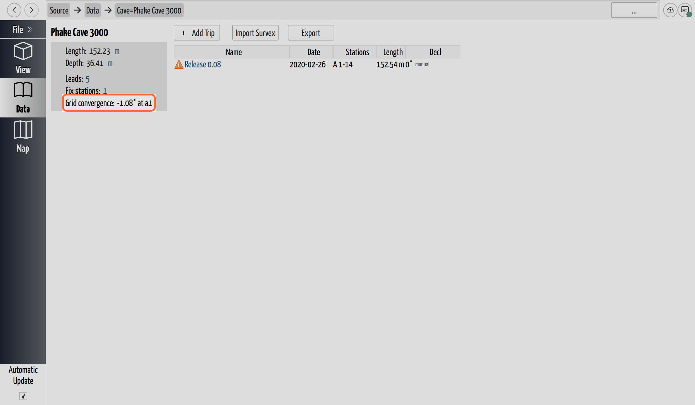

# Understand Grid Convergence

## Why / when you need this

Once you [georeference a cave](georeference-a-cave.md), a new readout appears on
its page: **Grid convergence**. It's not something you set — CaveWhere computes
it — but it's worth understanding, because it quietly rotates every compass
reading in the cave onto the grid, and that rotation is what lets the cave line up
with anything measured on the grid. Two cases make it matter:

- **Fixing more than one station.** When you fix two or more stations to
  real-world coordinates, those coordinates live on the grid, so the direction
  *between* them is a **grid bearing**. Your survey, though, measures a **true
  bearing** (magnetic plus [declination](../survey-data/declination.md)), and the
  two disagree by exactly the convergence. Leave that gap in and the traverse can't
  reach both fixed points at once — the survey arrives at the second one rotated
  off its known coordinate, and the miss shows up as a loop-closure error between
  the fixes that no amount of re-measuring will clear. Correcting for convergence
  puts your measured directions in the same grid as the fixed coordinates, so the
  loop closes on the geometry instead of fighting it.
- **Aligning with aerial LiDAR or a point cloud.** Aerial scans and surface point
  clouds arrive already in a projected grid, oriented to grid north. A cave turned
  only to true north sits rotated off them by the convergence angle, so a passage
  drifts sideways from the surface feature it actually runs beneath — and the error
  grows with distance from the entrance. Turning the cave onto grid north lines its
  north up with the scan's north, so the two datasets sit in one frame.

Both come down to the same thing: anything that reaches you *already on the grid* —
GPS control, aerial LiDAR, a surface map — speaks grid north, so the cave has to
speak grid north to meet it. That's why a georeferenced cave's bearing correction
isn't simply its declination.

## What it is

**Grid convergence** is the angle between **true north** (the direction to the
geographic pole) and **grid north** (the "up" direction of your projected
coordinate system's grid). A flat map projection can only line its grid up with
true north along one line; move east or west of that line and grid north leans
away from true. That lean is the convergence, and it depends on both the
projection and *where in it* you are — inside a single UTM zone, convergence can
vary by a degree or more between the zone's central meridian and its edge.

Unlike [declination](../survey-data/declination.md), grid convergence has
nothing to do with the Earth's magnetic field, so it doesn't drift with time —
it depends only on location and projection. CaveWhere computes it at the cave's
first fixed station.

*Two points at the same longitude lie on one true-north meridian, yet they get
different UTM eastings — because grid north leans away from true north. That lean
is the grid convergence, and it grows the farther you sit from the projection's
central meridian. Based on a diagram by **Mike Futrell**.*

## Reading the value

The **Grid convergence** cell sits next to the **Fix stations** link on the cave
page. When the cave is georeferenced it reads as an angle at a station —
for example `0.74° at a1` — and hovering it shows the coordinate system in use.

Before that, it explains *why* it has nothing to report:

| Reading | Meaning |
|---------|---------|
| `0.74° at a1` | The convergence CaveWhere is applying, measured at that fixed station. |
| `n/a (no fix station)` | The cave has a coordinate system but no [fixed station](georeference-a-cave.md#fix-a-station) to compute at. |
| `n/a (no coordinate system)` | The cave has a fix but no [project coordinate system](georeference-a-cave.md#choose-the-projects-coordinate-system) to converge against. |
| `n/a (geographic CS)` | The coordinate system is geographic (latitude/longitude), which has no grid, so convergence is zero and there's nothing to correct. |

The first two "n/a" readings are a checklist: georeferencing needs *both* a
coordinate system and a fixed station, and the readout tells you which one is
still missing.

*The grid convergence readout on the cave page. The help panel (the **?**) spells
out what the value means and how it's applied.*

## Why it changes your correction

Here's the part that matters even if you never look at the number. When CaveWhere
solves the survey, it turns each magnetic compass reading into a **grid bearing** —
one that lines up with your projected coordinates. That's two corrections in turn:

1. **Correct to true north** — add the [declination](../survey-data/declination.md):
   *magnetic reading + declination = true bearing*.
2. **Correct for the grid** — subtract the grid convergence:
   *true bearing − grid convergence = grid bearing*.

Chained together, that's the whole correction at once:

> **grid bearing = magnetic reading + declination − grid convergence**

So the bearing CaveWhere ends up plotting is a *grid* bearing, not a true one —
and that grid isn't an abstract reference direction. **The grid is the project
coordinate system you chose** — the UTM zone or projection you set when you
[georeferenced the cave](georeference-a-cave.md#choose-the-projects-coordinate-system) —
and that same system is the frame CaveWhere lays the 3D model out in and exports
to. Look at a georeferenced cave in plan view and north on the screen *is* grid
north; the model's eastings and northings are the grid's. So the second correction
isn't bending your survey toward some outside grid — it's aligning it to the map
CaveWhere already draws. On a local (un-georeferenced) cave there's no projection,
so convergence is zero, the correction stops at step 1, and the model is drawn to
true north instead. Georeference the cave and step 2 switches on automatically.

This is why you can't read a georeferenced cave's total bearing correction off
its declination alone, and why the same survey can point very slightly
differently once it's placed on a grid. The shift is usually small — a fraction
of a degree to a couple of degrees — but it's real, and it's what keeps the cave
aligned with everything else in its coordinate system.

## Next steps

- [Georeference a Cave](georeference-a-cave.md) — set the coordinate system and
  fixed station that turn this readout on.
- [Set the Declination](../survey-data/declination.md) — the other half of the
  bearing correction.
- [Directions and Coordinate Systems](../concepts/coordinate-systems.md) — the
  three norths in full.
