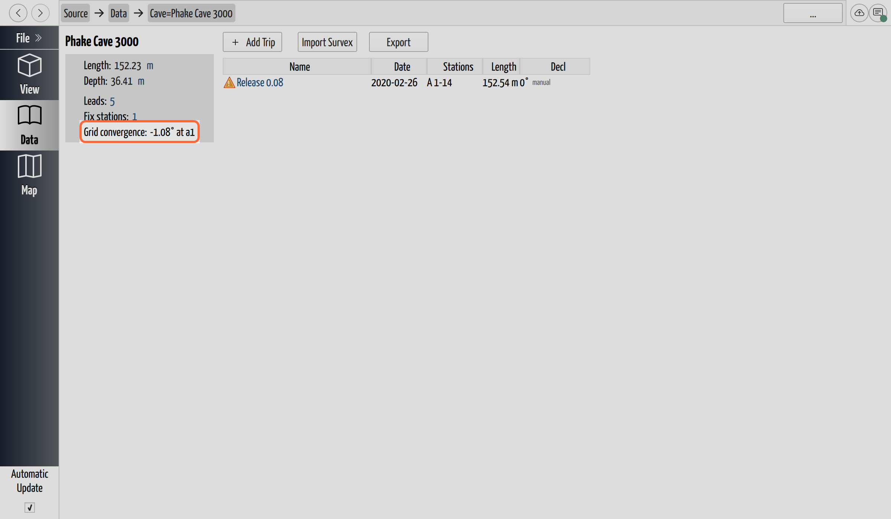

# Understand Grid Convergence

## Why / when you need this

Once you [georeference a cave](georeference-a-cave.md), a second correction
switches on: **grid convergence**. It's not something you set or see — CaveWhere
computes and applies it — but it's worth understanding, because it quietly
rotates every compass reading in the cave onto the grid, and that rotation is
what lets the cave line up with anything measured on the grid. Two cases make it
matter:

- **Fixing more than one station.** When you fix two or more stations to
  real-world coordinates, those coordinates live on the grid, so the direction
  *between* them is a **grid bearing**. Your survey, though, measures a **true
  bearing** (magnetic plus [declination](../survey-data/declination.md)), and the
  two disagree by exactly the convergence. Leave that gap in and the traverse can't
  reach both fixed points at once — the survey arrives at the second one rotated
  off its known coordinate, and the miss shows up as a loop-closure error between
  the fixes that no amount of re-measuring will clear. Correcting for convergence
  puts your measured directions in the same grid as the fixed coordinates, so the
  loop closes on the geometry instead of fighting it.
- **Aligning with aerial LiDAR or a [point cloud](../point-clouds/add-a-point-cloud.md).**
  Aerial scans and surface point
  clouds arrive already in a projected grid, oriented to grid north. A cave turned
  only to true north sits rotated off them by the convergence angle, so a passage
  drifts sideways from the surface feature it actually runs beneath — and the error
  grows with distance from the entrance. Turning the cave onto grid north lines its
  north up with the scan's north, so the two datasets sit in one frame.

Both come down to the same thing: anything that reaches you *already on the grid* —
GPS control, aerial LiDAR, a surface map — speaks grid north, so the cave has to
speak grid north to meet it. That's why a georeferenced cave's bearing correction
isn't simply its declination.

## What it is

**Grid convergence** is the angle between **true north** (the direction to the
geographic pole) and **grid north** (the "up" direction of your projected
coordinate system's grid). A flat map projection can only line its grid up with
true north along one line; move east or west of that line and grid north leans
away from true. That lean is the convergence, and it depends on both the
projection and *where in it* you are — inside a single UTM zone, convergence can
vary by a degree or more between the zone's central meridian and its edge.

Unlike [declination](../survey-data/declination.md), grid convergence has
nothing to do with the Earth's magnetic field, so it doesn't drift with time —
it depends only on location and projection. CaveWhere reads it at the cave's
first fixed station, in the
[projection it derived for your project](#the-grid-is-a-low-distortion-projection) —
and that choice of projection is what keeps the angle down to a fraction of a
degree instead of the couple of degrees a UTM zone would hand you.

So it takes two things: a projection for the project, *and* a fixed station that
says where this cave sits in it. Until both are there — nothing georeferenced
yet, or a cave with no [fixed station](georeference-a-cave.md#fix-a-station) of
its own — the convergence is zero and the cave is drawn to true north.

*Two points at the same longitude lie on one true-north meridian, yet they get
different UTM eastings — because grid north leans away from true north. That lean
is the grid convergence, and it grows the farther you sit from the projection's
central meridian. Based on a diagram by **Mike Futrell**.*

## The grid is a low-distortion projection

Which projection you land on decides how big the convergence gets, and CaveWhere
doesn't put you in a UTM zone. The first thing you georeference — a fixed station
or a point cloud — becomes the center of a **low-distortion projection** (LDP): a
transverse Mercator built for your project alone, running through your own cave.
Three things follow, and they're the reason the LDP exists:

- **Distances on the grid are the distances you surveyed.** A UTM zone shrinks
  everything by 400 ppm at its central meridian — 40 cm of every kilometer — and
  stretches it by about as much out at the zone edge, so a 1 km survey leg is
  never quite 1 km on the grid. CaveWhere's LDP sits at true scale where you are:
  even 50 km out from its center — about as far as a project ever reaches — the
  error is around 3 cm per kilometer, under the noise of the tape that measured
  it.
- **Grid north is essentially true north.** Convergence is exactly zero along the
  meridian running through the LDP's center, and it grows only with **east–west**
  distance from that line — a cave 50 km due *north* of the center has none at
  all. Due east or west, 50 km out, it reaches about 0.26° at 30°N, 0.38° at
  40°N, and 0.53° at 50°N. The same cave placed at the edge of a UTM zone would
  carry 1.93° at 40°N — five times as much. So the bearing correction stays close
  to the [declination](../survey-data/declination.md) alone. Small isn't zero,
  though, so CaveWhere still applies it: a third of a degree is the same order as
  the precision of the compass that took the reading, and it keeps growing the
  farther east or west the cave runs.
- **There are no zone seams.** A cave that straddles a UTM zone boundary would
  otherwise be split between two grids with different norths; the LDP has one
  center and no edges.

The trade is that the LDP belongs to this project — it isn't a published system
another program will recognize by name. That only matters on the way out, which
is why [exporting a survey](../import-export/export-surveys.md) writes a standard
coordinate system rather than the project's own frame.

## Reading the value

The **Grid convergence** cell sits next to the **Fix stations** link on the cave
page. When the cave is georeferenced it reads as an angle at a station — for
example `0.376° at a1` — and hovering it gives the value at full precision plus
the grid it's measured in.

The readout carries three decimals because the
[LDP](#the-grid-is-a-low-distortion-projection) keeps the angle small on
purpose. Convergence grows by roughly 0.008° per kilometer of east–west distance
from the projection's center at 40°N, so at coarser precision most caves in a
project would round to a flat zero — which would read as a correction that isn't
running, when in fact it's running and tiny. That's the point the cell is making.

The **first** thing you georeference always reads `0.000°`, and that's the right
answer rather than a missing one: it defines the projection's center, and grid
north and true north are the same direction along the meridian through it. The
tooltip says as much, so the zero doesn't look like a failure.

Before a cave is georeferenced, the cell explains *why* it has nothing to report:

| Reading | Meaning |
|---------|---------|
| `0.376° at a1` | The convergence CaveWhere is applying, measured at that fixed station. |
| `0.000° at a1` | The cave sits on the projection's central meridian — usually because it's the one that defined it. |
| `n/a (no fix station)` | Nothing places this cave: it has no [fixed station](georeference-a-cave.md#fix-a-station), or the ones it has name no [coordinate system](georeference-a-cave.md#fix-a-station) to read their numbers under. |
| `n/a (no coordinate system)` | Nothing in the project is georeferenced yet, so there is no projection to converge to and the model is drawn to true north. |

Both "n/a" readings are a checklist: convergence needs a projection for the
project *and* a fixed station that says where this cave sits in it, and the
readout tells you which one is still missing.

*The grid convergence readout on the cave page. The help panel (the **?**) spells
out what the value means and how it's applied.*

## Why it changes your correction

Here's what it does. When CaveWhere
solves the survey, it turns each magnetic compass reading into a **grid bearing** —
one that lines up with your projected coordinates. That's two corrections in turn:

1. **Correct to true north** — add the [declination](../survey-data/declination.md):
   *magnetic reading + declination = true bearing*.
2. **Correct for the grid** — subtract the grid convergence:
   *true bearing − grid convergence = grid bearing*.

Chained together, that's the whole correction at once:

> **grid bearing = magnetic reading + declination − grid convergence**

So the bearing CaveWhere ends up plotting is a *grid* bearing, not a true one —
and that grid isn't an abstract reference direction. **The grid is the projection
CaveWhere derived for the project** when you
[georeferenced the cave](georeference-a-cave.md#fix-a-station), and that same
frame is the one it lays the 3D model out in. Look at a georeferenced cave in plan view and north on the screen *is* grid
north; the model's eastings and northings are the grid's. So the second correction
isn't bending your survey toward some outside grid — it's aligning it to the map
CaveWhere already draws. On a local (un-georeferenced) cave there's no projection,
so convergence is zero, the correction stops at step 1, and the model is drawn to
true north instead. Georeference the cave and step 2 switches on automatically.

This is why you can't read a georeferenced cave's total bearing correction off
its declination alone, and why the same survey can point very slightly
differently once it's placed on a grid. The shift is usually small — a fraction
of a degree to a couple of degrees — but it's real, and it's what keeps the cave
aligned with everything else in its coordinate system.

## Next steps

- [Georeference a Cave](georeference-a-cave.md) — fix the station that turns this
  correction on.
- [Set the Declination](../survey-data/declination.md) — the other half of the
  bearing correction.
- [Directions and Coordinate Systems](../concepts/coordinate-systems.md) — the
  three norths in full.
