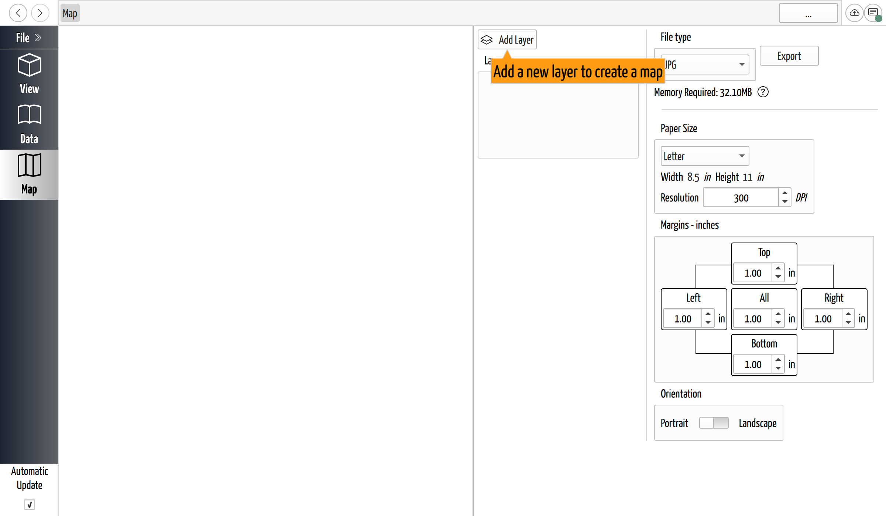
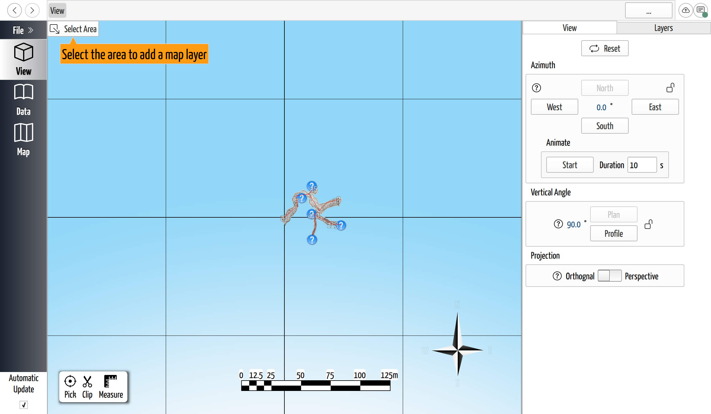

# Export a Map

## Why / when you need this

Sometimes you don't want the *data*, you want a *picture*: a map to print, a
figure for a trip report, an image to post. The **Map** page composes one from
the 3D cave and exports it as an image or PDF — and, because a cave map is
usually printed at a stated scale ("1:500"), it lets you lay the cave out on a
real paper size at a real scale rather than just taking a screenshot.

## The idea: layers on a sheet of paper

A map here is one or more **layers** arranged on a **paper sheet**. Each layer is
a rectangular capture of the 3D view — a piece of the cave, taken from the
camera angle the view had when you captured it. You place, scale, and rotate
those layers on the page, set the paper size, and export the sheet.

That structure is why the Map page has a paper preview on one side and options on
the other: you're composing a page, not grabbing the screen.

*The Map page. The paper sheet is on the left; the layers, file type, paper size,
and resolution are on the right.*

## Aim the 3D view first

Because a layer captures the cave *from the current camera angle*, set up the
[3D view](../view-3d/the-3d-view.md) the way you want the map to look before you
capture — a plan map wants the view looking straight down in orthographic
projection, a profile wants it side-on. The layer freezes that orientation.

## Add a layer

On the Map page, click **Add Layer**. CaveWhere switches to the **View** page
with a selection tool active and the prompt *"Select the area to add a map
layer."* Click and drag a rectangle over the part of the cave you want, then
click **Done**. The captured area becomes a layer on the paper, and you're
returned to the Map page.

*Add Layer drops you on the 3D view to draw the area you want on the map. Aim the
view the way the map should look first — the layer captures it from here.*

Add more layers the same way to build a multi-part map — an overview plus a
detail inset, for instance.

## Adjust a layer

Select a layer in the **Layers** list to edit it. Its properties include:

- **Scale** — the map scale, written as *On Paper = In Cave* and shown as
  "1:_N_". This is the number that makes it a map rather than a snapshot: set it
  and the layer is drawn so a given distance on paper equals a real distance
  underground.
- **Size**, **Position**, and **Rotation** on the page. You can also drag and
  rotate the layer directly in the paper preview.
- **Scale Bar** — on by default, so a printed map carries its own scale.
- **Leads** — off by default; turn it on to include
  [lead markers](../view-3d/the-3d-view.md) on this layer.

## Set the paper and resolution

The **Paper Size** options set the sheet:

- **Letter, Legal, A4**, or **Custom Size** (type your own width and height).
- **Orientation** — Portrait or Landscape (for the fixed sizes).
- **Margins** on each edge.
- **Resolution** in DPI — 100 to 600, defaulting to **300**, which is a normal
  print resolution. Higher DPI means a sharper, larger file.

## Export

Pick the **File type** and click **Export**, then choose where to save. CaveWhere
renders the sheet and opens the finished file in your system's default viewer.

In practice, most cavers export **SVG** or **PDF** and redraw the map in a vector
editor like **Inkscape** or **Adobe Illustrator**. CaveWhere lays the cave out to
scale and the drawing program is where the finished cartography happens — the
export is a faithful base to trace over, not usually the final map. The raster
formats are for when you want a finished image directly.

The formats fall into two groups:

| Type | Good for |
|------|----------|
| **PNG** | A lossless image with a transparent background. The usual choice for the web or for dropping into a document. |
| **JPG** | A smaller image with a white background; fine for a photo-like export, lossy. |
| **TIF** | A lossless image with a transparent background, for print workflows that expect TIFF. |
| **SVG** | A vector page that scales without pixelation — the format to open in Inkscape or Illustrator for redrawing. |
| **PDF** | A print-ready vector page at the paper size and margins you set — send it to a printer, or open it in a vector editor to redraw. |

## Next steps

- [The 3D View](../view-3d/the-3d-view.md) — aim the camera and pick the
  projection before you capture a layer.
- [Export Surveys to Other Programs](export-surveys.md) — export the survey
  *data* instead of a picture.
