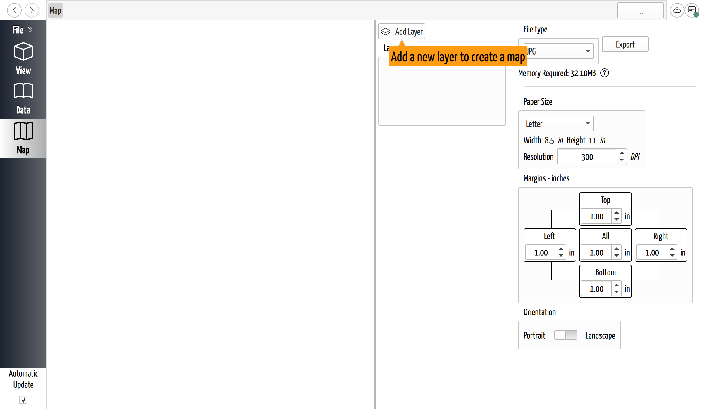
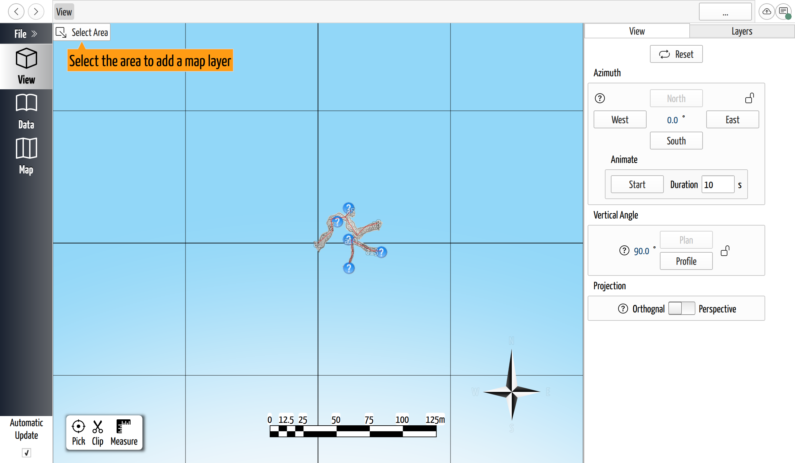

# Export a Map

## Why / when you need this

Sometimes you don't want the *data*, you want a *picture*: a map to print, a
figure for a trip report, an image to post. A cave map gets printed at a stated
scale, "1:500" or the like, so the **Map** page lays the cave on real paper at a
real scale instead of grabbing the screen.

## The idea: layers on a sheet of paper

A map here is one or more **layers** on a **paper sheet**. Each layer is a
rectangular capture of the 3D view, frozen at the camera angle you took it from.
Place, scale, and rotate them on the page, set the paper size, export. CaveWhere
names them **Capture 1**, **Capture 2**, and so on in the **Layers** list.

*Paper on the left, layers and options on the right.*

## Aim the 3D view first

A layer captures the cave from whatever the camera is doing right then, so set
the [3D view](../view-3d/the-3d-view.md) up first. A plan map wants the view
straight down in
[orthogonal projection](../view-3d/perspective-and-field-of-view.md), one
constant scale everywhere; a profile wants it side-on. Capture in Perspective
and no scale you type afterward makes it measurable.

## Add a layer

Click **Add Layer**. CaveWhere jumps to the **View** page with the selection
tool armed and this prompt hanging off the **Select Area** button, see below:

> Select the area to add a map layer

Drag a rectangle over the part of the cave you want, then click **Done**. The
capture lands on the paper and you're back on the Map page.

*Add Layer drops you on the 3D view to draw the area you want.*

Repeat for a detail inset. Right-click a layer and pick **Remove** to drop it.

## Adjust a layer

Select a layer in the **Layers** list; the properties box stays hidden until you
do.

- **Scale**, written *On Paper* = *In Cave*, with the ratio beside it. Put 1 in
  against 50 ft and you get **1:600**. Mismatched units turn the readout red
  with *Weird scaling units*; a scale that comes out zero or infinite reads
  *Invalid scale (check DPI)*.
- **Size**, **Position**, and **Rotation**, in inches and degrees. Dragging the
  layer in the preview edits them too.
- **Scale Bar**, on by default, with a **Units:** menu offering *Project
  Default*, *Metric*, and *Imperial*.
- **Leads**, off by default. Turn it on to draw
  [lead markers](../view-3d/the-3d-view.md) on this layer.

## Set the paper and resolution

- **Letter** (8.5 × 11 in), **Legal** (8.5 × 14 in), **A4** (8.27 × 11.69 in),
  or **Custom Size**, which unlocks the width and height fields. All inches.
- **Orientation**, Portrait or Landscape. Custom Size hides the switch; swap the
  2 numbers yourself.
- **Margins - inches**, starting at 1 in on each edge, with an **All** box that
  sets all 4 at once. These are not just whitespace: CaveWhere draws a border
  rectangle on the margin line, and it prints.
- **Resolution** in DPI, stepping by 100 from 100 to 600, starting at **300**.

## Export

Pick a **File type**, click **Export**, and choose where to save. The list opens
on **JPG**, so change it first. CaveWhere renders the sheet and, if the write
succeeds, hands the file to your default viewer.

**Memory Required**, below the button, counts one image at paper size times DPI,
4 bytes a pixel: Letter at 300 DPI is 2550 × 3300 pixels, about 32 MB; at 600
DPI, 128 MB. Doubling DPI quadruples it, and 40 × 40 in at 600 DPI asks 2.1 GB.
The `?` beside the readout warns:

> Using more memory than what's on computer my cause your computer to hang!
> CaveWhere may temporarily use equal or double the amount of disk space
> required by the memory required

Free disk is the real constraint: that buffer is a memory-mapped temp file. A
render too big to place fails into an error dialog rather than hanging, though
the final write still copies it all into RAM. Only 32-bit builds disable
**Export**, at 1 GB. With no layers you get an empty sheet carrying its page
outline and margin frame.

I recommend exporting **SVG** or **PDF** and finishing the cartography in
Inkscape or Adobe Illustrator. The raster formats are for a finished image
straight out.

| Type | What you get |
|------|--------------|
| **PNG** | Lossless raster, transparent background. Usual choice for the web. |
| **JPG** | Lossy raster on a white background; smaller file, photo-like. |
| **TIF** | Lossless raster, transparent background, for print workflows wanting TIFF. |
| **SVG** | Vector page, no pixelation. Open it in Inkscape or Illustrator. |
| **PDF** | Vector page at your exact paper size, ready for a printer. |

## Next steps

- [Perspective and Field of View](../view-3d/perspective-and-field-of-view.md):
  pick the projection before you capture a layer.
- [Export Surveys to Other Programs](export-surveys.md): export the survey
  *data* instead of a picture.
