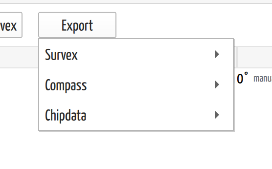

# Export Surveys to Other Programs

## Why / when you need this

CaveWhere isn't the only program a cave passes through. You might send a survey
to a collaborator who reduces data in Survex, hand a club its cave back in the
Compass format its archive uses, or run the raw shots through a tool that reads
one of these formats. Export writes your survey out so another program can read
it.

Export is a one-way copy to a file — your project is untouched, and you keep
working in CaveWhere exactly as before. (To move a *whole project* between
CaveWhere's own formats, that's [Save As](../projects-and-files/save-a-project.md),
not export.)

## Where export lives

Export is on the **Data** page and on each **cave** page, as the **Export**
button beside Import. Like import, it's **desktop-only** — hidden on mobile
builds.

The button opens a menu of formats and scopes:

*The Export menu. Survex, Compass, and Chipdata each open a submenu of scopes;
Survex offers trip, cave, and region, the others a single cave.*

| Format | Scopes offered | File |
|--------|----------------|------|
| **Survex** | Current trip · Current cave · Region (all caves) | `.svx` |
| **Compass** | Current cave | `.dat` |
| **Chipdata** | Current cave | *(you name it)* |

Which scopes are available depends on what's selected: the **Current cave** and
**Current trip** items grey out when nothing is selected, and **Current trip** is
offered on the cave page, where a trip row is selected in the trip table.

After you pick a scope, a file dialog asks where to save. That's the whole
interaction — CaveWhere writes the file and there's no confirmation dialog
afterward; the export is done when the file appears where you saved it.

## Survex keeps the most

The Survex exporter is the highest-fidelity of the three, because CaveWhere's own
survey model maps cleanly onto Survex. It writes:

- The shots, with front sights, back sights, or both, and plumbed legs as
  `UP` / `DOWN`.
- The **[calibration](../survey-data/calibration.md)** — tape, compass, and clino
  corrections and the units.
- The **[declination](../survey-data/declination.md)**, as `*declination auto`
  when the trip uses automatic declination, or the value when it's manual.
- The **team**, though only roles Survex recognizes survive; a free-text role
  CaveWhere allows but Survex doesn't is dropped.
- LRUD, dates, and a `duplicate` flag on any shot you
  [excluded from the length total](../survey-data/enter-survey-data.md).

One thing to know: only the **Region (all caves)** export writes the output
coordinate system (`*cs`). A single-cave or single-trip `.svx` carries the
survey but not the coordinate system it's georeferenced into — export the whole
region if you need that.

## Compass changes station names

The Compass exporter writes a `.dat` file, and the one behavior to understand
before you rely on it is that **it uppercases every station name**. A station
called `a1` in CaveWhere is written as `A1` in the Compass file.

This is deliberate, and it's about a real difference between the two programs:
**Compass treats `a1` and `A1` as two different stations; CaveWhere treats them
as the same one.** To keep CaveWhere's case-insensitive names from silently
splitting into two stations in Compass, the exporter forces them all to one case.

The consequence to remember is that **a round-trip through Compass doesn't
preserve the original casing**: export `a1`, and re-importing the Compass file
gives you back `A1`. The survey is the same; the spelling of the station names
isn't. Names are also truncated to Compass's 12-character limit, and spaces are
stripped from the survey name.

The Compass exporter writes the survey data file (`.dat`) only — not a `.mak`
project file.

## Chipdata is the leanest

Chipdata export writes a cave in the Chipdata format. It's the most limited of
the three, so reach for it only if that's specifically what you need:

- Station names are truncated to **5 characters**.
- **No declination or calibration values are written** — only the units and the
  corrected-sight flags. If the receiving program needs the corrections, Chipdata
  won't carry them.
- The file dialog doesn't add an extension, so type the full filename you want.

## What export doesn't tell you

Export runs in the background and, unlike a Compass *import*, doesn't show a job
in the sidebar or a progress bar — a survey export is quick, and the file simply
appears when it's done. There's no completion notice. If you exported and want to
be sure, open the file: a Survex `.svx` and a Compass `.dat` are both plain text
you can read.

## Next steps

- [Import Surveys from Other Programs](import-surveys.md) — the reverse trip, and
  the note on names that a round-trip doesn't preserve.
- [Export a Map Image](export-a-map.md) — export a *picture* of the cave (PNG,
  PDF, SVG) rather than its survey data.
