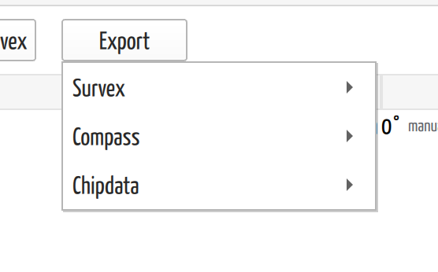

# Export Surveys to Other Programs

## Why / when you need this

CaveWhere isn't the only program a cave passes through. You might send a survey
to a collaborator who reduces data in Survex, or hand a club its cave back in
Compass format. Export writes a copy out and leaves your project alone. (To
move a *whole project* between CaveWhere's formats, use
[Save As](../projects-and-files/save-a-project.md).)

## Where export lives

The **Export** button sits on the **Data** page beside **Import**, and on each
**cave** page beside **Import Survex**. Both are desktop-only, hidden on mobile.

*The 3 formats, each with a submenu arrow.*

| Format | Scopes | File |
|--------|--------|------|
| **Survex** | Current trip · Current cave · Region (all caves) | `.svx` |
| **Compass** | Current cave | `.dat` |
| **Chipdata** | Current cave | *(you name it)* |

**Current cave** and **Current trip** carry the name they would write, as in
**Current cave - Phake Cave 3000**, and gray out when that name is empty. The
test reads the *name*, not the selection, so an unnamed cave grays itself out.
**Current trip** also wants the wide cave-page layout with a trip row selected.
**Region (all caves)** is a plain item that never grays.

A save dialog follows, filtered to `Survex (*.svx)`, `Compass (*.dat)` or
`Chipdata (*.*)`. Type a name with no suffix and CaveWhere appends `.svx` or
`.dat`; Chipdata gets neither, so type the whole filename.

## Survex keeps the most

A `.svx` carries the shots (front sights, back sights or both, plumbs as
`UP` / `DOWN`), the [calibration](../survey-data/calibration.md) corrections to
2 decimals, and the units. It also writes the date, LRUD in a `*data passage`
block, and `*flags duplicate` around any shot you
[left out of the length total](../survey-data/enter-survey-data.md).
Corrections come out negated: Survex signs them the opposite way.

**Current trip writes an empty file right now.** A refactor dropped the line
handing trip data to the writer, so the exporter runs on a blank trip: you get a
`*date` and a `*data normal` line and no shots. Export the cave instead.

Team members go out as `*team` lines, but only recognized roles survive: `tape`,
`notes`, `explorer`, `dog`. CaveWhere's filter holds 35 of the 36 Survex takes,
so free-text roles and `gps` drop without a word.

[Declination](../survey-data/declination.md) writes as `*declination auto` only
when the trip runs on automatic declination *and* the cave has a fixed station
with a coordinate system, since Survex needs a point to run IGRF at. Otherwise
out goes the *manual* value, and a manual 0.0 writes no line at all.

Only **Region (all caves)** writes `*cs out`, the output coordinate system. A
single georeferenced cave sends its `*cs` lines out without one, which the
code's own comment expects cavern to reject. With a station fixed, I recommend
exporting the region and deleting the extra caves.

## Compass changes station names

Compass export uppercases every station name: enter `a1` and the `.dat` says
`A1`. Compass reads those as 2 stations where CaveWhere reads one, so a
case-mixed survey would split in two. The price: a round-trip
won't give your spelling back. Names also get cut to the 12-character Compass
field, and spaces come out of the survey name.

Declination lands in the header as a plain number to 2 decimals. Missing
readings, LRUD and backsights alike, go out as -999,
the Compass null. An empty trip gets a placeholder shot from `New1` to `New2`,
since Compass will not open an empty survey. CaveWhere writes the `.dat` only,
never a `.mak`.

## Chipdata is the leanest

- Names cut to **5 characters**, and each line prints *to* before *from*.
- **No declination and no calibration corrections**, only the units and
  corrected-backsight flags.
- Chunks that fail validation get skipped without telling you.

Reach for Chipdata only when asked.

## What export doesn't tell you

Anything at all. Export runs as a background task with no job in the sidebar, no
progress bar, no completion notice and, worse, no error. A file that will not
open for writing files `Open file <name>` in an error list nothing reads, then
deletes itself. A separate guard covers projects holding external centerline
attachments:

> Cannot export — this project contains external centerline attachments. Use
> your original .svx / .dat / .mak / .wpj / .srv files (in each cave or trip's
> external-centerline/ subdir inside the project) to share.

Nothing binds that guard to a menu item, so the items stay live, the dialog
opens, and the export quietly declines. Open the file afterward: `.svx` and
`.dat` are plain text, and a stub with no shots means nothing landed.

## Next steps

- [Import Surveys from Other Programs](import-surveys.md), the reverse trip.
- [Export a Map](export-a-map.md), which writes a *picture* of the cave as PNG,
  JPG, TIF, SVG or PDF.
