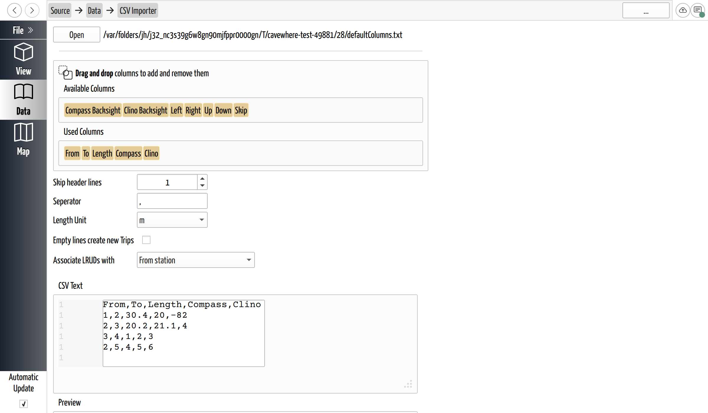

# Import a CSV or Spreadsheet

## Why / when you need this

Not every source of survey data is a Survex, Compass, or Walls file. Sometimes
it's a spreadsheet you kept the numbers in, or a plain export from a tool that
only writes columns of text. CaveWhere can read those too — but a bare table of
numbers doesn't say which column is the distance and which is the compass, so
importing a CSV is mostly the work of *telling CaveWhere what each column means*.

Like every other import, this **adds a new cave** to the open project; it never
replaces what's there.

## Open the importer

On the **Data** page, click **Import**, then **CSV (.csv)**. This opens the CSV
Importer, a page of its own. Click **Open** and pick your file — it accepts
`.csv` and `.txt`, and any character can be the column separator, so
tab- or semicolon-separated files work as well as commas.

The page re-parses live: every change you make below updates the preview
immediately, so you can see the effect of a mapping before you commit it.

*The CSV importer. The Used Columns list on the right is dragged to match the
file's column order; the Preview and Status confirm the mapping before you
import.*

## Map the columns

The columns are two lists you drag between:

- **Used Columns** — the columns CaveWhere will read, *in the order your file
  has them*. It starts with **From, To, Length, Compass, Clino**.
- **Available Columns** — column meanings not yet in use: **Compass Backsight,
  Clino Backsight, Left, Right, Up, Down**, and **Skip**.

Drag a meaning from one list to the other, and drag within **Used Columns** to
reorder, until the order of the used columns matches the order of the columns in
your file. **Skip** is special: use it for a column your file has that CaveWhere
should ignore, and use it as many times as you need — it's the one meaning you
can place more than once.

## Set the parsing options

Below the columns:

| Setting | What it does |
|---------|--------------|
| **Skip header lines** | How many lines at the top to ignore. Defaults to **1** — most exports have a header row of column titles. |
| **Separator** | The character between columns. Defaults to a comma; set it to a tab or semicolon to match your file. |
| **Length Unit** | The unit the distance and LRUD numbers are in (meters by default). This tells CaveWhere how to read the numbers — it doesn't convert them. |
| **Empty lines create new Trips** | Off by default. On, a blank line in the file starts a new trip, which is how a single file holding several trips can come in already split. |
| **Associate LRUDs with** | Whether each row's L/R/U/D belongs to its **From station** (the default) or its **To station**. Passages are conventionally dimensioned at one end; pick the one your data used. |

## Check the preview, then import

Two views help you confirm the mapping before importing:

- **CSV Text** shows the raw file with line numbers — useful for spotting the
  header rows to skip or an odd separator.
- **Preview** shows the file *as CaveWhere parsed it*, in a table. A
  **More / Less** button switches between the first 20 rows and the whole file.

The **Status** box is the gate. It reads **Success** when the mapping produces no
fatal errors, or lists the errors and warnings it found — for example *"Looking
for 5 columns but found 4 on line 12"* when a row is short, or a note that the
file was empty. **The Import button is disabled while there are fatal errors**,
so you can't import a file that won't parse. Warnings don't block it.

When the status is clean, click **Import**. The new cave is added to the project
and CaveWhere returns you to the Data page.

## Next steps

- [Import Surveys from Other Programs](import-surveys.md) — Survex, Compass, and
  Walls, which carry their own structure and use a wizard instead.
- [Enter Survey Data](../survey-data/enter-survey-data.md) — the survey table the
  imported shots land in, and how CaveWhere checks them.
