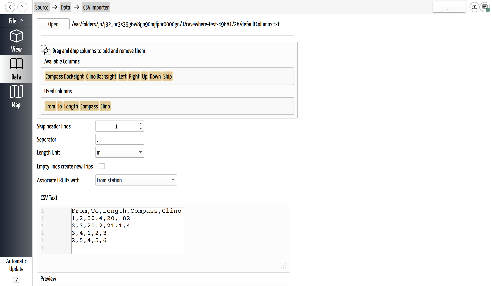

# Import a CSV or Spreadsheet

## Why / when you need this

Not every source of survey data is a Survex, Compass, or Walls file. Sometimes
it's a spreadsheet, or a plain export from a tool that only writes columns of
text. CaveWhere reads those too, but a bare table never says which column holds
the distance and which the compass, so importing a CSV is mostly the work of
*telling CaveWhere what each column means*.

Like every other import, this **adds a new cave** and never replaces what's
there. It arrives named **Imported CSV Cave** whatever the file was called, with
trips **Trip 1**, **Trip 2**, and so on. Plan on renaming.

## Open the importer

On the **Data** page, click **Import**, then **CSV (.csv)**. That opens the CSV
Importer, a page of its own. Click **Open** and pick your file; the dialog
offers `Comma Seperated (*.csv *.txt)` and `All files (*)`, so any extension
works.

Every control re-parses the file as you change it, though **Seperator** waits
until you leave the field.

*The CSV importer, its default 5 used columns matching the file.*

## Map the columns

The columns are 2 rows of draggable chips, shown above:

- **Used Columns**, the columns CaveWhere reads, *in the order your file has
  them*. It starts with 5: **From, To, Length, Compass, Clino**.
- **Available Columns**, the 7 meanings not in use yet: **Compass Backsight,
  Clino Backsight, Left, Right, Up, Down**, and **Skip**.

Drag between the rows, and inside **Used Columns** to reorder, until the used
order matches your file's. **Skip** stays behind in **Available Columns** when
you drag it out, so you can ignore any number of columns.

## Set the parsing options

| Setting | What it does |
|---------|--------------|
| **Skip header lines** | Lines at the top to ignore. Defaults to 1, since most exports write a row of column titles. |
| **Seperator** | The text between columns; the app really does spell it that way. Defaults to a comma, and takes any string, not just 1 character. Nothing validates it, so a wrong separator reads each line as one column, warning on all of them. |
| **Length Unit** | The unit the distance and LRUD numbers are already in, meters by default. It tells CaveWhere how to read them and converts nothing. |
| **Empty lines create new Trips** | Off by default. On, a blank line starts a new trip, splitting a multi-trip file on the way in. |
| **Associate LRUDs with** | Whether a row's L/R/U/D belongs to its **From station** (the default) or its **To station**. Pick the end your data dimensioned. |

## Check the preview, then import

**CSV Text** shows the raw file, **Preview** shows it as CaveWhere parsed it.
Both stop at the first 20 lines, header rows counted, until you press **More**;
**Less** puts the cap back. Ignore CSV Text's number gutter, which prints `1` on
every row. Take line numbers from the errors.

The **Status** box reads **Success** only when the parse produced no errors
*and* no warnings. Otherwise it counts and lists them:

> Looking for 5 columns but found 4 on line 4

Now the trap. A row whose **Length** reads 0, blank, or anything that is not a
number stops being a shot, unless it opens the trip. CaveWhere treats it as an
LRUD-only row, drops the reading, and hunts for a shot it already read between
those 2 stations to hang the dimensions on. Finding one is silent. Failing that,
you get:

> Can't set LRUD data for shot "5" because shot "3" to "5" on line 7.

If a shot is missing from the imported cave, suspect its length column first.

**Import** is disabled only while a *fatal* error stands, and the only one this
importer raises is a file it cannot open. Short rows and lost LRUDs
are warnings, so a badly mapped file imports happily. I recommend reading the
warning count rather than trusting the button.

Clicking **Import** adds the cave and takes you back to the Data page.

## Next steps

- [Import Surveys from Other Programs](import-surveys.md), for Survex, Compass,
  and Walls, which use a wizard instead.
- [Enter Survey Data](../survey-data/enter-survey-data.md), the survey table the
  imported shots land in.
