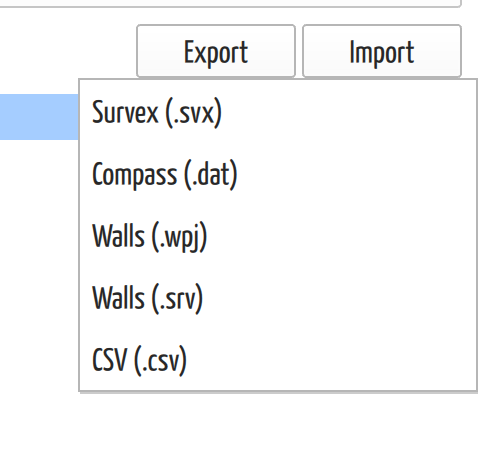
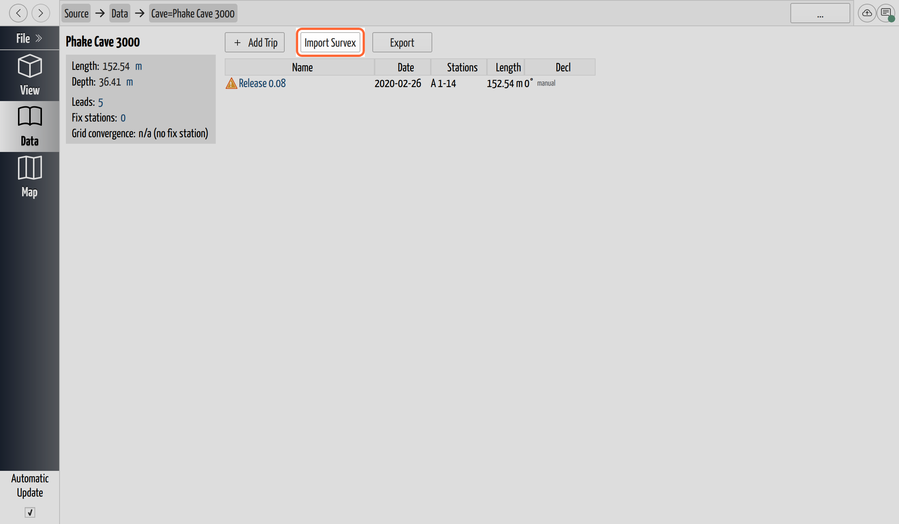

# Import Surveys from Other Programs

## Why / when you need this

Many caves already have survey data in another program before you start a
CaveWhere project. Import brings that data in — Survex, Compass, or Walls — so
you can carpet notes onto it and view it in 3D, without re-entering a single
shot.

Import always **adds to the project you already have open** — it never replaces
it. Each imported survey lands as one or more new caves alongside whatever is
already there, so importing into a project with work in it is safe: nothing you
had is touched.

## Where import lives

Import is on the **Data** page — the cave list you reach by clicking **Data** in
the sidebar. The **Import** button sits at the top, beside **Export**.

Import is a **desktop-only** feature. On a mobile build the Import and Export
buttons aren't shown at all.

The button opens a menu of formats:

*The Import menu. Each format opens its own file dialog; Survex and Walls go on
to the import wizard, CSV to its own page.*

| Menu item | File | Notes |
|-----------|------|-------|
| **Survex (.svx)** | A Survex data file | Opens the import wizard (below). |
| **Compass (.dat)** | A Compass data file | Imported directly, no wizard. |
| **Walls (.wpj)** | A Walls project file | Opens the import wizard. |
| **Walls (.srv)** | One or more Walls survey files | You can select several at once. Opens the wizard. |
| **CSV (.csv)** | A comma-separated table | Opens the [CSV importer](import-csv.md), a page of its own. |

## Survex and Walls: choose what becomes a cave

Survex and Walls files are *trees* — a project references surveys, which
reference more surveys, and CaveWhere can't know which level you think of as "a
cave" and which as "a trip." So instead of guessing, it shows you the tree and
lets you decide.

After you pick a file, a progress window parses it, then the import wizard opens.
It shows the survey blocks it found as a tree, and beside each block a dropdown
with three choices:

- **Don't Import _\<name\>_** — leave this block out.
- **_\<name\>_ is a Cave** — bring it in as a new cave.
- **_\<name\>_ is a Trip** — bring it in as a trip inside the cave above it.

The **Import** button stays disabled until you've marked at least one block as a
Cave or a Trip — importing nothing isn't a useful outcome, so the wizard won't
let you. A hint at the bottom (*"You need to select which caves you want to
import"*) says so while it's disabled.

If the file had parse problems, they appear in a tabbed error area at the bottom
of the wizard — **Survex Errors** or **Walls Errors** for problems reading the
file, and **Import Errors** for problems building caves from it. A warning
doesn't stop the import; it tells you a block came in with something CaveWhere
couldn't fully interpret.

When you click **Import**, the marked blocks become new caves and trips in the
open project.

> **A name that already exists doesn't merge.** If an imported cave has the same
> name as one already in the project, CaveWhere gives the new one a distinct name
> rather than folding the two together — import adds, it never combines. If you
> meant to extend an existing cave, import as a trip (below) or merge by hand
> afterward.

## Compass: imported directly

Compass import skips the wizard. You pick the `.dat` file and CaveWhere brings
its caves straight in. A **Compass import** job appears in the sidebar's
[job list](../getting-started/find-your-way-around.md) while it runs.

Compass files that don't parse cleanly produce *warnings*, not a hard failure —
you get whatever caves were readable, plus a dialog listing what was skipped and
why. The messages name the file and line, so a malformed row is easy to find in
the original.

## Import a Survex file as a new trip

The imports above all create new *caves*. There's a second, different Survex
import that creates a **trip** instead — useful when a `.svx` file *is* one
trip's worth of shots and you want it inside a cave you already have. This is the
usual way to bring in a centerline from a phone survey app: **TopoDroid**, for
instance, exports a trip's shots as a Survex file, and this is how that trip
lands in the cave you're building.

On a **cave** page, **Import Survex** sits beside **Add Trip**. It adds a new
trip to that cave and reads the Survex file into it, taking the date, team, and
calibration from the file and flattening all of its shots into the one trip.
Unlike the Data-page Import menu, this one is always available — it isn't
desktop-gated — and it doesn't open the wizard, because the outcome is fixed:
one file, one new trip, in the cave you're looking at.

*On a cave page, **Import Survex** brings a `.svx` file in as a new trip in that
cave — distinct from the Data page's Import menu, which brings surveys in as new
caves.*

## What import can't tell you

Import runs in the background and, apart from the Compass job and the Survex and
Walls progress window, reports only through the error dialog. When an import
finishes cleanly the new caves simply appear in the list. If you expected data
and don't see it, re-open the Import menu and check the error dialog didn't flag
the file — a Compass or CSV file with a fatal problem can come in empty rather
than refusing outright.

## Next steps

- [Import a CSV or Spreadsheet](import-csv.md) — map arbitrary columns to
  stations, distances, and LRUD.
- [Export Surveys to Other Programs](export-surveys.md) — the reverse trip, out
  to Survex, Compass, or Chipdata.
- [Organize Caves and Trips](../survey-data/caves-and-trips.md) — where imported
  caves and trips land, and how to rename them.
