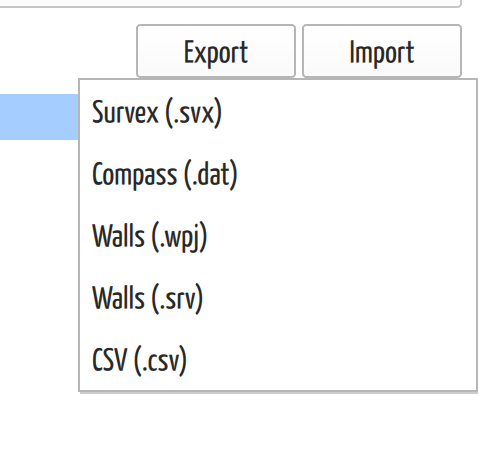
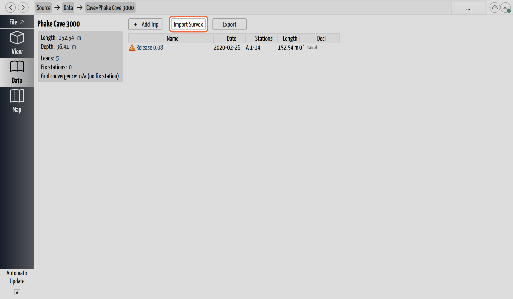

# Import Surveys from Other Programs

## Why / when you need this

Most caves have survey data in another program before the CaveWhere project
exists. Import reads Survex, Compass, and Walls files so you can carpet notes
onto that centerline and view it in 3D without retyping a shot.

Import **adds to the project you already have open**. Each file lands as new
caves beside whatever is there; nothing you had gets touched.

## Where import lives

Import is on the **Data** page, the cave list in the sidebar. The **Import**
button sits at the top beside **Export**, and both are desktop-only: a mobile
build shows neither.

The button opens a menu of 5 formats, see below.

*The Import menu. Survex and Walls go on to the wizard, Compass imports
straight in, CSV opens its own page.*

| Menu item | File | Notes |
|-----------|------|-------|
| **Survex (.svx)** | One Survex data file | Opens the import wizard. |
| **Compass (.dat)** | One Compass data file | Imported directly, no wizard. |
| **Walls (.wpj)** | One Walls project file | Opens the import wizard. |
| **Walls (.srv)** | Walls survey files | Select several at once. Opens the wizard. |
| **CSV (.csv)** | A comma-separated table | Opens the [CSV importer](import-csv.md). |

Survex and Walls remember the last file you picked (`LastImportSurvexFile` and
`LastImportWallsFile` in settings) and reopen the dialog there.

## Survex and Walls: choose what becomes a cave

Survex and Walls files are *trees*: a project references surveys that reference
more surveys. CaveWhere cannot know which level you call a cave and which a
trip, so it shows you the tree and lets you decide.

A progress window parses the file, then the wizard opens, titled **Survex
Importer** or **Walls Importer**. Select a block in the tree and the dropdown
offers 3 choices, each spelling out that block's name:

- **Don't Import _\<name\>_**
- **_\<name\>_ is a Cave**
- **_\<name\>_ is a Trip**

Marking a block as a Cave cascades one level: its children become trips, and
theirs become plain structure. Select more than one block and the dropdown goes
dead, so mark them one at a time.

The **Import** button stays disabled until at least one block is a Cave or a
Trip, with the hint *"You need to select which caves you want to import"* beside
it. Parse problems land in 2 tabs at the bottom: **Survex Errors** or **Walls
Errors** for reading the file, **Import Errors** for building caves out of it,
with an `Errors:` and `Warnings:` tally beside the button. Warnings never stop
an import.

Walls files carry their `#units` corrections into the trip's calibration.
`INCD` becomes the tape correction, `INCA` and `INCV` the front compass and
clino, `INCAB` and `INCVB` the back pair, and `TYPEAB` and `TYPEVB` tick the
corrected-backsight boxes. Their tolerance argument stays behind in Walls. Three
things CaveWhere reads and then refuses, warned once per import rather than once
per line:

> no-average backsights (e.g. #units typeab=C,2,X) are not supported by Cavewhere
>
> unit variance (e.g. #units uv=... uvv=... uvh=...) are not supported by Cavewhere
>
> LRUD type (e.g. #units lrud=to) is not currently supported by Cavewhere

A `#units` block that changes the calibration, or a new date, also starts a new
trip, so one `.srv` may arrive as several.

A name that already exists does not merge. CaveWhere appends a number instead:
a second *Fisher Ridge* lands as *Fisher Ridge 2*, a third as *Fisher Ridge 3*.
The comparison ignores case and rewrites `\ / : * ? " < > |` to `_` first, so
both `fisher ridge` and `Fisher/Ridge` still collide. To extend a cave you have,
import as a trip or merge by hand.

## Compass: imported directly

Compass import skips the wizard. You pick one `.dat` file, it comes in as one
cave, and a **Compass import** job runs in the sidebar's
[job list](../getting-started/find-your-way-around.md) meanwhile.

A `.dat` the parser cannot finish loses that whole cave, reported as a
*warning*, not a failure, so an import can finish with nothing imported and
nothing louder than a warning list. Milder problems CaveWhere fixes and warns
about: it trims a cave name over 80 characters to 80, and a survey team to 100.
Most messages name the file or the line, few name both.

## Import a Survex file as a new trip

The imports above create *caves*. A second Survex import creates a **trip**
instead, for when a `.svx` file is one trip's worth of shots and belongs in a
cave you already have. **TopoDroid**, for instance, exports a trip's shots as a
Survex file, and this is how that trip lands.

On a **cave** page, **Import Survex** sits beside **Add Trip**, see below. It
adds an empty trip and reads the file into it: date, team, and calibration from
the first block, then the shots from *every* block flattened into that one trip.
If your `.svx` holds more than one survey, I recommend the Data page's Import
menu instead, which keeps them apart. This button is not desktop-gated, and it
skips the wizard: the outcome is fixed, one file to one new trip in the cave you
are looking at.

*On a cave page, **Import Survex** brings a `.svx` file in as a new trip in that
cave, unlike the Data page's Import menu, which brings in whole new caves.*

## What import can't tell you

Import runs in the background and reports in 3 places only: the progress
window, the Compass job, and the error lists. A clean import simply makes new
caves appear. If you expected data and see none, check the errors: a Compass
file with a fatal problem comes in empty rather than refusing outright.

## Next steps

- [Import a CSV or Spreadsheet](import-csv.md): map arbitrary columns to
  stations, distances, and LRUD.
- [Export Surveys to Other Programs](export-surveys.md): the reverse trip, out
  to Survex, Compass, or Chipdata.
- [Organize Caves and Trips](../survey-data/caves-and-trips.md): where imported
  caves land, and how to rename them.
