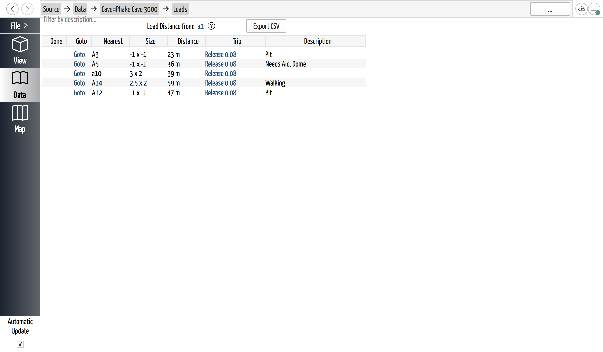
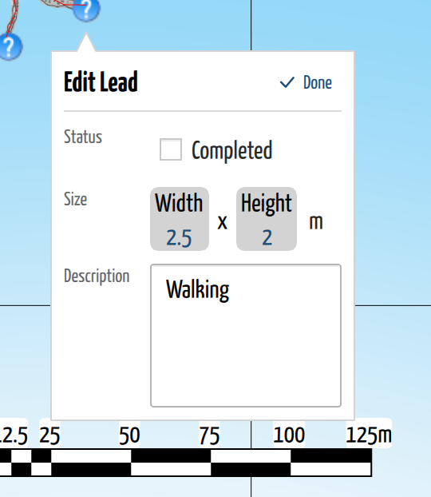

# Track and Export Leads

## Why / when you need this

Every cave you survey leaves passage you didn't get to — a pit you couldn't rig,
a crawl that kept going, a dome that needs aid. Marked on the drawings as you
[digitize a scrap](../scraps/digitize-a-scrap.md), these are the cave's
[leads](../concepts/glossary.md#lead): unexplored passage that still **goes**,
and the reason a team comes back.

Scattered across a dozen notes, leads are easy to lose track of. The **Leads
page** gathers every one in a cave into a single list you can sort, rank, and
take into the field. It answers the questions you ask when planning the next
trip: *What's still unpushed? How big is it — worth the walk? How far is it from
the entrance, or from wherever I'll already be? Which trip found it, so I can
read their notes?* And once a lead has been pushed, you tick it off so the list
always shows what's actually left.

## Open the Leads page

Leads belong to a **cave**. On the cave's page — the one with its trip table —
click the **Leads** link (it shows the current lead count) to open the list.

*The Leads page gathers every lead in the cave. Each row is one lead; the columns
rank and describe it, and the toolbar above holds the description filter, the
reference station the distance is measured from, and **Export CSV**.*

## Read the lead list

Each row is one lead. The columns are built for triage:

- **Done** — a check mark once the lead has been pushed. This column only
  *shows* the state; you set it when you [edit the lead](#edit-a-lead-and-mark-it-done),
  not here.
- **Goto** — jumps to the lead in the 3D view (see
  [below](#jump-to-a-lead-in-the-3d-view)).
- **Nearest** — the survey station closest to the lead, worked out for you. This
  is where the lead sits *in the cave*, so it's how you find it on a printed map
  or in the survey.
- **Size** — the passage size you estimated when you marked the lead, as width ×
  height (a dimension you didn't estimate reads as `-1`). The number that says
  whether it's a walking lead or a grim squeeze.
- **Distance** — the straight-line distance from a station *you* choose — see
  [Rank leads by distance](#rank-leads-by-distance-from-a-station).
- **Trip** — the trip whose notes the lead was drawn on; it's a link that
  **opens that scrap in the notes**, where the lead was marked.
- **Description** — whatever you typed about the lead ("Needs aid, dome",
  "Walking", "Pit").

Click any column header to **sort** by it — sort by Size to find the big going
passage, by Distance to find what's near where you'll be. On a narrow window the
table becomes one lead per row, and the header sort is replaced by a **Sort**
dropdown and an ascending/descending button.

To narrow a long list, type in the **Filter by description** box — it keeps only
the leads whose description contains what you type (so "pit" finds every pit).

If the page is empty, it reads *"There's no leads. Add them in during
carpeting"* — leads are created on the drawings, not here. See
[Digitize a Scrap](../scraps/digitize-a-scrap.md#mark-leads).

## Rank leads by distance from a station

The **Distance** column is the planning tool. Set **Lead Distance from** (in the
toolbar) to a station — the entrance, a camp, or wherever the next trip will
already be — and every lead's Distance becomes its **line-of-sight** distance
from that station. Sort by Distance and the list orders itself by how far each
lead is from that point: the cheap wins float to the top, the far corners sink to
the bottom.

It's line-of-sight — a straight line through the rock, not passage walked — so
it's a rough "how far away" for ranking, not a survey length. Until you pick a
station the column reads `0 m` for every lead.

The station name you set here also labels the distance column in the
[exported CSV](#export-the-list-to-csv), so the field list carries the same
reference you planned against.

## Jump to a lead in the 3D view

Leads don't just live in a list — because each one is anchored inside a scrap,
carpeting morphs it onto the survey, so it appears in the
[3D view](../view-3d/the-3d-view.md) as a **question-mark marker** sitting where
the passage actually is.

Click **Goto** on a lead's row to fly there: CaveWhere switches to the 3D view,
centres the camera on the lead, and selects its marker. Clicking a marker in the
3D view directly does the same — it opens a small **Lead** popup with the lead's
details and, at the bottom, **Open in Notes** to jump back to the drawing it was
marked on.

Leads share the 3D view's [layer controls](../view-3d/the-3d-view.md): they can
be shown or hidden as a group, so you can clear the question marks off a busy
model and bring them back when you're planning.

## Edit a lead and mark it done

A lead's **description**, **size**, and **done** state are edited on the lead
itself — either in the 3D view or back on the note — not in the list (the Leads
page's Done column is display-only). In the 3D view, click a lead's marker to
open its popup, then click **Edit**:

*Selecting a lead in the 3D view opens its popup; **Edit** turns it into a form
with the lead's status, size, and description. The other question-mark markers
are the cave's remaining leads.*

- **Completed** — tick it once the lead has been pushed. A completed lead drops
  off the 3D model (its marker hides so only the open leads clutter the view) and
  gets its check mark in the Leads list. Untick it if it turns out to still go.
- **Size** — the passage width and height, with a unit; leave it blank if you're
  not sure.
- **Description** — free text about the lead.

You can also edit a lead the same way on its note: in **Carpet** mode, select the
lead marker on the drawing and its **Lead Info** panel offers the same fields.
Either way you're editing the one lead — the Leads page, the 3D popup, and the
note all read and write the same thing.

## Export the list to CSV

To take the leads into the field or into a spreadsheet, click **Export CSV** and
choose where to save. CaveWhere writes a comma-separated file with one row per
lead and these columns:

`Completed`, `Nearest Station`, `Trip`, `Size Width`, `Size Height`,
`Size Units`, `Distance to <station> (m)`, and `Description`.

Two things carry over from how you've set the page up. The distance column is
headed with the **reference station** you chose above (or *Distance to Reference
Station* if you didn't pick one), so the file records what the distances are
measured from. And the rows come out in the **order the list is currently
showing** — so filter to just the going leads, sort them by distance, and the
CSV lands already trimmed and ranked for the trip. The export runs in the
background; it appears as an *Export Leads CSV* job while it writes.

## Where to go next

- **[Digitize a Scrap](../scraps/digitize-a-scrap.md#mark-leads)** — where leads
  come from: marking the "go" on a drawing in Carpet mode.
- **[The 3D View](../view-3d/the-3d-view.md)** — navigate the model the leads are
  morphed onto, and show or hide them with layers.
- **[Glossary](../concepts/glossary.md#lead)** — lead, scrap, and the other
  survey terms.
