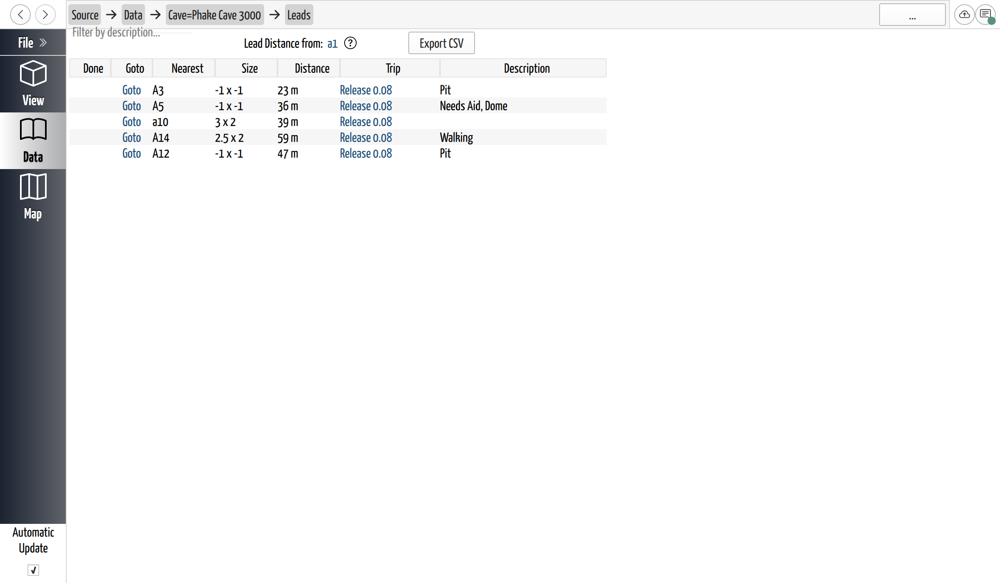
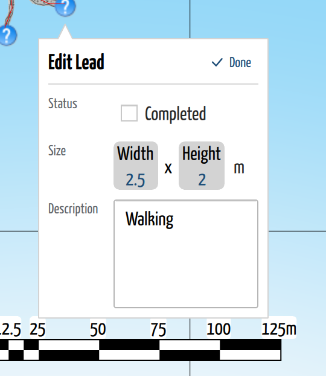

# Track and Export Leads

## Why / when you need this

Every cave you survey leaves passage you did not get to: a pit you could not
rig, a crawl that kept going, a dome that needs aid. Marked on the drawings as
you [digitize a scrap](../scraps/digitize-a-scrap.md), these are the cave's
[leads](../concepts/glossary.md#lead), unexplored passage that still **goes**.

Spread across the notes, leads get lost. The **Leads page** collects every one
in a cave into a single sortable list. That list is what you want when planning
the next trip. It answers what is still unpushed, how big it is, how far it sits
from where the team will already be, and which trip found it.

## Open the Leads page

Leads belong to a **cave** (not to a trip), so each cave keeps its own list. On
the cave's page, the **Leads:** row shows the count as a link. Click the number
to open the list, shown below.

*Every lead in the cave, one per row, with the filter, the reference station and
**Export CSV** on the toolbar above the table.*

## Read the lead list

The screenshot above shows all 7 columns. Each row is one lead:

- **Done** shows a check mark once the lead has been pushed. The column only
  displays the state; you set it when you
  [edit the lead](#edit-a-lead-and-mark-it-done).
- **Goto** flies to the lead in the 3D view.
- **Nearest** names the station closest to the lead *on the same scrap*,
  measured across the drawing rather than through the cave. The drawback: a lead
  near the edge of one scrap may name a station further off than one sitting
  just over the border. A scrap traced without stations leaves the cell blank.
- **Size** reads width x height, unlabeled, in the trip's distance unit. A
  dimension you did not estimate reads -1, so 4 x -1 means 4 across and a
  height nobody wrote down.
- **Distance** gives the line-of-sight distance from a station you choose,
  rounded to a whole number of meters and labeled m (even in a project set to
  imperial units).
- **Trip** links to the scrap the lead was drawn on.
- **Description** carries whatever you typed: "Needs Aid, Dome", "Walking".

The list arrives unsorted. Click a header to sort by that column, and
watch for two things. Completed leads gather at one end whichever column you
pick, because the sort compares the Done state first. And Size sorts as text,
which files 10 x 2 ahead of 3 x 2 instead of after it. I recommend ranking by
Distance and reading Size off the row, since a Size sort will not surface the
big passage.

Narrow the window and each lead collapses to one wrapped line, the headers replaced
by a **Sort** dropdown of the 6 sortable columns and an ascending/descending
button.

**Filter by description...** matches as a wildcard rather than as plain text.
`pit*dome` finds a description with both words in that order, and a typed `?`
matches any single character rather than a literal question mark.

An empty list, or one filtered to nothing, reads
*"There's no leads. Add them in during carpeting"* (you
create leads on the drawings, never here). See
[Digitize a Scrap](../scraps/digitize-a-scrap.md#mark-leads).

## Rank leads by distance from a station

CaveWhere seeds **Lead Distance from** (top of the screenshot above) with the
first station of the cave's first trip, so the column already holds numbers when
the page opens. Set it to whatever the next trip cares about: the entrance, a
camp, the foot of the big pit. The ⓘ button beside the field explains it:

> Lead distance from a station, calculates the **line of sight** distance from
> the station to all the leads.

Straight through the rock, not passage walked: good for ranking, never a survey
length.

Type a name the cave does not know and nothing complains. The lookup fails
quietly: the field keeps your text and every Distance falls to 0 m. Clear the
field and it reads *No Station*.

## Jump to a lead in the 3D view

A scrap owns each of its leads, so carpeting morphs them onto the survey along
with the outline. Each one turns up in the
[3D view](../view-3d/the-3d-view.md) as a question-mark marker sitting where the
passage really is.

**Goto** switches to the 3D view, centers the camera on the lead, and selects
its marker. Clicking a marker selects it too, opening a small **Lead** popup with
**Open in Notes** at the bottom to get back to the drawing.

Every lead carries a `Type=Lead` keyword plus its scrap's own keywords, so the
[keyword filter](../view-3d/layers-and-keywords.md) can hide leads on their own
or hide them along with their scrap. **File → Debug → Leads Visible** switches
the whole set off at once.

## Edit a lead and mark it done

You edit a lead's description, size and done state on the lead itself, either in
the 3D view or back on the note. Click a marker, then click **Edit**, as shown
below:

*Selecting a lead opens its popup; **Edit** turns status, size and description
into inputs. The other question marks are the cave's remaining leads.*

- **Completed** ticks the lead off once it has been pushed. Its marker then
  drops out of the 3D view unless you select it, when it comes back dimmed to
  60% opacity, and its check mark appears on the Leads page. Untick it if the
  lead turns out to still go.
- **Size** takes a width and a height. The `m` or `ft` beside them is read-only,
  set by the trip's distance unit. An omitted dimension stores as -1,
  shown `?` in Lead Info and `-1` on the Leads page; with both blank the panel
  reads *Not set*.
- Free text goes in **Description**, the only column the filter searches, so
  write the words you will later go looking for.

The same fields sit on the note: in **Carpet** mode, select the lead marker and
the **Lead Info** panel offers them. Out of edit mode the popup shows a status
pill reading *Open lead* or *Completed*. Both editors write the lead the Leads
page only reads.

## Export the list to CSV

**Export CSV** opens a save dialog titled *Export leads to CSV*. CaveWhere adds
the `.csv` extension if you leave it off, and truncates whatever the name
already holds. The button stays disabled while the filtered list is empty. The
file carries 8 columns:

`Completed`, `Nearest Station`, `Trip`, `Size Width`, `Size Height`,
`Size Units`, `Distance to <station> (m)`, and `Description`.

`Completed` writes `Yes` or `No`. The distance goes in at up to 12 significant
digits, not whole meters, and its header names your reference
station, falling back to `Distance to Reference Station (m)`. Rows come out in
the order the page is showing, filter and sort included, so trim and rank the
list first and the CSV lands ready for the trip.

The write runs in the background as an *Export Leads CSV* job. **If opening the
file fails, nothing tells you.** The job finishes, the complaint goes to the
console, and no file appears. Check the folder before you shut the laptop.

## Where to go next

- **[Digitize a Scrap](../scraps/digitize-a-scrap.md#mark-leads)** for where
  leads come from: marking the go on a drawing in Carpet mode.
- **[The 3D View](../view-3d/the-3d-view.md)** to navigate the model that
  carries the leads.
- **[Glossary](../concepts/glossary.md#lead)** for lead, scrap and the other
  survey terms.
