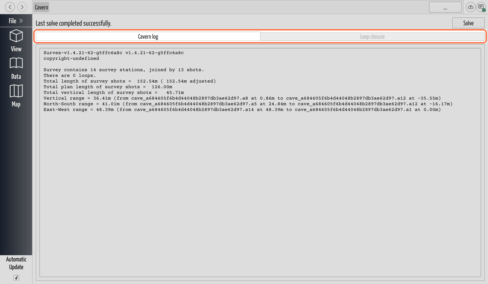

# Check Loop Closure and Find Blunders

## Why / when you need this

Every instrument reading carries a little error. When a survey route returns to a
station it already visited (a **loop**), the 2 paths to that station almost never
meet exactly. That gap, the
**[misclosure](../concepts/glossary.md#loop-closure)**, is the best cross-check
your data has. A small gap is the instruments behaving like instruments; a
*large* one almost always means a **blunder**: a transposed digit (`173` written
`137`), a compass read backwards, a distance typed into the wrong row.

Catch it while you still remember the trip and can re-check the book.

## CaveWhere closes loops for you

You never run loop closure as a separate step. CaveWhere embeds
[Survex](../concepts/glossary.md#survex) 1.4.21 and calls its `cavern` solver
in-process every time your survey data changes. `cavern` performs a
**least-squares network adjustment**. Rather than dumping the misclosure onto the
last shot, it spreads the error across the loop, weighted by each leg, and
settles on the most likely position for every station. That adjusted
[line plot](../concepts/glossary.md#loop-closure) is what
[The 3D View](../view-3d/the-3d-view.md) shows.

Fixing a blunder therefore repairs everything downstream: the network re-solves,
the loop closes, and any [carpeted](../concepts/glossary.md#carpeting) sketches
re-carpet to follow. See
[Why an edit ripples](../concepts/data-model.md#why-an-edit-ripples).

One checkbox governs all of it. Clear **Automatic Update** at the bottom of the
sidebar and the solve stops, so loop closure stops with it. The report on screen
then describes your last solve, not your current data, with no warning. See
[Carpeting is automatic](../scraps/carpeting.md#carpeting-is-automatic).

## Open the Cavern Output page

The report lives on the **Cavern Output** page. Open it from the **Data** page:
click the **☰** menu button at the right of the region's name row and choose
**Cavern Output**. The **File** menu reaches it as **Cavern Output…**. After a
failed solve both items rename themselves, to **Cavern Output (solve error)**
and **Cavern Output… (solve error)**, so a bad solve announces itself.


*The Cavern Output page, with the Loop closure tab grayed out.*

The page above carries 4 things. A **status line** reads either **"Last solve
completed successfully."** or, in red, **"Cavern reported an error during the
last solve."** with cavern's own message below it. A **Solve** button re-runs
cavern on demand, rarely needed. A **Cavern log** tab holds the `.log` file. A
**Loop closure** tab holds the `.err` file, enabled only when that file has
content, which Survex writes only for a cave with loops.

The `.log` and `.err` files live in a temporary directory CaveWhere deletes after
each solve, so nothing lands in your project folder and these read-only panes
hold the only copy. Before the first solve, the log pane reads
**"No cavern output to display."**

### What the Cavern log tells you

The log reports the survey:

```
Survey contains 14 survey stations, joined by 13 shots.
There are 0 loops.
Total length of survey shots =  152.54m ( 152.54m adjusted)
```

**"There are *N* loops"** tells you whether this cave has anything to close. The
figure in parentheses is the length *after* adjustment, so the 2 side by side
show how much the solve stretched or shortened your measured lengths. Phake Cave
3000 has nothing to adjust, so both read 152.54 m.

Expect one thing to look broken: station names come out as
`cave_a684605f6b4d44048b2897db3ae62d97.a8`, not `a8`. CaveWhere prefixes each
cave with `cave_` and its 32-character internal id so it can map cavern's
stations back. Your name follows the dot.

## Read the loop-closure report

The **Loop closure** tab shows the `.err` file exactly as Survex writes it. It
holds one block per **traverse**, not one per loop. A traverse is a run of legs
between 2 junctions (or a junction and a fixed point), and Survex reports only
those inside a loop, skipping any *articulation* leg whose removal would split
the survey. So a dead-end side passage never appears, a loop-free cave leaves the
file empty, and a loop built from 3 junction-to-junction runs prints 3 blocks,
not 1.

A block, with a blunder in it:

```
a1 - a2 - a3 - a4 - a5 - a1
Original length  78.40m (  5 shots), moved   1.83m ( 0.37m/shot). Error   2.33%
2.470000
H: 2.900000 V: 0.710000
```

Names carry the same `cave_` prefix as in the log, cut short above. Line by line:

- **The station line** names the traverse's stations, joined by ` - ` (` = ` for
  an *equate*, `<fixed point>` for a station with no name of its own).
- **Original length** is the measured length, over that many **shots**.
- **moved** is the misclosure vector itself: how far the adjustment shifted
  things to pull the traverse shut.
- **Error** is `100 × moved ÷ Original length` and nothing more. Scan for this
  one. A traverse of zero measured length prints `Error    N/A` instead.
- **The bare number on the third line** is E, split into horizontal **H** and
  vertical **V**. Each takes the square root of the actual squared error divided
  by the squared error your instruments should produce. That puts the line at
  1.0: at E = 1.0 the traverse closed exactly as well as the gear allows. The
  2.47 above ran nearly 2.5 times worse, and that gap is what a blunder looks
  like. A high **H** with a low **V** points at the compass or the tape; a high
  **V** points at the clino.

## How good is good enough?

No pass/fail line exists; Survex enforces nothing. The bands below are house
guidance for reading the **Error %**, not a rule the software applies, and the
right target depends on traverse length, instruments and care.

- **Under about 0.5%.** A tight traverse. Careful work with a laser rangefinder
  (a DistoX, say) routinely does this well or better.
- **0.5% to 2%.** Normal for a long traverse, or for compass, clino and tape. The
  adjustment absorbs it without visibly distorting the map.
- **Above about 2%, go looking.** Past roughly 5% you almost certainly have a
  blunder rather than accumulated noise.

Two things keep that percentage honest. It depends on traverse length: a fixed
reading error takes a bigger slice of a 20 m loop than of a 200 m one, so
check the absolute **moved** distance too. E, H and V have no such problem: they
compare the misclosure against what your instruments should produce. A high
**Error %** with E near 1.0 means a short traverse, not a blundered one.

I recommend reading E first and the percentage second, and trusting E when the 2
disagree. Above, 2.33% might pass for a long, sloppy loop, but E at 2.47 says
otherwise.

## Track down the blunder

The report names a traverse, not a leg. Three techniques narrow it to the one
wrong reading.

### Check the front/back sight warning first

If you shot the leg both ways, CaveWhere flags a foresight and backsight
disagreeing by more than **2°** right in the survey table, as **"Frontsight and
backsight differs by *x*°"** (see
[Fix Survey Errors](../survey-data/survey-errors.md)). That is the sharpest
per-shot signal you have.

### Walk the traverse for the usual suspects

In [Entering Survey Shots](../survey-data/enter-survey-data.md), read the
traverse's legs down **Station**, **Distance**, **Compass** and **Vertical
Angle**, looking for:

- a **transposed digit**, `173` typed as `137`.
- a **Compass** reading about 180° off, shot the wrong way and not marked as a
  backsight.
- a **Distance** typed into the wrong row.
- an **up** or a **down** in **Vertical Angle** where a number belongs.

A blunder is usually one gross mistake, not a scatter of small ones.

### Break the tie-in on purpose

Not every blunder is a bad reading. A **tie-in error** is a bad *connection*: two
runs of passage joined at the wrong station, usually a mistyped or reused name.
The measurements are fine and the topology is wrong. Survex has to honor the
connection you declared, so it hauls the second run across the cave to reach the
station you named, and the traverse closes badly.

To find the station that run really meets, open the loop on purpose: add a
character, an `x` say, to one tie-in station's name so it stops matching its
counterpart.


*Renaming A2 to A2x breaks the junction and frees the run.*

That does not break the plot, as the right panel above shows. The survey stays
connected through the loop's other end, and the freed end floats out to where its
own shots put it. Look at it in the 3D view. It lands nearest the station it
*should* tie to, so rename it to that station and the loop closes.

This works best on a loop with a small error, since the free end then drops
almost exactly onto the right station. On a badly closing loop it may land
between 2 stations and settle nothing, and if it lands back on the name it
already carried, the tie-in held.

### What CaveWhere will not tell you

A large closure error puts no red or yellow badge on any survey cell. Those
badges come from data checks (a missing reading, a name that fails to connect), a
separate system from loop closure. A misclosure surfaces in exactly one place:
the Cavern Output report.

## When there are no loops

**"There are 0 loops."** describes the shape of the survey, not a problem. A cave
that never reconnects to itself is a tree with nothing to close, which is why
Phake Cave 3000 leaves the `.err` file empty and its **Loop closure** tab grayed
out. Loops appear the moment 2 runs of passage meet, whether a lead pushed
through or a new trip tied back onto an existing station. Until then the 2° front
and back sight check is your only in-survey cross-check, and only on the legs you
shot both ways.

## Where to go next

- **[Fix Survey Errors](../survey-data/survey-errors.md)**: survey-table errors
  and warnings, including the 2° front and back sight check.
- **[Why CaveWhere](../concepts/why-cavewhere.md#keeping-the-map-correct-loop-closure)**:
  the reasoning behind an always-current, always-closed 3D map.
- **[How a Project Is Organized](../concepts/data-model.md#why-an-edit-ripples)**:
  why fixing one shot moves stations elsewhere and re-carpets old sketches.
