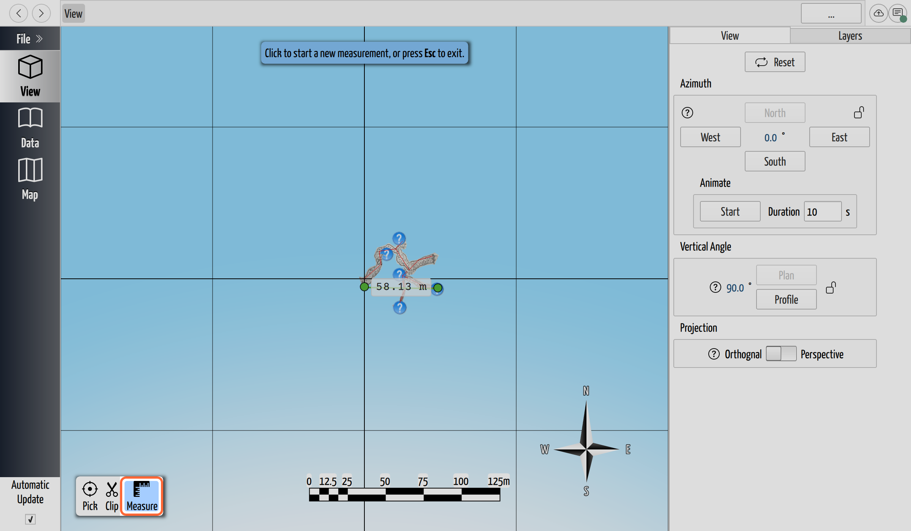
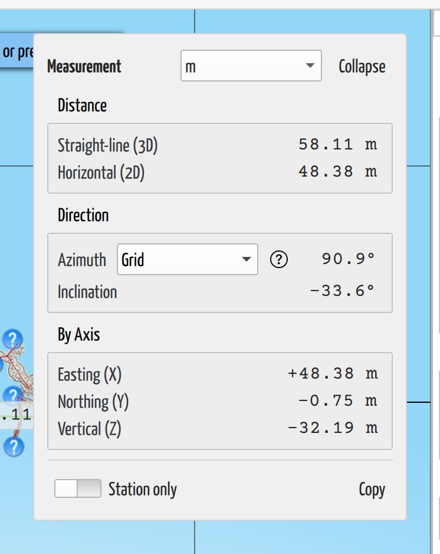

# Measure Distance and Bearing

## Why / when you need this

Once a cave is in the [3D view](../view-3d/the-3d-view.md), you'll want to ask
concrete questions of it: *How far is it from this station to that one? Which way
does this dead-end lead actually point, so I know where to dig from the surface?
How much does this passage climb between here and there?* The **measurement tool**
answers all three at once. You pick two points in the view and CaveWhere reports
the straight-line distance, the compass bearing, and the vertical angle between
them — the same numbers you'd get from a shot, but taken off the finished model
rather than measured underground.

It's a scratch-pad measurement, not survey data: it lives only as long as you're
looking at it, and picking a new pair replaces it. Nothing you do here changes the
survey.

## Open the measurement tool

Measuring happens in the **3D view**. In the floating toolbar at the bottom-left
of the view — the same one that holds the coordinate **Pick** and **Clip** tools —
click **Measure** (the ruler icon, tooltipped *Measure distance and bearing*).

*The Measure tool (highlighted) sits in the 3D view's toolbar, beside the
coordinate picker and the clip tool; clicking it again turns it back off. Here a
completed measurement runs between two points, its distance labelled on the line.*

You can still orbit, pan, and zoom while the tool is active — left-click is
reserved for placing points, but the usual right-drag and scroll gestures keep
working, so you can reframe the cave mid-measurement to line a shot up.

## Place two points

A measurement runs between **two points**. As you move the cursor over the model,
a marker previews where the next point will land:

1. **Click to place the first point.** A help box at the top of the view walks you
   through it: *"Click to place the first point."*
2. **Move the cursor** and a live preview stretches from the first point to the
   cursor, with the running distance shown on the connecting line — so you can read
   a distance just by hovering, before you commit the second point. The help box now
   reads *"Click to place the second point."*
3. **Click to place the second point.** The measurement freezes and the full
   readout appears (see below). The help box switches to *"Click to start a new
   measurement, or press `Esc` to exit."*

Clicking again starts a fresh measurement, and **`Esc`** puts the tool away. Only
one measurement exists at a time.

### Snap to a survey station

Where the tool places a point depends on what's under the cursor. By default
(**Free** placement) a click lands wherever your line of sight meets the model — a
passage wall, the point cloud, anywhere. When the cursor is near a **survey
station** on the centerline, though, the marker changes to a ring and the point
**snaps exactly to that station**, so a station-to-station measurement is precise
rather than eyeballed.

To measure *only* between stations, turn on the **Station only** switch in the
readout panel. Clicks then place a point only when they snap to a station and
do nothing over open passage — which is what you want when the number has to be a
true station-to-station distance, not "roughly wall to wall".

A point behind a wall can't be snapped: the wall is hit first, so the tool never
picks a station you can't actually see. Orbit until the station is in view.

## Read the measurement

With both points down, a **Measurement** panel appears in the top-right of the view.
It groups the numbers the way a surveyor thinks about a shot:

*The measurement between two points. Distance, direction (azimuth and inclination),
and the signed east/north/up components, each in the chosen unit.*

- **Distance**
    - **Straight-line (3D)** — the direct distance between the two points, through
      the air.
    - **Horizontal (2D)** — the distance ignoring height, i.e. the length of the
      shadow it would cast on a map. The gap between this and the 3D distance is how
      steep the line is.
- **Direction**
    - **Azimuth** — the compass bearing from the first point to the second,
      `0–360°`. Which "north" this is measured from is up to you — see
      [the next section](#choose-which-north-the-azimuth-uses).
    - **Inclination** — the vertical angle, `−90°` (straight down) to `+90°`
      (straight up), `0°` being level.
- **By Axis** — the same displacement broken into signed components:
  **Easting (X)**, **Northing (Y)**, and **Vertical (Z)**. The sign carries the
  direction — a negative vertical means the second point is *lower* than the first,
  a negative easting means it's *west* — so this is the group to read for "which way
  and how far down".

A **unit selector** in the panel header switches every length between **metres,
kilometres, feet, and miles** at once; it defaults to metres and remembers your
choice. Every value is selectable text, and the **Copy** button drops the whole
readout — distances, bearing, and axis components — onto the clipboard as text,
ready to paste into notes. On a narrow view the panel collapses to just the
distance; the **Expand** button in its header brings the full breakdown back.

## Choose which north the azimuth uses

A bearing is only meaningful once you say *north of what* — and, as the
[three norths](../concepts/coordinate-systems.md#three-norths) come apart the moment
a cave is placed on a map, the tool lets you pick. The selector beside the
**Azimuth** row offers three references; the **?** button beside it spells them out
in the app. The mnemonic is **Grid = the map, True = the globe, Magnetic = your
compass**:

- **Grid** — north of the coordinate grid the model is drawn in (the UTM grid
  lines, say). This is the default, and it's the north that matches the 3D view, the
  survey's own coordinates, and a printed map, so a grid bearing is what you'd
  transfer straight onto a plan.
- **True** — geographic north, toward the pole. It differs from grid north by the
  [grid convergence](../georeferencing/grid-convergence.md) at this spot — the lean
  between the map's grid and the real meridians.
- **Magnetic (today)** — where a compass points *now*. It differs from true north by
  the magnetic [declination](../concepts/coordinate-systems.md#magnetic--true-declination),
  which drifts year to year, so CaveWhere computes it for **today's date** at this
  location. This is the bearing to give someone who'll walk the surface with a
  compass in hand. Because it's tied to today, it's a live reading, not a stored one.

**True and Magnetic need the cave [georeferenced](../georeferencing/grid-convergence.md).**
Converting a grid bearing to true or magnetic takes a real-world position and
coordinate system, so on a local, un-georeferenced cave those two options are greyed
out and only **Grid** is offered — there, "grid north" is simply straight up the
model's own axes. Georeference the cave and all three switch on. Hover the azimuth
value to see the exact convergence and declination being applied; if a coordinate
system is set but can't be resolved, the value reads **n/a** and the tooltip says
why.

## Next steps

- [The 3D View](../view-3d/the-3d-view.md) — navigate and aim the view you're
  measuring in.
- [Understand Grid Convergence](../georeferencing/grid-convergence.md) — why a true
  bearing and a grid bearing differ, and by how much.
- [Directions and Coordinate Systems](../concepts/coordinate-systems.md) — the three
  norths in full, and what georeferencing gives a cave.
</content>
</invoke>
