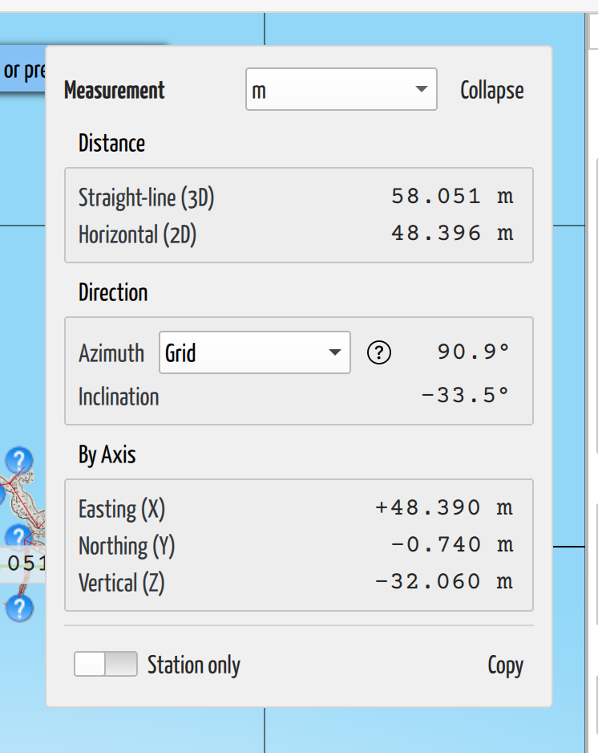

# Measure Distance and Bearing

## Why / when you need this

The cave sits in the [3D view](../view-3d/the-3d-view.md) and you want a number
off it. Pick 2 points and the **measurement tool** reports the straight-line
distance, the bearing, and the vertical angle between them.

A shot carries those same 3 numbers, but these come from the finished model, not a
tape. The 3D view draws the *solved* survey, so a measurement inside a loop
hands you the adjusted geometry, not what you wrote in the book. Treat it as a
scratch pad: a new pair replaces the old one, `Esc` throws it away, and nothing
reaches the project file.

## Open the measurement tool

The floating toolbar at the bottom-left of the 3D view holds **Pick**, **Clip**,
and **Measure**. Click **Measure**, the ruler icon, tooltipped *Measure distance
and bearing*. The 3 take turns, and clicking **Measure** again hands the view back
to the turn-table. Leaving the tool discards the measurement, so `Esc` doubles as
the delete key.

The cursor becomes a crosshair. Orbit and zoom keep working, because right-drag
and scroll pass through to the turn-table. Panning doesn't: the turn-table pans on
left-drag and the tool has taken left-click, so nothing is left to forward. Press
`Esc` and pan with the tool off.

## Place two points

Hover the model and a marker previews where the next point will land. The help box
at the top of the view says what a click will do:

1. **Click to place the first point.** The box reads *"Click to place the first
   point."*
2. **Move the cursor.** A rubber band stretches to the cursor with the running
   distance on a chip at its midpoint, so you can read a distance before
   committing. The box reads *"Click to place the second point."*
3. **Click to place the second point.** The measurement freezes, the line
   thickens, and the readout panel appears. The box switches to *"Click to start a
   new measurement, or press **Esc** to exit."*

Only 1 measurement exists at a time. The band draws thin and faded while you
choose the second point. It switches to the danger color at full strength where a
click would place nothing: the ray missed every piece of geometry, or **Station
only** is on and you are not over a station.

### Snap to a survey station

By default (**Free** placement) a click lands wherever your line of sight meets
the model: a morphed scrap, a point cloud, anywhere. That answer is approximate by
construction, because the surface came out of somebody's traced outline. Pass
within **1.5 mm** of a **survey station** and the marker swaps its filled dot for
a hollow ring. The point then **snaps exactly to that station**. That tolerance is
physical millimeters on the glass, not pixels.

Snapping only reaches the centerline, and a station hidden behind a wall never
snaps, because the wall returns the nearer hit. Orbit until it comes into view.
Where stations crowd into that 1.5 mm the snap may take a neighbor, so zoom in
until they separate.

To measure *only* between stations, turn on the **Station only** switch at the
bottom of the readout panel. Clicks then land only where they snap to a station,
and do nothing over open passage. That panel exists only once a measurement is
complete, so you can't arm Station only before your first one. Measure any 2
points, flip the switch, then measure the pair you wanted. Flipping it
mid-measurement gates only what happens next.

The mode lasts the session and no longer, as does the unit. Of the three, only
the north reference persists to disk. Within a session the help box reads
*"Click a survey station to start measuring."*

**I recommend leaving Station only off** for most work, and turning it on for the
measurement you plan to write down.

## Read the measurement

With both points down, a **Measurement** panel appears in the top-right.

*The Measurement panel, the same vector shown 3 ways.*

Every group carries the same vector in different clothes, in selectable monospace
text. Angles read to 1 decimal place, and lengths to the millimeter: 3 decimals
in meters, 2 in feet, so either unit resolves the same distance.

- **Distance** gives **Straight-line (3D)**, `58.051 m` here, the direct distance
  through the air, and **Horizontal (2D)**, `48.396 m`, the shadow the line would
  cast on a map.
- **Direction** gives the **Azimuth**, `90.9°`, the bearing from the first point
  to the second in the range `0-360°`, and the **Inclination**, `-33.5°`, from
  `-90°` straight down to `+90°` straight up.
- **By Axis** splits the displacement into signed **Easting (X)**, **Northing
  (Y)**, and **Vertical (Z)**. A positive value carries an explicit sign,
  `+48.390 m`, and a value that rounds to zero prints no sign at all.

No panel appears during the live preview, so a bearing costs both points.

### Units and copying

The **unit selector** in the panel header switches every length at once between
**m**, **km**, **ft**, and **mi**. It starts on whatever the project's unit system
implies, meters for metric and feet for imperial. Pick a unit yourself and it
holds for the session, for reading one measurement in feet without touching the
project. Nothing is written to disk, so the selector goes back to following the
project the moment its unit system changes — the project setting stays the one
that decides.

**Copy** drops the whole readout on the clipboard as plain text, laid out like the
panel. Its azimuth line carries the reference in parentheses, `grid`, `true`, or
`magnetic, today`, so nobody can misread a pasted bearing later.

## Choose which north the azimuth uses

A bearing means nothing until you say north of what. The
[three norths](../concepts/coordinate-systems.md#three-norths) come apart the
moment a cave lands on a map. The selector sits in the **Azimuth** row. The
mnemonic: **Grid = the map, True = the globe, Magnetic = your compass**.

- **Grid** means north of the coordinate grid the model gets drawn in, the UTM
  grid lines, say. It is the default and needs no coordinate system, because
  CaveWhere draws the scene with **+X east, +Y north, and +Z up**, so grid north
  amounts to the +Y axis.
- **True** means geographic north, reached by adding the
  [grid convergence](../georeferencing/grid-convergence.md) at this spot.
- **Magnetic (today)** means where a compass points now: true north less the
  magnetic
  [declination](../concepts/coordinate-systems.md#magnetic-to-true-declination).

Counting both corrections east-positive:

> **true = grid + convergence**
> **magnetic = grid + convergence − declination**

CaveWhere evaluates both at the **first** point you placed, not the midpoint, with
no interpolation to the second. The declination comes from the IGRF-14 model that
ships with Survex, for **today's date in UTC**. That is not the date on your
[trip's declination](../survey-data/declination.md), so a cave surveyed in 2004
and a bearing read off it today may not agree.

**True and Magnetic need the cave
[georeferenced](../georeferencing/grid-convergence.md).** On a local cave both
rows stay in the list but come up grayed out, leaving **Grid** as the only one you
can pick. Georeference the cave and all 3 switch on.

Three more things before you trust a bearing. **Losing the coordinate system snaps
the selection back to Grid**, rather than leaving the readout reporting a stale
correction. **A set but unresolvable coordinate system reads `n/a`**, never a
silently wrong grid number, with the reason in a tooltip. And a *geographic*
coordinate system makes True equal Grid, because latitude and longitude have no
grid to lean against, so the convergence comes out 0. The cave page reports that
case as `n/a (geographic CS)`, which looks like a failure but is not.

## Next steps

- [The 3D View](../view-3d/the-3d-view.md) to aim the view you measure in.
- [Understand Grid Convergence](../georeferencing/grid-convergence.md) for why
  true and grid bearings differ.
- [Directions and Coordinate Systems](../concepts/coordinate-systems.md) for the
  3 norths in full.
