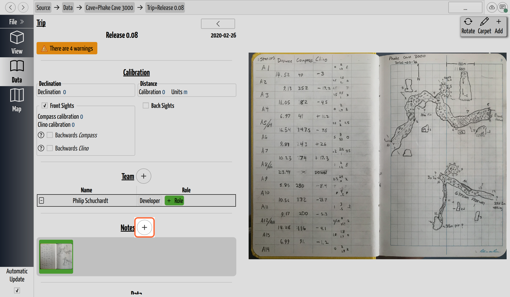
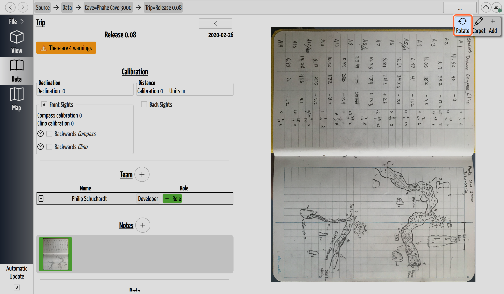

# Add Notes to a Trip

## Why you need this

However you recorded the cave underground — pencil on waterproof paper, a sketch
drawn on a tablet, or a LiDAR scan off your phone — what you carried out is a
drawing CaveWhere knows nothing about yet. A **note** is that drawing brought into
the project and attached to the [trip](../concepts/glossary.md#trip) it belongs
to. Until a note is in the project there is nothing to trace, so this is the first
step of turning a survey into a map: notes are what
[scraps](../concepts/glossary.md#scrap) are digitized *from*.

**A note doesn't have to start on paper.** A scanned notebook page, a PDF, an SVG
exported from a digital sketching app like TopoDroid, and a `.glb` LiDAR scan all
import the same way and all become notes — what you drew on only starts to matter
later, when you georeference them.

Notes are attached **per trip**, which keeps a drawing next to the survey data it
was made alongside — the same trip's shots, calibration, and team.

## Add a note

Open the trip and click **Add**, then choose **Notes or 3D Model**. Two buttons
do this and both lead to the same place: the **+** beside the **Notes** heading,
and **Add** in the note toolbar at the top right.

*The **+** beside the Notes heading, ringed. The **Add** button in the toolbar at
the top right does the same thing.*

**Notes or 3D Model** opens a file picker titled *Load Images or LiDAR scans*.
You can select **several files at once**, and each becomes its own note. A trip
with no notes yet offers the same import from a panel in the middle of the
gallery ("No notes found…") rather than from the menu.

There is **no drag-and-drop** — the file picker is the only way in.

## What you can import

| Kind | Extensions |
|---|---|
| Scanned or photographed notes | `.png`, `.jpg` / `.jpeg`, `.tif` / `.tiff`, `.bmp`, `.gif`, `.webp` |
| Vector sketches (for example from TopoDroid) | `.svg` |
| Documents | `.pdf` |
| 3D scans | `.glb` |

A few things worth knowing about the less obvious ones:

- **PDFs become one note per page.** A four-page PDF gives you four notes, named
  after the file with the page appended — `notes.pdf (Page 3)`. PDF and SVG are
  *rasterized* on import, at a resolution you control in **Settings → PDF / SVG**
  (96 ppi by default). Turning that up costs memory, so raise it only if a
  sketch looks too coarse to trace.
- **PDF support is built in.** The official CaveWhere builds ship with it, so if
  you downloaded CaveWhere rather than compiling it yourself, `.pdf` is there and
  you can skip the rest of this point. It is a *build-time* option, though:
  CaveWhere can only offer `.pdf` when it was built against Qt's PDF module, and
  a build compiled from source without that module won't list `.pdf` in the file
  picker at all. **Settings → PDF / SVG** says which you have — it reports
  whether PDFs are supported. If they aren't, nothing is wrong with your file:
  convert the page to a `.png` and import that, or use an official build.
- **`.glb` files are LiDAR notes**, and behave differently enough to have their
  own page. See [Work with LiDAR Notes](lidar-notes.md).

Very large images are scaled down on import (the ceiling is about 67 megapixels),
so a huge scan won't exhaust memory.

## What happens to the file

CaveWhere **copies the file into the project** and refers to it by name from
then on. The bytes you imported are kept as-is — your import is not re-encoded
or flattened into a database — so the note in the project is the file you
imported, and moving or deleting the original afterwards doesn't affect the
project.

Two conveniences follow from that. If a photo carries an orientation tag,
CaveWhere applies it on import so the note is the right way up. And on a
`.cwproj` project you can **right-click a note → Reveal** to open the copied file
in your file manager.

## Rotate a note

Notes arrive sideways — a page fed into the scanner the short way, a tablet held
in landscape. Click **Rotate** to turn the note 90° at a time.

*One click of **Rotate**. This is the same note that sits upright in the
screenshot above, now turned 90°; the gallery thumbnail turns with it. Click
again to keep going in 90° steps.*

This is **only how the note is displayed.** It is not the same thing as telling
CaveWhere which way is north on the page — that lives on the scrap, and is
covered in [Choose the Scrap Type](../scraps/scrap-types.md#north-or-up-orient-the-drawing).
Rotating a note to a comfortable reading angle will not rotate your carpet, and
straightening a carpet is not something Rotate can do.

## Remove a note

Each note carries a small **red ✕** in its top corner; it asks for confirmation
before removing the note from the trip.

## Next steps

- A scrap traced on a note can only be scaled once the note knows how big a real
  page it represents. That's usually automatic — check
  [Set the Image Resolution](note-resolution.md) if a scale looks wrong.
- Imported a LiDAR scan? It needs its up, north, and scale set instead:
  [Work with LiDAR Notes](lidar-notes.md).
- Otherwise the note is ready to trace:
  [Digitize a Scrap](../scraps/digitize-a-scrap.md).
