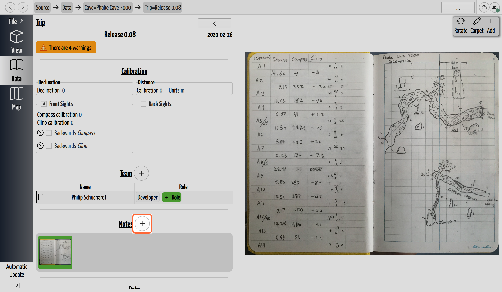

# Add Notes to a Trip

## Why you need this

However you recorded the cave underground, pencil on waterproof paper, a tablet
sketch, or a LiDAR scan off your phone, what you carried out is a drawing
CaveWhere knows nothing about. A **note** is that drawing brought into the
project and attached to the [trip](../concepts/glossary.md#trip) it belongs to.
Nothing exists to trace until a note lands in the project:
[scraps](../concepts/glossary.md#scrap) get digitized *from* notes.

Paper scans, PDFs, SVGs from a sketching app like TopoDroid, and `.glb` LiDAR
scans all come in through one picker. Notes attach **per trip**, which parks a
drawing beside the shots, calibration, and team it was made alongside.

## Add a note

Open the trip and click the round **+** beside the **Notes** heading, or **Add**
in the note toolbar, then choose **Notes or 3D Model**. Both are shown below.

*The round **+** beside the Notes heading, ringed. The **Add** button in the
toolbar opens the same menu.*

The note toolbar appears only once the trip holds a note, and drops **Add** at
phone width, so the **+** starts every first note.

**Notes or 3D Model** opens a file picker titled *Load Images or LiDAR scans*.
Select as many files as you want in one go. Each becomes its own note, named
after the file. A trip with no notes yet also offers a *No notes found...* panel
with a **Load** button.

**Dragging a file onto the window does nothing.** The picker is the only way in.

## What you can import

| Kind | Extensions |
|---|---|
| Scanned or photographed notes | `.png`, `.jpg` / `.jpeg`, `.tif` / `.tiff`, `.bmp`, `.gif`, `.webp` |
| Vector sketches | `.svg` |
| Documents | `.pdf` |
| 3D scans | `.glb` |

That table is CaveWhere's list, but the test that runs on what you picked is
Qt's. The suffix has to match an image plugin your build loaded. When it
doesn't, the file gets dropped without a message, the same way a `.gltf` does.
So count the notes that appear against the files you picked.

- **A PDF becomes one note per page.** A 4-page PDF gives you 4 notes, named
  after the file with the page number appended, as in `notes.pdf (Page 3)`.
  Pages count from 1.
- **PDF and SVG stay vector on disk.** CaveWhere renders them to pixels only
  when it draws them, at the resolution set in **Settings → PDF / SVG**, and
  caches the result under `.cw_cache`. Import bakes nothing in, so changing that
  number re-renders your PDF notes; an SVG picks it up when its cache entry is
  next rebuilt. The settings page says so itself:

  > PDF / SVG rasterization is supported up to 600 ppi or 256mb, but high
  > resolutions require a large amount of memory.

  Memory climbs with the square of the resolution, so **I recommend leaving it
  at the default 96 ppi** and raising it only for a sketch too coarse to trace.
- **PDF support gets compiled in, not configured.** The official downloads ship
  with it. A build made without Qt's PDF module never lists `.pdf` in the
  picker, and it silently drops one you hand it anyway; **Settings → PDF / SVG**
  reports which you have on its **PDFs** line. Convert the page to a `.png` if
  that reads unsupported. SVG needs no such module.
- **`.glb` files become LiDAR notes**, different enough to have their own page.
  See [Work with LiDAR Notes](lidar-notes.md).

## What happens to the file

CaveWhere **copies your file into the project** and keeps only its name on the
note. The copy lands in the trip's own folder (`<Cave>/trips/<Trip>/notes/`),
and the bytes cross untouched. Move or delete the original afterward and the
project never notices. Import 2 files both called `notes.png` and the second
lands as `notes-1.png`. The import ends by flushing a save, so a note you just
added already sits on disk before you reach for **Save**.

Right-click a note in the gallery for **Show in Finder** (macOS), **Show in
Explorer** (Windows), or **Show in File Manager** elsewhere. That item appears
only on a saved `.cwproj` project, not on a bundled `.cw` file or an unsaved
project.

## Rotate a note

Notes arrive sideways, a page fed into the scanner the short way. **Rotate**
turns the note 90° per click. The large view and the gallery thumbnail both
turn. A [LiDAR
note](lidar-notes.md) carries no Rotate button, since you orbit a scan instead
of reading it flat.

**Rotation changes the display and nothing else.** No part of carpeting reads
it, so a comfortable reading angle leaves your carpet alone. Which way north
lies on the page lives on the scrap instead, under [Choose the Scrap
Type](../scraps/scrap-types.md#north-or-up-orient-the-drawing).

## Remove a note

Select a note in the gallery and a red **✕** appears in its top-right corner.
Only the selected note carries one, which makes deleting a neighbor by accident
harder. Click it and a small box offers **Remove** and **Cancel**; clicking
outside the box cancels too.

**Remove deletes the copy inside the project, not just the entry in the trip.**
The image file leaves the notes folder along with the note, which is the best
argument for keeping your originals somewhere of your own. On a `.cwproj` project
every saved version stays in the history, so
[Restore to here](../collaboration/review-history.md#restore-back-to-an-earlier-version)
reaches back past the removal.

## Next steps

- Check [Set the Image Resolution](note-resolution.md) if a scrap's scale looks
  wrong. A note has to know how big a real page it represents; usually that
  happens on its own.
- A LiDAR scan needs its up, north, and scale set instead:
  [Work with LiDAR Notes](lidar-notes.md).
- Otherwise the note is ready to trace:
  [Digitize a Scrap](../scraps/digitize-a-scrap.md).
