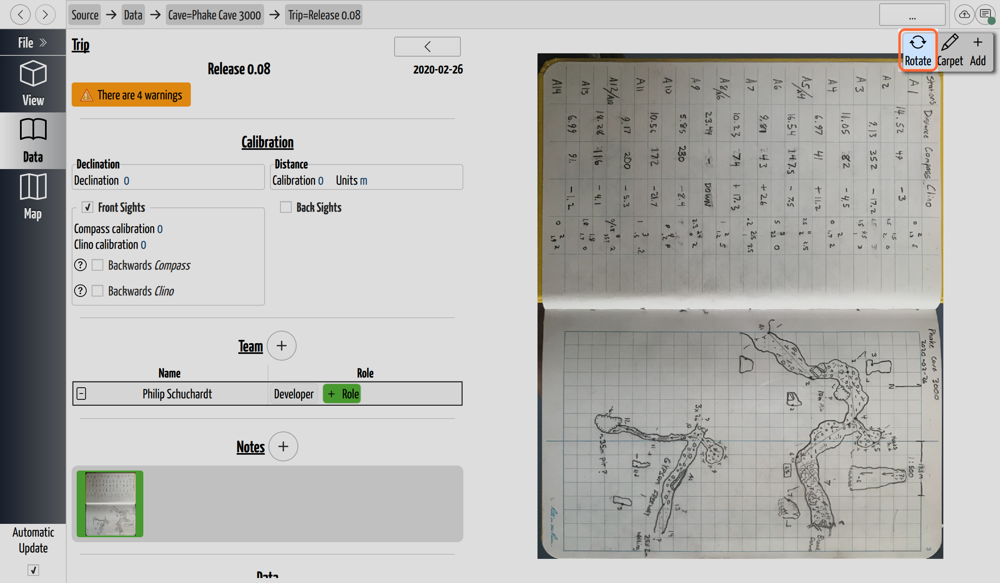

# Add Notes to a Trip

## Why you need this

However you recorded the cave underground, pencil on waterproof paper, a sketch
drawn on a tablet, or a LiDAR scan off your phone, what you carried out is a
drawing CaveWhere knows nothing about. A **note** is that drawing brought into
the project and attached to the [trip](../concepts/glossary.md#trip) it belongs
to. Nothing exists to trace until a note lands in the project, so this step
starts the work of turning a survey into a map:
[scraps](../concepts/glossary.md#scrap) get digitized *from* notes.

**A note doesn't have to start on paper.** A scanned notebook page, a PDF, an
SVG exported from a digital sketching app like TopoDroid, and a `.glb` LiDAR
scan all come in through one picker. What you drew on starts to matter later,
when the note has to say how much real paper one pixel covers.

Notes attach **per trip**, which parks a drawing beside the survey data it was
made alongside: the same trip's shots, calibration, and team.

## Add a note

Open the trip and click the round **+** beside the **Notes** heading, or **Add**
in the note toolbar once the trip already has a note, then choose **Notes or 3D
Model**. See below for where those controls sit.

*The round **+** beside the Notes heading, ringed. The **Add** button in the
toolbar at the top right opens the same menu.*

Two controls open that menu, and which you get depends on how wide the window
is. **Add** sits in the note toolbar at the top right, from 600 px up, last in a
row of 3 after Rotate and Carpet. That toolbar only appears once the trip holds
a note, so the **+** starts every first note. The round **+**
beside the **Notes** heading in the survey editor shows below 1200 px. Between
those widths you have both, as shown above. At 1200 px and up the survey editor
hands its 80 px thumbnails to the full gallery (a 210 px strip you can drag
wider), taking the **+** with it.

**Notes or 3D Model** opens a file picker titled *Load Images or LiDAR scans*.
Select as many files as you want in one go. Each becomes its own note, named
after the file. From 600 px up, a trip with no notes yet puts a panel reading
*No notes found...* in the middle of the note pane, with a **Load** button onto
the same picker.

Below 600 px the note toolbar gives way to a narrow one that carries no **Add**
at all, so at phone width the **+** is your only route in.

**Dragging a file onto the window does nothing.** The picker is the only way in.

## What you can import

| Kind | Extensions |
|---|---|
| Scanned or photographed notes | `.png`, `.jpg` / `.jpeg`, `.tif` / `.tiff`, `.bmp`, `.gif`, `.webp` |
| Vector sketches (for example from TopoDroid) | `.svg` |
| Documents | `.pdf` |
| 3D scans | `.glb` |

The picker offers them as a single filter: 9 image extensions, plus `.pdf` and
`.glb`.

That table is CaveWhere's list. The test that runs afterward on what you picked
is Qt's, and the suffix has to match an image plugin your build actually loaded.
When that match fails, the file gets dropped without a message, the same way a
`.gltf` does. So count the notes that appear against the files you picked;
sometimes the number comes up short and nothing tells you.

Four things worth knowing about the less obvious formats.

- **A PDF becomes one note per page.** A 4-page PDF gives you 4 notes, named
  after the file with the page number appended, as in `notes.pdf (Page 3)`.
  Pages count from 1.
- **PDF and SVG stay vector on disk.** CaveWhere renders them to pixels only
  when it draws them, at the resolution set in **Settings → PDF / SVG**, and
  caches the result under `.cw_cache`. The default is 96 ppi; the field accepts
  72 to 600. Import bakes nothing in, so changing that number re-renders your
  PDF notes; an SVG picks the new resolution up the next time its cache entry is
  rebuilt. The in-app help does not undersell the top of that range:

  > PDF / SVG rasterization is supported up to 600 ppi or 256mb, but high
  > resolutions require a large amount of memory.

  Pixel count climbs with the square of the resolution, so 600 ppi asks for
  roughly 39 times the memory 96 ppi does. **I recommend leaving it at 96** and
  raising it only for a sketch too coarse to trace.
- **PDF support gets compiled in, not configured.** The official downloads ship
  with it, so if you downloaded CaveWhere rather than building it, `.pdf` works
  and you can skip the rest of this bullet. A build made without Qt's PDF module
  never lists `.pdf` in the picker, and it silently drops one you hand it
  anyway. **Settings → PDF / SVG** reports which you have on its **PDFs** line.
  If that reads unsupported, nothing is wrong with your file: convert the page
  to a `.png`, or install an official build. SVG needs no such module.
- **`.glb` files become LiDAR notes**, different enough to have their own page.
  See [Work with LiDAR Notes](lidar-notes.md).

**The rasterizer has a ceiling, and it scales down to stay under it.** CaveWhere
caps a rendered PDF page or SVG at 256 MB of uncompressed pixels at 4 bytes
each, which works out to 67,108,864 of them. Ask for more and the width and
height come down proportionally until they fit, so a big page at 600 ppi costs
you resolution instead of the session. A raster scan is different: its pixel
count is whatever the file says, and nothing on the import path trims it.

## What happens to the file

CaveWhere **copies your file into the project** and keeps only its name on the
note. The copy lands in the trip's own folder (`<Cave>/trips/<Trip>/notes/`),
and the bytes cross untouched. Nothing gets re-encoded or flattened into a
database. Move or delete the original afterward and the project never notices.
Import 2 files both called `notes.png` and the second lands as `notes-1.png`, so
one copy never overwrites another.

The import ends by flushing a save, so a note you just added already sits on
disk before you reach for **Save**. The small thumbnails in the survey editor's
Notes section, shown above, are scaled copies cached under `.cw_cache` and keyed
on a hash of the file, so overwriting the copy on disk refreshes them.

Two conveniences follow from keeping your file intact. A photo carrying an
orientation tag has that rotation applied every time CaveWhere reads it, so the
note hangs the right way up while the file on disk stays byte-identical. And you
can right-click a note in the gallery for **Show in Finder** (macOS), **Show in
Explorer** (Windows), or **Show in File Manager** elsewhere. That item appears
only on a saved `.cwproj` project. A bundled `.cw` file, or a project you have
not saved yet, does not offer it.

## Rotate a note

Notes arrive sideways: a page fed into the scanner the short way, a tablet held
in landscape. **Rotate** turns the note 90° per click, and 4 clicks bring it
back where it started. One click is shown below.

*One click of **Rotate**, on the same note that sits upright in the first
screenshot.*

The large view and the gallery thumbnail both turn, as shown above. Rotate
belongs to image notes. A [LiDAR note](lidar-notes.md) carries no Rotate button
at all, since you orbit a scan instead of reading it flat.

**Rotation changes the display and nothing else.** CaveWhere saves the angle
with the trip and hands it to the note's camera. No part of carpeting reads it.
Rotate is also not how you tell CaveWhere which way north lies on the page. That
lives on the scrap, under [Choose the Scrap
Type](../scraps/scrap-types.md#north-or-up-orient-the-drawing). Turning a note
to a comfortable reading angle leaves your carpet alone, and a crooked carpet
isn't something Rotate can straighten.

## Remove a note

Select a note in the gallery and a red **✕** appears in its top-right corner,
24 px square. Only the selected note carries one, which makes deleting a
neighbor by accident harder. Click it and a small box offers **Remove** and
**Cancel**. Clicking anywhere outside the box cancels too. The gallery strip has
to be showing, so this needs the 1200 px layout.

**Remove deletes the copy inside the project, not just the entry in the trip.**
The image file leaves the notes folder along with the note. Your original
outside the project survives, which is the best argument for keeping your scans
somewhere of your own. On a `.cwproj` project every saved version stays in the
history, so
[Restore to here](../collaboration/review-history.md#restore-back-to-an-earlier-version)
reaches back past the removal.

## Next steps

- A scrap traced on a note can only be scaled once the note knows how big a real
  page it represents. Usually that happens on its own. Check
  [Set the Image Resolution](note-resolution.md) if a scale looks wrong.
- Imported a LiDAR scan? It needs its up, north, and scale set instead:
  [Work with LiDAR Notes](lidar-notes.md).
- Otherwise the note is ready to trace:
  [Digitize a Scrap](../scraps/digitize-a-scrap.md).
