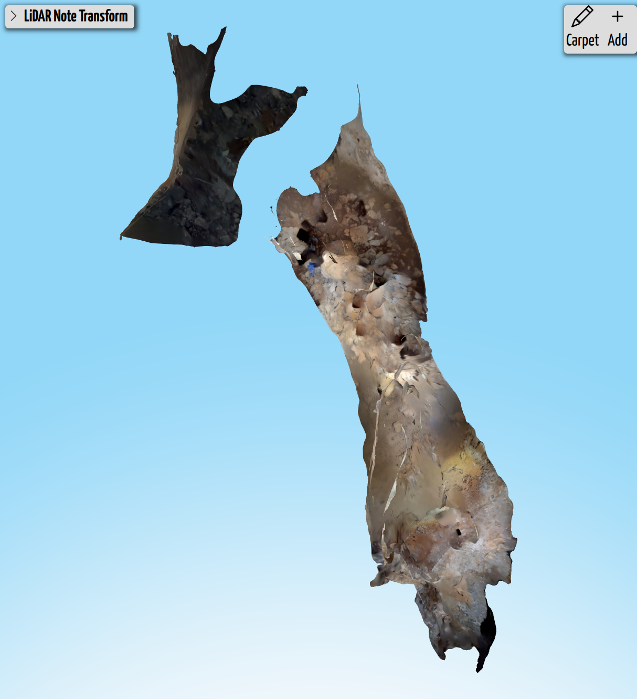
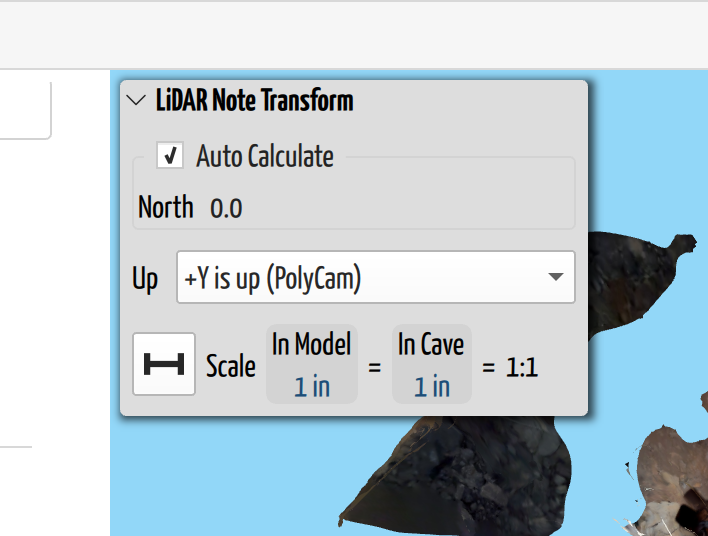
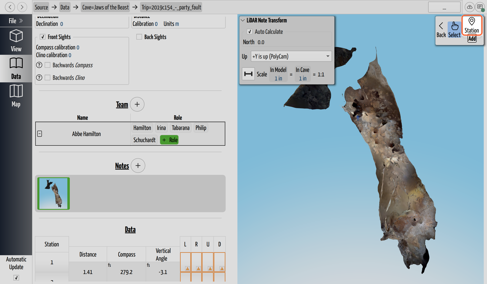

# Work with LiDAR Notes

*A LiDAR note is a 3D scan of a passage, attached to a trip like any other note.
It keeps the photographic texture of the rock, and you orbit it rather than
reading it flat.*

## Why you need this

A **LiDAR note** is a 3D scan of a passage — usually shot on a phone — brought
into CaveWhere as a note.

It is not a replacement for sketching, and it won't out-draw a good sketcher. A
scan records **surfaces**, and it records them very well — it will capture a
breakdown pile in more detail than anyone would sit and draw. What it cannot
record is everything that isn't a surface. **Airflow doesn't appear in a scan**,
and neither does which of the three ways on is the one worth pushing, where the
water goes, or which features in front of you actually matter. A sketch is a set
of judgements about exactly those things; a scan makes none.

What a scan adds is **another dimension of survey data, recorded next to the
sketch**, and that's useful in ways drawing isn't. Back on the surface you can
hold the sketch up against the scan and see what got missed, mis-shaped, or
mis-scaled while you were cold and hurrying. And someone still learning to sketch
can compare what they drew against the passage as it actually is — feedback that
is otherwise very hard to get once you're out of the cave.

The catch is that a scan arrives knowing nothing about your cave. It has its own
idea of which way is up, no idea where north is, and — depending on the capture
app — possibly no idea how big it is. It is a shape floating in its own space.
This page is about telling CaveWhere those three things, after which the scan
[carpets](../concepts/glossary.md#carpeting) into the model the same way a
sketched [scrap](../concepts/glossary.md#scrap) does: pinned to the survey by
stations you place on it.

## Import a scan

LiDAR notes come in through the same door as everything else — **Add → Notes or
3D Model** — and the file picker accepts them alongside images. See
[Add Notes to a Trip](add-a-note.md).

CaveWhere reads **`.glb`** (binary glTF), and will open **any polygonal glTF
model** — it doesn't have to have come from a LiDAR sensor.

**PolyCam is the best-supported source.** Its scans arrive already the right way
up and already life-size, so in the usual case you import one and there is nothing
to set. Other sources vary, and **photogrammetry models are the ones to watch**:
they often come in with the wrong up direction, and they usually need their scale
set by hand, because photogrammetry reconstructs shape from photographs and has no
way of knowing how big the real thing was. Both are fixable below — up first,
then scale.

One file becomes one LiDAR note, named after the file. Opening it shows the scan
in a 3D view you can orbit, rather than a flat page, and CaveWhere grabs a
thumbnail of it for the gallery on first view.

Everything below lives in the **LiDAR Note Transform** panel on that view.

*The LiDAR Note Transform panel. Up comes first: north and scale are applied
after the scan has been stood upright.*

## Tell CaveWhere which way is up

**Do this first.** CaveWhere applies the up rotation *before* it rotates the scan
to north or rescales it, so getting up wrong makes the other two meaningless.

The **Up** dropdown names the axis in the scan that points at the sky:

- **+Y is up (PolyCam)** — the default, and what PolyCam and Scaniverse produce.
  If you scanned with either, you're already done.
- **−Y is up**, **+Z is up**, **−Z is up**, **+X is up**, **−X is up** — pick the
  one matching your capture app when you know which axis it uses.
- **Custom** — when you don't know, when the scan was taken at an angle, or when
  it's a photogrammetry model that came in lying on its side. Choosing Custom
  reveals an **arrow tool**: click two points that you know run vertically in the
  real passage — a drip line, the edge of a pit — and CaveWhere tilts the scan to
  match.

Custom mode also shows four **read-only** numbers labelled *Custom up rotation
(xyzw)*. They are the rotation the arrow tool worked out, exposed so you can see
it. You don't have to understand or edit them — the app's own help says as much:
stay in Custom, drag the arrow tool, and the fields keep themselves up to date.

## Set north

With **Auto Calculate** ticked — it is by default — CaveWhere works north out
from the survey itself, by comparing the stations you've placed on the scan
against their real positions. That needs **at least two stations** on the note,
so place those first and north tends to solve itself.

The checkbox sits around the North row alone, and that's exactly what it governs:
on a LiDAR note **Auto Calculate means auto-calculate north**. It doesn't touch up
or scale.

When it can't, untick **Auto Calculate** and either type the angle in **North**
or use the **north tool**: click two points along something whose bearing you
know — the arrow you drew on your notes, or a passage you shot down — and enter
that bearing when asked for the **arrow's azimuth**. Ticking Auto Calculate back
on hides the tool and returns the field to read-only.

## Check the scale

**Scale is never worked out for you here.** This is the one place a LiDAR note
differs from a [scrap](../concepts/glossary.md#scrap), where Auto Calculate
derives the scale from the stations. On a LiDAR note, Auto Calculate covers
**north and nothing else** — the scale is whatever the model came with, until you
change it. That's deliberate rather than an omission: a scan is supposed to arrive
life-size already.

So a true LiDAR scan is usually right as it stands, because the sensor measures
real distances — the panel's own advice is that **LiDAR notes should typically be
1:1**, and you can leave the scale alone.

**Photogrammetry is the exception, and it needs the scale set by hand.** A model
reconstructed from photographs has a perfectly good *shape* but no idea of its
*size*: nothing in a set of pictures says whether that passage is two metres wide
or twenty. The same applies to any capture app that exports in pixels or some
other non-metric unit.

Either way the fix is the scale tool: click two points on the scan and enter the
**actual distance** between them — a shot length you measured, or anything else
in the scan whose real size you know. CaveWhere compares that against the distance
in the model and works the scale out. The row is labelled **In Model** rather than
*On Paper*, because there is no paper — and for the same reason a LiDAR note has
no [DPI](note-resolution.md). A model is measured in its own units; a photograph
of a page is measured in pixels.

## Place stations on the scan

Stations are what tie the scan to the survey, exactly as they tie a scrap to it.
Click **Carpet** to get the tools, then choose **Station** and click on the scan
where each surveyed station sits. Name each one to match the station name in your
survey data: **the name is the whole link** — CaveWhere matches a station on the
note to a station in the survey by name and nothing else, so a typo silently
unhooks it.

*The **Station** tool on a LiDAR note. The Add group holds Station and nothing
else, because a scan has no outline to trace.*

**Two stations is the practical minimum** — that's what Auto Calculate needs
before it can work north out. It will not work the *scale* out from them, though;
that stays yours to set.

## What LiDAR notes don't have

- **No scraps and no leads.** The Scrap and Lead tools are hidden on a LiDAR
  note. A scan already *is* the passage shape, so there's no outline to trace —
  which is the whole point. Mark leads on a sketched note instead.
- **No DPI**, for the reason given above.
- **No Rotate button.** You orbit the 3D view instead, and the up/north controls
  handle real orientation.
