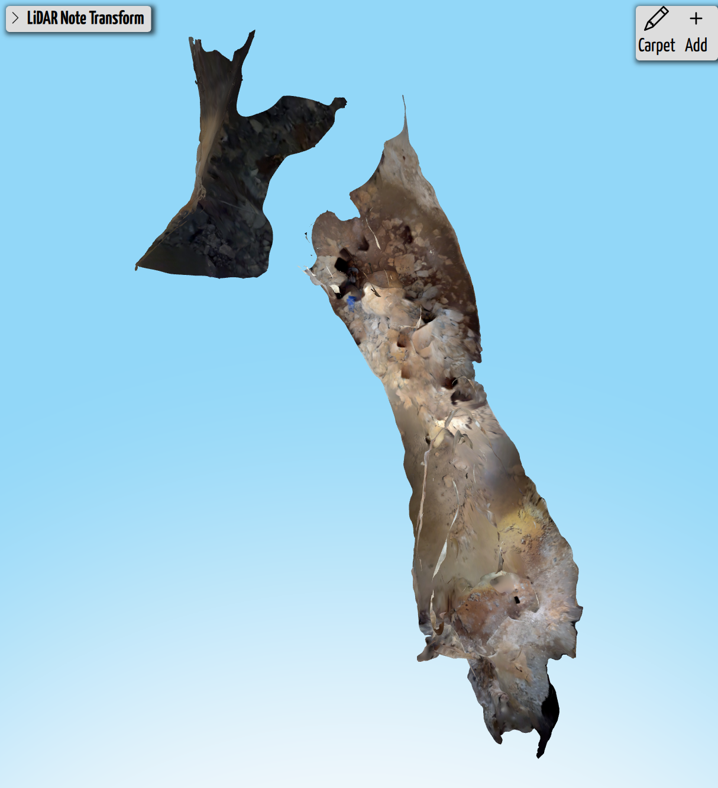

# Work with LiDAR Notes

*A LiDAR note attaches to a trip like any other note. You orbit it rather than
read it flat.*

## Why you need this

A **LiDAR note** is a 3D scan of a passage, usually shot on a phone, brought
into CaveWhere as a note.

It doesn't replace sketching. A scan records **surfaces**, and it records them
very well: a breakdown pile in more detail than anyone would sit and draw.
Everything else goes unrecorded. **Airflow does not appear in a scan.** Neither
does which lead deserves pushing or where the water goes. A sketch is a set of
judgments about exactly those things; a scan makes none.

A scan does add a second record: back on the surface you hold sketch against
scan and see what got missed or mis-scaled while you were cold and hurrying.

The catch: a scan knows nothing about your cave. It carries its own idea of
which way is up, no idea where north lies, and (depending on the capture app) no
idea how big it is. Tell CaveWhere those 3 things and the scan
[carpets](../concepts/glossary.md#carpeting) into the model like a sketched
[scrap](../concepts/glossary.md#scrap) does, though under
[fixed settings you can't tune](../scraps/carpeting.md).

## Import a scan

LiDAR notes come in through the same door as [every other
note](add-a-note.md), **Add → Notes or 3D Model**. The picker that opens, titled
*Load Images or LiDAR scans*, lists your image formats and `*.glb` in one
filter.

**CaveWhere takes exactly one 3D format: `.glb`, binary glTF.** The check reads
the suffix and ignores case, so `SCAN.GLB` imports fine. A `.gltf` selected
beside it gets dropped without a word. Convert it first.

Any polygonal glTF opens, LiDAR sensor or not, but the loader only understands
triangle meshes: a glTF of points or lines comes in untyped, and what lands on
screen is not your model. CaveWhere reads only the base color texture, so the
photograph carries all the shading you see.

**PolyCam and Scaniverse need the least work.** Their scans arrive the right way
up, and a true LiDAR scan is life-size already, so an import usually needs
nothing set. **Photogrammetry needs the most work**: nothing in a set of
photographs says which way was up or how big the real thing was, so set both by
hand, up first, then scale.

Each file becomes one LiDAR note named after the file, extension included.
CaveWhere copies the `.glb` into the project's notes folder and stores only the
file name, so moving the original breaks nothing, but your project carries the
full bytes of every scan. Opening a note shows the scan in an orthographic 3D
view you orbit.

Everything below lives in the **LiDAR Note Transform** panel.

*The panel on a fresh import. Up comes first: north and scale apply after the
scan stands upright.*

## Tell CaveWhere which way is up

**Do this first.** The transform runs the up rotation, then the spin about Z
that sets north, then the uniform scale. Get up wrong and the other 2 mean
nothing.

The **Up** dropdown holds 7 entries, each naming the axis in the scan that
points at the sky. The panel above shows the default.

- **+Y is up (PolyCam)**, the default, and what PolyCam and Scaniverse produce.
  Nothing to do here.
- **-Y is up**, **+Z is up**, **-Z is up**, **+X is up**, **-X is up**, for when
  you know the axis your capture app uses. Each applies a fixed 90° or 180°
  rotation; +Z is CaveWhere's own up and rotates nothing.
- **Custom**, for when you do not know, or when the scan came in at an angle or
  lying on its side.

Custom reveals an **arrow tool**: click 2 points you know run vertically in the
real passage (a drip line, the edge of a pit) and CaveWhere rotates that
direction onto +Z on the second click. It also switches Up to Custom for you,
and its button appears only while Up already reads Custom.

## Set north

**Auto Calculate**, ticked by default as shown above, works north out from the
survey, comparing the stations you placed on the scan against their surveyed
positions, averaged over every shot it finds.

Two conditions, and the second one bites.

- The note needs **at least 2 stations**. Below that, CaveWhere gives up.
- At least 2 of them need a **shot between them in your survey data**.
  CaveWhere pairs note stations only when the survey network lists them as
  neighbors, so 2 stations at opposite ends of the cave yield no north.

The answer comes back in plan view: the calculation flattens Z on the surveyed
positions and the scan alike, ignoring how much the passage climbs. CaveWhere
then corrects it by the trip's
[declination](../survey-data/declination.md), so editing declination on the
trip swings north on the scan too.

The checkbox wraps the North row alone: on a LiDAR note, **Auto Calculate means
auto-calculate north**.

When auto fails, untick it. That unlocks the **North** field (one decimal place)
and reveals the **north tool**. Type the bearing straight in, or click 2 points
along something whose bearing you know (the arrow you drew on your notes, a
passage you shot down). CaveWhere then asks *What is azimuth of the
arrow?* and takes 0.0 to 360.0, subtracting it from the direction it measured.
Tick Auto Calculate back on and the field locks again.

## Check the scale

**Nothing works the scale out for you here.** Here a LiDAR note parts company
with a [scrap](../concepts/glossary.md#scrap), whose Auto Calculate derives
scale from the stations. The LiDAR code works out a transform carrying both,
writes back the north, and drops the scale. Whatever the model came with
survives until you change it, because a scan should arrive life-size.

A true LiDAR scan usually does, because the sensor measures real distances. The
panel says as much in its help:

> LiDAR notes should typically be **1:1**. If your source is already metrically
> correct, leave scale at 1. Adjust only if your capture app exported in pixels
> or non-metric units.

**I recommend taking that literally on any phone scan.** Leave the scale at 1:1,
as in the panel above, and reach for the tool only once the passage comes out
visibly the wrong size against your shots. Correcting a sensor that already
measured in meters adds an error the survey never had.

Photogrammetry stays the exception: photographs give a model its *shape* and
nothing of its *size*.

The scale tool fixes either case. Click 2 points and enter the **actual
distance** between them (meters unless you change the unit): a shot length you
measured, or anything whose real size you know. The model side goes in unitless,
since a model carries numbers, not units. Hence the row reading **In Model** and
**In Cave** rather than *On Paper*, and hence no [DPI](note-resolution.md) on a
LiDAR note.

## Place stations on the scan

Stations tie the scan to the survey exactly as they tie a scrap to it. Click
**Carpet** for the tools, choose **Station**, then click the scan where each
surveyed station sits. Each click casts a ray at the model, so one landing on
the background adds nothing.

**Every station you place arrives named `Station Name`.** That placeholder
matches nothing in your survey, so rename each one as you go. The name carries
the whole link: CaveWhere ties a note station to a survey station by name and
nothing else, case-insensitively, the same rule the survey table follows. A typo
unhooks the station silently.

A note without stations still opens and orbits perfectly well, but it never
reaches the 3D view. CaveWhere skips any LiDAR note carrying no stations when it
builds render geometry, and it waits on the cave's station positions. A scan
imported before the survey plots may stay invisible until it catches up. The
stations show only while you sit in carpet mode, which keeps them from getting
dragged or deleted during a read.

## What LiDAR notes don't have

- **No scraps and no leads.** The Scrap and Lead tools stay hidden, so the Add
  group holds Station alone. A scan already *is* the passage shape, so nothing
  needs tracing, which is rather the point. Mark leads on a sketched note
  instead.
- **No DPI**, for the reason given above.
- **No Rotate button.** The toolbar drops to 2 buttons, Carpet and Add, as in
  the first screenshot. You orbit the 3D view instead, and the up and north
  controls handle real orientation.
