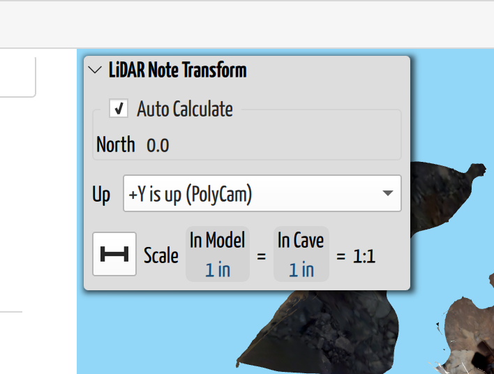
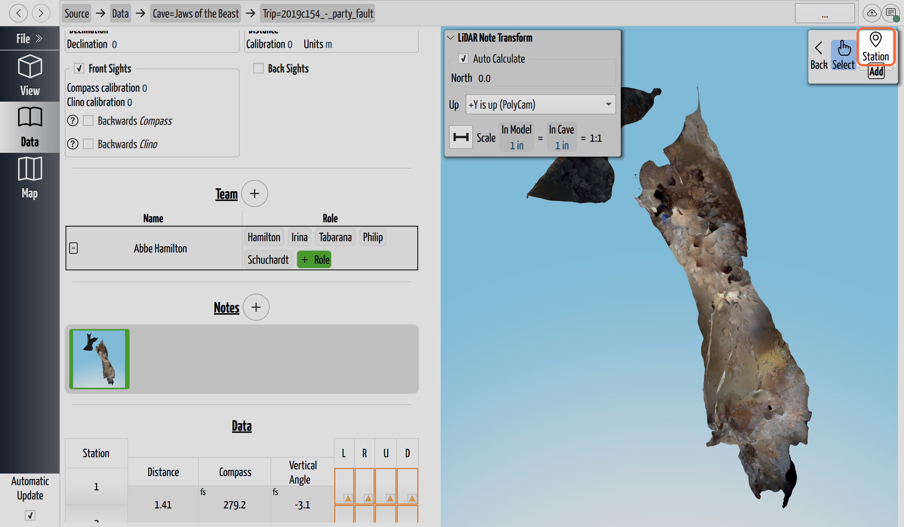

# Work with LiDAR Notes

*A LiDAR note attaches to a trip like any other note. It keeps the photographic
texture of the rock, and you orbit it rather than reading it flat.*

## Why you need this

A **LiDAR note** is a 3D scan of a passage, usually shot on a phone, brought
into CaveWhere as a note.

It doesn't replace sketching, and it won't out-draw a good sketcher. A scan
records **surfaces**, and it records them very well. It catches a breakdown pile
in more detail than anyone would sit and draw. Everything that isn't a surface
goes unrecorded. **Airflow does not appear in a scan.** Neither does which way on deserves
pushing, where the water goes, or which features in front
of you actually matter. A sketch is a set of judgments about exactly those
things; a scan makes none.

So a scan adds a second dimension of survey data beside the sketch, and that
helps in ways drawing does not. Back on the surface you hold the sketch up
against the scan and see what got missed, mis-shaped, or mis-scaled while you
were cold and hurrying. Someone still learning to sketch can compare what they
drew against the passage as it stands. That feedback is otherwise hard to come
by once you leave the cave.

The catch: a scan knows nothing about your cave. It carries its own idea of
which way is up, no idea where north lies, and (depending on the capture app) no
idea how big it is. Tell CaveWhere those 3 things and the scan
[carpets](../concepts/glossary.md#carpeting) into the model exactly as a sketched
[scrap](../concepts/glossary.md#scrap) does. Exactly, in fact:
`cwTriangulateLiDARTask` walks every vertex of the scan through
`cwTriangulateTask::morphPoint`, the same function that morphs scrap points.

## Import a scan

LiDAR notes come in through the same door as everything else, **Add → Notes or
3D Model**. The picker that opens, titled *Load Images or LiDAR scans*, lists
your image formats and `*.glb` in one filter. See
[Add Notes to a Trip](add-a-note.md).

**CaveWhere takes exactly one 3D format: `.glb`, binary glTF.** The test reads
the file suffix and ignores case, so `SCAN.GLB` imports fine. A `.gltf` selected
beside it gets dropped without a word. Convert it first.

Where the file came from matters less than its extension. Any polygonal glTF
opens, LiDAR sensor or not. The loader only understands triangle meshes,
though, so a glTF exported as points or as lines comes in untyped, and what
lands on screen is not your model.
CaveWhere also reads only the base color texture and paints it with the `unlit`
shader pair, so your capture app supplies all the shading you see, baked into
the photograph. Normal maps go unused.

**PolyCam and Scaniverse need the least work.** Their scans arrive the right way
up, and a true LiDAR scan is life-size already. An import from either usually
leaves you nothing to set; the default Up entry has PolyCam's name on it. Other
apps vary. **Photogrammetry needs the most work.** Nothing in a set of
photographs says which way was up or how big the real thing was, so expect to set
both by hand, up first, then scale.

Each file becomes one LiDAR note named after the file, extension included, so
`passage.glb` names the note too. CaveWhere copies the `.glb` into the project's
notes folder and stores only that file name on the note. Moving the original
therefore breaks nothing. The drawback: your project carries the full bytes of
every scan you import. Opening a note shows the scan in an orthographic
3D view you orbit. On the first load CaveWhere grabs the viewer with the
overlays switched off and caches the picture under `.cw_cache` as
`passage.glb.icon.png` (one PNG per scan). The gallery draws that file as the
thumbnail from then on.

Everything below lives in the **LiDAR Note Transform** panel, shown below on a
fresh import.

*The panel on a fresh import. Up comes first: north and scale both get applied
after the scan stands upright.*

## Tell CaveWhere which way is up

**Do this first.** The transform runs the up rotation, then the spin about Z
that sets north, then the uniform scale, in that order. Get up wrong and the
other 2 mean nothing.

The **Up** dropdown holds 7 entries, and the panel shown above sits on the
default one. Each names the axis in the scan that points at the sky.

- **+Y is up (PolyCam)**, the default, and what PolyCam and Scaniverse produce.
  Scan with either and you have nothing to do here.
- **-Y is up**, **+Z is up**, **-Z is up**, **+X is up**, **-X is up**, for when
  you know the axis your capture app uses. Each applies a fixed rotation: ±90°
  about X for the Y choices, ∓90° about Y for the X choices, nothing at all for
  +Z, and a 180° flip about X for −Z.
- **Custom**, for when you do not know, when you shot the scan at an angle, or
  when a photogrammetry model came in lying on its side.

Custom reveals an **arrow tool**. Click 2 points you know run vertically in the
real passage (a drip line, the edge of a pit) and CaveWhere rotates that
direction onto +Z. The tool applies on the second click. Nothing to confirm, no
number to type. It also switches Up to Custom for you, so expect the dropdown to
change under your hand. Its button appears only while Up already reads Custom;
pick anything else and the button goes away.

Custom also shows 4 read-only fields labeled *Custom up rotation (xyzw)*: the
quaternion the arrow tool worked out, printed to 4 decimals. You never have to
read them, and the app's own help says the same. Stay in Custom, drag the arrow
tool, and the fields keep themselves current.

## Set north

**Auto Calculate**, ticked by default as shown above, works north out from the
survey. It compares the stations you placed on the scan against their surveyed
positions, then averages the answer over every shot it finds.

Two conditions, and the second one bites.

- The note needs **at least 2 stations**. Below that, CaveWhere gives up before
  it starts.
- At least 2 of them need a **shot between them in your survey data**.
  CaveWhere pairs stations on the note only when the survey network lists them
  as neighbors. So 2 stations at opposite ends of the cave yield no shot and no
  north.

The answer comes back in plan view. On a LiDAR note the calculation flattens Z
on the surveyed positions and on the scan alike, which is to say it looks
straight down and ignores how much the passage climbs. CaveWhere then corrects
the result by the trip's [declination](../survey-data/declination.md). Editing
declination on the trip therefore swings north on the scan too, without your
touching the note.

The checkbox wraps the North row alone, and that is exactly what it governs. On
a LiDAR note, **Auto Calculate means auto-calculate north**. It leaves up and
scale alone.

When auto fails, untick **Auto Calculate**. That unlocks the **North** field (it
shows one decimal place) and reveals the **north tool** beside it. Type the bearing
straight in, or use the tool: click 2 points along something whose bearing you
know (the arrow you drew on your notes, a passage you shot down). CaveWhere then
asks *What is azimuth of the arrow?* and takes a number between 0.0 and 360.0,
which it subtracts from the direction it measured. Tick Auto Calculate back on
and the tool disappears and the field locks again.

## Check the scale

**Nothing works the scale out for you here.** Here a LiDAR note parts company
with a [scrap](../concepts/glossary.md#scrap), where Auto Calculate derives the
scale from the stations. The LiDAR code computes an average transform carrying
both a scale and a north, writes back the north, and drops the scale on the
floor. Whatever the model came with survives until you change it, because a scan is
supposed to arrive life-size.

A true LiDAR scan usually does, because the sensor measures real distances. The
panel says as much in its own help:

> LiDAR notes should typically be **1:1**. If your source is already metrically
> correct, leave scale at 1. Adjust only if your capture app exported in pixels
> or non-metric units.

**I recommend taking that literally on any phone scan.** Leave the scale at 1:1,
as in the panel shown above, and reach for the tool only once the passage comes
out visibly the wrong size against your shots. Correcting a sensor that already
measured in meters adds an error the survey never had.

Photogrammetry stays the exception. A model reconstructed from photographs has a
perfectly good *shape* and no idea of its *size*. Nothing in a set of pictures
says whether that passage runs 2 m wide or 20. The same limitation hits any
capture app, and some of them export in pixels or another non-metric unit.

Either way the scale tool fixes it. Click 2 points on the scan and enter the
**actual distance** between them (meters unless you change the unit). Use a shot
length you measured, or anything in the scan whose real size you know. The model
side of that comparison goes in unitless, which fits a `.glb`: a model carries
numbers, not units. Hence the row reading **In Model** and **In Cave** rather
than *On Paper*, and hence a LiDAR note having no [DPI](note-resolution.md). A
photograph of a page gets measured in pixels; a model gets measured in its own
units.

## Place stations on the scan

Stations tie the scan to the survey, exactly as they tie a scrap to it. Click
**Carpet** for the tools, choose **Station** (shown below), then click the scan
where each surveyed station sits. Each click casts a ray at the model, so a
click landing on the background adds nothing.

**Every station you place arrives named `Station Name`.** That placeholder
matches nothing in your survey, so rename each one as you go. The name carries
the whole link: CaveWhere ties a station on the note to a station in the survey
by name and by nothing else. Case does not matter, because
`cwStation::canonicalKey()` lowercases every name before the pipeline compares
it, the same rule the survey table follows. A typo matters a great deal, and it
unhooks the station silently.

*The **Station** tool, shown above with its button highlighted. The Add group
holds Station and nothing else, because a scan has no outline to trace.*

**Two stations is the practical minimum**, which Auto Calculate needs before it
can work north out. It will not work the *scale* out from them, though; that
stays yours to set.

A note without stations still opens and orbits perfectly well, but it never
reaches the 3D view. CaveWhere skips any LiDAR note carrying no stations when it
builds render geometry, and it waits on the cave's station positions as well. A
scan imported before the survey data plots may therefore stay invisible until
the plot catches up. The stations themselves show only while you sit in carpet
mode, which keeps them from getting dragged or deleted during a read.

## What LiDAR notes don't have

- **No scraps and no leads.** The Scrap and Lead tools stay hidden on a LiDAR
  note. A scan already *is* the passage shape, so nothing needs tracing, which
  is rather the point. Mark leads on a sketched note instead.
- **No DPI**, for the reason given above.
- **No Rotate button.** The toolbar drops to 2 buttons, Carpet and Add, as shown
  in the first screenshot on this page. You orbit the 3D view instead, and the
  up and north controls handle real orientation.
- **No room on a narrow window.** Below 600 px the note gets a page to itself
  and the transform panel opens collapsed to its title bar, which is how it sits
  in that same screenshot. Click the chevron to open it.
