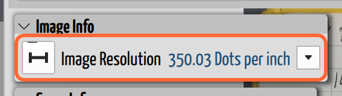
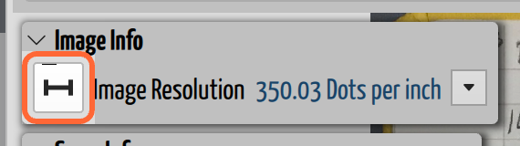

# Set the Image Resolution

## Why you need this

A scan is a grid of pixels, and pixels have no size. A note that is 3000 pixels
wide might be a pocket notebook page or a flip-chart sheet, and nothing in the
image says which. **Image Resolution** — the note's **DPI**, its dots per inch —
is what supplies the missing fact: how much real paper each pixel covers.

That matters because a scrap's scale is stated in *paper distance*: **On Paper
1 in = In Cave 517 in**. The "1 in" is only an inch if CaveWhere knows how many
pixels make an inch on your note. Get the DPI wrong and that whole equation is
quoted in the wrong unit; make it zero or invalid and the scrap cannot warp at
all. This is the setting behind the **"Invalid scale (check DPI)"** error you may
have hit in the [Scrap Info panel](../scraps/scrap-types.md#set-the-scale).

Most of the time you never touch it. **CaveWhere reads the DPI out of the image
file** when you import it, and scanners record it faithfully — a page scanned at
300 DPI arrives saying 300 DPI. You need this page when the file *doesn't* carry
that information, or carries the wrong information: photos taken with a phone,
images that have been through a converter or an editor that dropped the metadata,
and pages exported from other software.

**This is a raster problem, so it mostly isn't a digital surveyor's problem.** A
PDF or an SVG states its own page size, so CaveWhere works the resolution out from
the document rather than trusting metadata that may not be there, and a note
sketched digitally normally arrives with a sane one you can leave alone. A
[LiDAR note](lidar-notes.md) has no DPI at all — a scan is already measured in
real units, so there's no paper to size. If every note in your project came from a
tablet or a scanner that does the right thing, you can skip this page until
something looks wrong.

## Find the Image Resolution

The **Image Info** panel is only shown while you're editing the note, so click
**Carpet** first. The panel sits at the top of the note next to Scrap Info.

*The Image Info panel. This note reports 350.03 dots per inch, read from the scan
itself. The button on the left starts the resolution tool; the menu on the right
copies or resets the value.*

If you know the real number — because you scanned the page yourself — type it in.
The field takes a unit, so you can enter the resolution in dots per centimetre or
dots per metre instead of DPI if that's what you have.

## Measure the resolution off the page

When nobody knows what the resolution is, measure it. You need something on the
note whose real paper size you can state: the printed grid on engineer's paper,
a ruler laid on the page before scanning, or the width of the page itself.

*The measurement button starts the resolution tool. It sits at the left of the
Image Resolution row, and carries the same measuring-bar icon as the scrap's
scale tool.*

1. Click the **measurement button** at the left of the Image Resolution row.
2. **Click two points** on the note, at each end of the thing you're measuring.
3. Type the **length on the paper** between those two points — the distance you'd
   get holding a ruler to the original page, not the distance in the cave. It
   defaults to inches.
4. Click **Done**.

CaveWhere divides the pixels between your two clicks by the length you gave and
sets the DPI from the result. **Done stays disabled until the length is greater
than zero**, so the tool can't hand back a nonsense resolution.

Note the difference between this tool and the similar-looking one in Scrap Info:
this one asks for a distance **on the paper**, the scrap's scale tool asks for a
distance **in the cave**. Both start with two clicks on the note, so it's an easy
pair to mix up.

## Apply the resolution to the whole trip

Notes from one trip are almost always scanned in one batch on one scanner, so
they share a resolution. The **menu** at the right of the row has two items:

- **Propagate resolution for each note in *(trip)*** — copies this note's
  resolution to every other note in the trip. Measure once, apply to all.
- **Reset to original** — puts back the resolution the image file itself
  declared, undoing your edits.

## What the DPI does and doesn't change

This one is easy to get backwards, so it's worth being precise.

The DPI does **not** change the note's pixels, and it does **not**, on its own,
resize your carpet. When **Auto Calculate** is on, CaveWhere derives the scrap's
scale by comparing distances on the page against the real survey shots — and it
measures those page distances *through the DPI*. The DPI ends up on both sides of
that comparison and cancels out, so changing it re-quotes the **1:*x*** ratio in
Scrap Info while the carpet stays exactly the size the survey says it is.

Where the DPI genuinely bites is:

- **When you type the scale by hand.** Once you enter *On Paper 1 in = In Cave
  40 ft* yourself, nothing is derived from the survey any more, and the DPI is
  the only thing deciding how much of your sketch "1 in" actually covers. A DPI
  that's off by a factor of two puts your carpet out by a factor of two.
- **When it's zero, negative, or not a number.** Then the page has no size at
  all, the scale works out to nothing usable, and the scrap can't warp. CaveWhere
  refuses the value outright rather than let that happen.

So: a suspiciously scaled carpet on an auto-calculated scrap is usually *not* a
DPI problem — check the scrap type and the stations first (see
[Troubleshoot the Carpet](../scraps/troubleshoot-carpeting.md)). A **"check DPI"**
error, or a hand-entered scale that comes out wrong, usually *is*.

## Errors you might see

- **"Invalid DPI. Value must be finite and greater than 0."** — in the Image Info
  panel, when the resolution is zero, negative, or not a number. Type a real
  resolution or use **Reset to original**. CaveWhere won't accept a zero you type,
  so this normally means the imported file declared nothing usable.
- **"Invalid scale (check DPI)"** — in the Scrap Info panel. The scrap's scale
  can't be worked out, and a bad note resolution is the usual reason. Fix the
  resolution here and the scrap's scale resolves.
