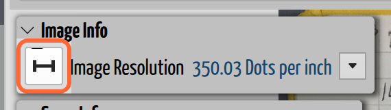

# Set the Image Resolution

## Why you need this

A scan is a grid of pixels, and pixels have no size. The note in the demo
project runs 3195 × 2564 pixels. Read that at 350.03 dots per inch and the page
measures 9.13 by 7.33 inches, a field notebook. Read the same file at 96 DPI and
it measures 33.3 by 26.7 inches, a flip-chart sheet. Nothing in the pixels picks
between them. **Image Resolution**, the note's **DPI**, supplies the missing
fact: how much real paper one pixel covers.

That matters because a scrap states its scale in *paper distance*. The demo
scrap reads **On Paper 1 in = In Cave 516.99 in**, which CaveWhere reduces to
**1:517**. That "1 in" only means an inch once CaveWhere knows how many pixels
make an inch on the note. Set the resolution wrong and the whole equation gets
quoted in the wrong unit. Set it to zero and the scrap cannot warp at all. That
is the **"Invalid scale (check DPI)"** error in the
[Scrap Info panel](../scraps/scrap-types.md#set-the-scale).

Most of the time you never touch it. On import CaveWhere asks Qt for the image's
own horizontal density and keeps it as a whole number of dots per meter,
converting at 39.3700787 dots per meter to the inch. The rounding shows: the
demo project's JPEG carries 3780 dots per meter, which comes back as 96.01 DPI,
not a clean 96.

Two limitations. Only the *horizontal* density gets read, so a file whose two
densities differ loses the vertical one. Files that declare no density at all
arrive with whatever fallback the image library hands over, and nothing on
screen says it was a guess. A phone photo, or a page run through a converter, is
a common way to end up there. Nothing in CaveWhere writes the density back out
either, so a note round-tripped through another tool arrives carrying whatever
that tool declared.

The number lives on the note, not on the file. CaveWhere saves it into the
project alongside the note and reads it back on load, so the panel need not
agree with the image. The demo project makes the point: that same JPEG record
still reads 3780 dots per meter while the note itself stores 350.0311716281545
and displays 350.03.

**Mostly this is a raster problem**. A PDF page gets measured in PostScript
points, 2835 dots per meter, so every PDF note reads 72.01 DPI. The rasterization
resolution makes no difference (**Settings → PDF / SVG**, 96 ppi by default). An
SVG gets measured in CSS pixels, 3780 dots per meter, so every SVG note reads
96.01. Both describe the document itself, and both already work. A
[LiDAR note](lidar-notes.md) carries no DPI at all: a scan records numbers, not
units, so no paper needs sizing.

## Find the Image Resolution

The **Image Info** panel, shown below, appears only while a note sits in carpet
mode, so click **Carpet** first. It rides above Scrap Info at the top of the
note. Below 600 px of window width it opens collapsed to its title bar, and the
chevron expands it.

*The Image Info panel. The row shown above holds the whole feature: a tool
button on the left, the value, and a menu on the right.*

As shown above, the value reads to at most 2 decimal places, trailing zeros
dropped, so a note at 300 dpi shows `300`. Beside it sits a dropdown
of 3 units (**Dots per inch**, **Dots per centimeter**, **Dots per meter**), and
switching units converts the number with it. Know the number already and you
can type it straight in.

## Measure the resolution off the page

When nobody knows the resolution, measure it. You need something on the note
whose paper size you can state: the printed grid on engineer's paper, a ruler
laid on the page before scanning, or the width of the page. It starts from the
button shown below.

*The measurement button, ringed above. It carries the same measuring-bar icon as
the scrap's scale tool.*

1. Click the **measurement button** shown above, at the left of the row.
   CaveWhere prompts *Click the length's first point*.
2. Click both ends of the thing you are measuring. The prompt becomes *Click the
   length's second point*, and a small panel opens under the second click.
3. Type the **length on the paper** between those points, meaning what a ruler
   on the original page would give, not the distance in the cave.
4. Click **Done**.

CaveWhere divides the pixels between your clicks by the length you typed. Two
things the panel never mentions. **Done stays disabled until the length exceeds
zero**, so the tool cannot hand back a resolution of nothing. The length field
also defaults to **inches** even on a metric project, because the interaction
pins that unit instead of reading the project unit system. Read the unit before
typing.

The tool measures the pixels you clicked on screen, then converts to the image's
native pixels by scaling with the original size over the rendered size. That
step keeps the answer honest on a rasterized PDF. At the default 96 ppi the
picture on screen carries 1.33 times as many pixels per axis as the document
carries points, and 8.3 times at the 600 ppi maximum. Escape abandons the
measurement, and a right-drag still pans while the tool is armed.

Your unit survives the measurement: start in **Dots per centimeter** and the
answer lands in dots per centimeter.

I recommend measuring across the **longest feature you can name** on the page.
The resolution comes out as pixels divided by the length you typed. A click that
misses by a few pixels therefore costs ten times as much over a 1 in baseline as
over a 10 in one.

Both tools start with 2 clicks on the note and wear the same icon, so they are
easy to mix up. This one asks for a distance **on the paper** and labels its
field *Length on the paper*. The scale tool asks for a distance **in the cave**,
labels its field *In cave length*, and defaults to meters.

## Apply the resolution to the whole trip

Notes from one trip usually come off one scanner in one batch, so they share a
resolution. The menu button at the right of the row (shown above) holds 2 items.

- **Propagate resolution for each note in *(trip name)*** copies this note's
  value *and its unit* onto every note in the trip. Measure once, apply to all.
  **Nothing asks you to confirm, nothing puts the old values back, and there is
  no undo.** Propagate from a note you trust.
- **Reset to original** restores the density stored with the image file. It also
  forces the unit back to **Dots per inch**, even when you were working in dots
  per centimeter. Its limitation: when the file never declared a usable density,
  reset may hand back the same fallback that caused the trouble.

## What the DPI does and doesn't change

This one is easy to get backwards.

The resolution never touches the note's pixels, and on its own it does not
resize your carpet. With **Auto Calculate** on, CaveWhere derives the scrap's
scale by comparing distances on the page against the surveyed shots, and it
measures those page distances *through* the resolution. The triangulator then
divides the page size in meters (pixels over dots per meter) by that derived
scale, which is itself proportional to one over dots per meter. The two cancel.
Changing the resolution re-quotes the **1:*x*** ratio in Scrap Info and leaves
the carpet exactly the size the survey says it is.

Where the resolution genuinely bites:

- **A scale you typed yourself**. With Auto Calculate off, CaveWhere returns
  from `updateNoteTransformation` before deriving anything, so the DPI alone
  decides how much of the sketch "1 in" covers. Wrong by a factor of 2, carpet
  wrong by a factor of 2. A fresh scrap starts at 1 cm = 2.5 m on a metric
  project, 1 in = 20 ft on an imperial one.
- **Zero, negative, or not a number**. The page then has no size, the scale
  returns NaN, and the scrap cannot warp. The field refuses such a value, so
  meeting this normally means the imported file declared something unusable.

One case earns its own warning. A resolution off by the 39.3700787 unit factor
can wedge the machine! The morph grid defaults to 0.5 m spacing in cave
coordinates (**Settings → Warping**).
A page claiming to be 39 times too large may ask for hundreds of millions of
grid points, and that pins every core for minutes. CaveWhere clamps the grid at
2048 points per axis and logs `clamping pathological point grid`, which turns a
hang into a coarse warp.

So a suspiciously scaled carpet on an auto-calculated scrap is usually *not* a
resolution problem. Check the scrap type and the stations first, in
[Troubleshoot the Carpet](../scraps/troubleshoot-carpeting.md). A check-DPI
error, or a hand-typed scale that lands wrong, usually is.

## Errors you might see

- **"Invalid DPI. Value must be finite and greater than 0."** sits in the Image
  Info panel whenever the resolution is zero, negative, or not a number. Type a
  real resolution, or use **Reset to original**. CaveWhere rejects a zero you
  type, so this normally points at the imported file.
- **"Invalid scale (check DPI)"** sits in the Scrap Info panel. The scrap's
  scale cannot be worked out, and a bad note resolution is the usual reason. Fix
  the resolution here and the scrap's scale resolves.
