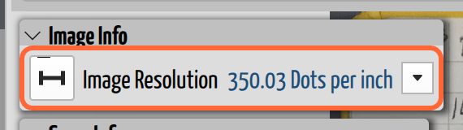

# Set the Image Resolution

## Why you need this

A scan is a grid of pixels, and pixels have no size. The demo project's note
runs 3195 × 2564 pixels: at 350.03 dots per inch a 9.13 by 7.33 inch field
notebook, at 96 DPI a 33.3 by 26.7 inch flip-chart sheet. **Image Resolution**,
the note's **DPI**, supplies the missing fact: how much real paper one pixel
covers.

That matters because a scrap states its scale in *paper distance*. The demo
scrap reads **On Paper 1 in = In Cave 516.99 in**, which CaveWhere reduces to
**1:517**. That "1 in" only means an inch once CaveWhere knows how many pixels
make an inch on the note. Set the number wrong and the scale comes out in the
wrong unit. Set it to zero and the scrap cannot warp at all: the
**"Invalid scale (check DPI)"** error in the
[Scrap Info panel](../scraps/scrap-types.md#set-the-scale).

Most of the time you never touch it. On import CaveWhere reads the image's own
horizontal density, stored as a whole number of dots per meter and converted at
39.3700787 to the inch. The rounding shows: the demo JPEG's 3780 dots per meter
comes back as 96.01 DPI, not a clean 96. Only the *horizontal* density gets
read, and a file that declares none arrives with whatever fallback the image
library hands over, with nothing on screen to say it was a guess.

From then on the number lives on the note, not on the file. CaveWhere saves it
with the project and reads it back on load, so the panel need not agree with the
image. The demo note stores 350.0311716281545, shown as 350.03, over a JPEG
that still records 96.01.

**Mostly this is a raster problem**. A PDF page always reads 72.01 DPI and an
SVG 96.01, whatever rasterization resolution you set in
[Add Notes to a Trip](add-a-note.md), and both already work. A
[LiDAR note](lidar-notes.md) carries no DPI: a scan records numbers, not units.

## Find the Image Resolution

The **Image Info** panel, shown below, rides above Scrap Info at the top of the
note and appears only in carpet mode, so click **Carpet** first.

*The Image Info panel, with the whole feature on one row: a tool button, the
value, and a menu.*

The value on the row shown above reads to at most 2 decimal places. A dropdown
beside it (**Dots per inch**, **Dots per centimeter**, **Dots per meter**)
converts the number as you switch, and you can type a known resolution straight
in.

## Measure the resolution off the page

When nobody knows the resolution, measure it. You need something on the note
whose paper size you can state: the grid on engineer's paper, a ruler scanned
alongside the page, or the page width.

1. Click the **measurement button** at the left of the row, the one wearing a
   measuring-bar icon. CaveWhere prompts *Click the length's first point*.
2. Click both ends of what you are measuring. The prompt becomes *Click the
   length's second point*, and a panel opens under the second click.
3. Type the **length on the paper** between those points, what a ruler on the
   page would give, not the distance in the cave.
4. Click **Done**.

CaveWhere divides the pixels between your clicks by the length you typed,
correcting for zoom so the answer stays honest on a rasterized PDF. The result
lands in whatever unit the dropdown shows, and Escape abandons the measurement.

Two things the panel never mentions. **Done stays disabled until the length
exceeds zero**, so the tool cannot hand back a resolution of nothing. And the
length field defaults to **inches** even on a metric project, whatever the
project unit system, so read the unit before typing.

I recommend measuring across the **longest feature you can name**. The
resolution is pixels divided by the length you typed, so a click off by a few
pixels costs ten times as much over a 1 in baseline as over a 10 in one.

The scrap's scale tool wears the same icon, so the two are easy to mix up. This
tool's field is *Length on the paper*; the scale tool's is *In cave length*, a
distance in the cave, and it defaults to meters.

## Apply the resolution to the whole trip

Notes from one trip usually come off one scanner in one batch, so they share a
resolution. The menu at the right of the row holds 2 items.

- **Propagate resolution for each note in *(trip name)*** copies this note's
  value *and its unit* onto every note in the trip. **Nothing asks you to
  confirm, nothing puts the old values back, and there is no undo.** Propagate
  from a note you trust.
- **Reset to original** restores the density stored with the image file and
  forces the unit back to **Dots per inch**. When the file declared no usable
  density, reset hands back the same fallback that caused the trouble.

## What the DPI does and doesn't change

This one is easy to get backwards. The resolution never touches the note's
pixels, and on its own it does not resize your carpet. With **Auto Calculate**
on, CaveWhere measures page distances *through* the resolution while deriving
the scrap's scale from the shots, so the resolution divides back out. Changing
it re-quotes the **1:*x*** ratio in Scrap Info and leaves the carpet the size
the survey says.

Where it genuinely bites is **a scale you typed yourself**. With Auto Calculate
off, CaveWhere derives nothing, so the DPI alone decides how much of the sketch
"1 in" covers. Wrong by a factor of 2, carpet wrong by a factor of 2.

One case earns its own warning. A resolution off by the 39.3700787 unit factor
can wedge the machine! The morph grid defaults to 0.5 m spacing in cave
coordinates (**Settings → Warping**). A page claiming to be 39 times too large
may ask for hundreds of millions of grid points and pin every core for minutes.
CaveWhere clamps the grid at 2048 points per axis and logs
`clamping pathological point grid`, which turns a hang into a coarse warp.

A suspiciously scaled carpet on an auto-calculated scrap is usually *not* a
resolution problem. Check the scrap type and the stations first, in
[Troubleshoot the Carpet](../scraps/troubleshoot-carpeting.md).

## Errors you might see

- **"Invalid DPI. Value must be finite and greater than 0."** sits in the Image
  Info panel whenever the resolution is zero, negative, or not a number. Type a
  real resolution, or use **Reset to original**. CaveWhere rejects a zero you
  type, so this normally points at the imported file.
- **"Invalid scale (check DPI)"** sits in the Scrap Info panel: the scrap's
  scale cannot be worked out, and a bad note resolution is the usual reason. Fix
  the resolution here and the scale resolves.
