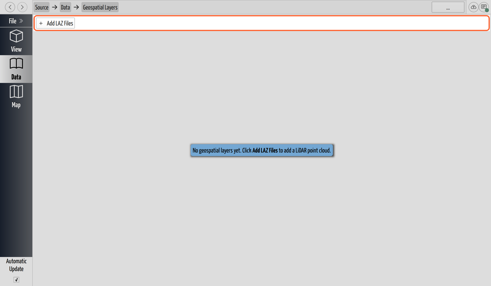

# Add a Point Cloud

## Why / when you need this

A cave survey is a wireframe: stations, shots, and the passage walls you sketched.
It says nothing about the world *above* the cave — where the entrance sits on the
hillside, which surface sink a lead is heading for, how a passage runs beneath a
road or a building. A **point cloud** — a LiDAR scan of the surface, usually flown
from the air — carries exactly that: millions of measured 3D points of the terrain.

Bring one into the project and CaveWhere draws it in the *same space* as the cave,
so the two line up. That's what lets you check a lead against the surface above it,
plan a dig from where a passage comes closest to daylight, or simply present the
cave in the landscape it belongs to.

The one prerequisite is a shared frame: the cloud and the cave both have to be on
the same real-world grid, so **the cave must be
[georeferenced](../georeferencing/georeference-a-cave.md)** (or become so as you add
the cloud — see below). A cloud dropped onto a floating, un-georeferenced cave has
nothing to line up with.

## Where point clouds live

Point-cloud layers are a project-wide thing, not a per-cave one, so they sit next
to the project's coordinate system. On the **Data** page, find the **Geospatial**
box: it holds the **Coordinate system** control and, below it, a **Layers** link
showing the current layer count (`0` on a project with none). Click the link to
open the **Geospatial Layers** page.

*The Geospatial Layers page before any cloud is added. The **Add LAZ Files** bar
is the entry point; the help box names the first step.*

## Add a LAZ or LAS file

Click **Add LAZ Files**. The file picker filters to **LAZ point clouds
(`*.laz` `*.las`)** — `.laz` is the compressed form, `.las` the uncompressed one,
and CaveWhere reads either. You can select several at once.

CaveWhere **copies** each file into the project (into a `GIS Layers` folder), so the
cloud travels with the project rather than depending on where the original scan
happened to live. A large scan is streamed and loaded in the background; a progress
entry tracks it, and the layer appears in the table as soon as its header is read.

## The layer table

Each loaded cloud is one row, under three columns:

- **Name** — the file's name. This is just the layer's label; renaming the file
  before you import it is the way to give it a friendly name.
- **Coordinate System** — the real-world grid the layer's points are in, shown by
  its human name (for example `NAD83 / UTM zone 13N`). Hover the cell to see the
  full underlying definition. This is the layer's *own* system, read from the file —
  it doesn't have to match the project's, because CaveWhere reprojects (see below).
- **Points** — how many points the cloud holds. Aerial scans run to millions.

## Coordinate systems: how the cloud lines up

A point cloud already knows where it is — a LiDAR file normally carries its own
coordinate system baked in. CaveWhere uses that to **reproject** every point into
the *project's* coordinate system, so the cloud and the survey end up on one grid
and overlay correctly. You don't align anything by hand.

Two cases are worth knowing:

- **The project has no coordinate system yet.** Adding your first cloud *adopts*
  that cloud's coordinate system as the project's, and centers the project on the
  cloud. This is the quick path: drop in an aerial scan and the project takes its
  grid, ready for you to
  [fix a station](../georeferencing/georeference-a-cave.md#fix-a-station) into it.
- **The cloud has no coordinate system of its own.** Some `.las` files don't embed
  one. Then CaveWhere has nothing to reproject from, and a help box appears:

  > One or more layers don't have an embedded coordinate system. Set the project's
  > coordinate system on the **Data** page to align them with surveys.

  Set the [project coordinate system](../georeferencing/georeference-a-cave.md#choose-the-projects-coordinate-system)
  to the one the cloud's numbers are actually in, and it falls into place.

Either way, the goal is the one from
[georeferencing](../georeferencing/georeference-a-cave.md): the cave, the surface
scan, and any surface map all reported in a single coordinate system, so they share
one space.

## Hide, archive, or remove a layer

**To hide a cloud in the 3D view**, use the **Layers** tab — the same keyword filter
that shows and hides caves and trips (see
[Focus on part of the cave](../view-3d/the-3d-view.md#focus-on-part-of-the-cave-layers)).
Every point cloud is tagged **Type: LAZ Layer**, so grouping the Layers tab by
**Type** gives you a **LAZ Layer** group you can tick or untick to show or hide the
clouds. That's the visibility control — there's no per-row checkbox on this page.

For the two heavier actions, **right-click a row** on the Geospatial Layers page:

- **Disable** / **Enable** — *unload* the cloud, not just hide it. A disabled layer
  isn't drawn and isn't held in memory at all, so this is how you **archive** a scan
  you're done with, and how you keep a large cloud from spending load time every time
  the project opens. It stays in the table, dimmed and marked **Disabled**; **Enable**
  loads it back. (The [clip tool](clip-a-point-cloud.md) disables the source clouds
  for you after a clip, leaving just the result on screen.)
- **Remove** — take the layer out of the project entirely. CaveWhere confirms first,
  then deletes the copied file from the project's `GIS Layers` folder. The original
  scan you imported from is untouched.

## What you see in the 3D view

Switch to the **3D view** and the cloud is drawn alongside the cave, in the same
coordinates. Two things about how it looks are automatic and worth understanding:

- **It reads as a lit surface, not a field of dots.** CaveWhere shades the cloud
  with *Eye-Dome Lighting* — each point is darkened according to how far its
  on-screen neighbors sit in front of or behind it, which brings out relief and
  edges the way shading on a solid surface would. There's no on/off switch; it's
  always on, because a raw scatter of equally-bright points is nearly impossible to
  read as terrain.
- **Points are sized to just touch.** CaveWhere sizes each point from the scan's own
  average spacing so neighboring points meet with no gaps — that gap-free coverage
  is what lets the shading read as a continuous surface instead of showing the
  background through the holes. If a cloud looks too sparse or too clotted, tune the
  point size right in the view: **hover the 3D view, hold `P`, and scroll** the mouse
  wheel or trackpad. While `P` is held the wheel grows and shrinks the points instead
  of zooming the camera.

## Next steps

- [Clip a Point Cloud](clip-a-point-cloud.md) — trim a big scan down to just the
  part over your cave.
- [Georeference a Cave](../georeferencing/georeference-a-cave.md) — fix the cave to
  the same grid the cloud is on, so the two line up.
- [Directions and Coordinate Systems](../concepts/coordinate-systems.md) — datums,
  projections, and why a shared grid matters.
