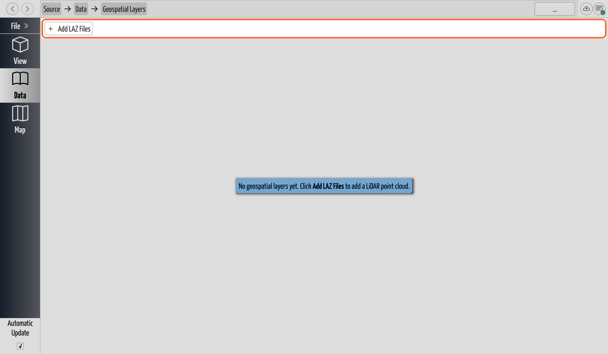

# Add a Point Cloud

## Why / when you need this

A cave survey is a wireframe: stations, shots, and the passage walls you sketched.
It says nothing about the world *above* the cave, where the entrance sits on the
hillside, which surface sink a lead heads for, whether a passage runs under a road.
A **point cloud** carries that: a LiDAR scan of the surface, usually flown from the
air, holding millions of measured 3D points.

Bring one in and CaveWhere draws it in the same space as the cave. Check a lead
against the surface above it, or plan a dig where a passage comes closest to
daylight.

Both have to sit on one real-world grid, so
**[georeference the cave](../georeferencing/georeference-a-cave.md)**, or let the
cloud do it (see below).

## Where point clouds live

Point-cloud layers belong to the project, not to a cave. Open the **Data** page and
find the **Project** box, which holds 3 rows: **Units**, **Coordinate system**, and
**Layers**. The count next to **Layers** is a link (`0` on a project with none);
click it to open **Geospatial Layers**. Editing the coordinate system needs the
pencil toggle in that box; the link works either way.

Until a cloud loads, the page below shows a blue help box: "No geospatial
layers yet. Click **Add LAZ Files** to add a LiDAR point cloud."

*The Geospatial Layers page before any cloud is added.*

## Add a LAZ or LAS file

Click **Add LAZ Files**, the bar ringed above. The file picker filters to **LAZ
point clouds (`*.laz` `*.las`)**. `.laz` is the compressed form, `.las` the
uncompressed one, and CaveWhere reads both through LASlib. Select several at
once.

CaveWhere **copies** each file into a `GIS Layers` folder inside the project, so the
cloud travels with the project. Beside each copy it writes a `<name>.cwlaz` sidecar
holding the layer's id and enabled bit. Decoding runs in the background on one
worker per 262,144 points, capped at one per core, tracked by a progress entry
labeled `Loading <name>.laz` even when the file was a `.las`.

## The layer table

Each loaded cloud is one row, under 3 columns.

- **Name** shows the file's base name. Nothing on this page renames a layer, so
  choose the file name before you import.
- **Coordinate System** names the grid the layer's own points sit on, as PROJ
  resolves it, such as `NAD83 / UTM zone 13N`. Hover the cell for the raw
  definition. It
  need not match the project's, because CaveWhere reprojects.
- **Points** counts the points, comma-grouped. Aerial tiles run to millions.

A row you turn off dims and picks up a **Disabled** chip.

## Coordinate systems: how the cloud lines up

A LiDAR file normally carries its own coordinate system. CaveWhere hands that and
the project's system to PROJ 9.3.1 and **reprojects** every point, so the cloud and
the survey land on one grid. You align nothing by hand.

**The project has no coordinate system yet.** Your first cloud gives the project its
grid and moves the project origin to that cloud's bounding-box center, ready for you
to [fix a station](../georeferencing/georeference-a-cave.md#fix-a-station) into it.
Auto-adopt only fills a gap, so whichever scan you add first decides the grid.
**I recommend setting the coordinate system yourself** when you know it.

**The cloud has no coordinate system of its own.** CaveWhere reads only the OGC WKT
record that LAS 1.4 writes. Older files store their CRS as GeoTIFF GeoKeys instead,
which CaveWhere does not decode, so a well-georeferenced old scan looks
unreferenced. A help box appears while the project has no coordinate system:

> One or more layers don't have an embedded coordinate system.  
> Set the project's coordinate system on the **Data** page to align them with surveys.

Set the [project coordinate system](../georeferencing/georeference-a-cave.md#choose-the-projects-coordinate-system)
to the one the cloud's numbers are actually in, and it falls into place.

**PROJ cannot get from the cloud's grid to the project's.** Nothing warns you. The
points go through untransformed and the cloud lands wherever its raw easting and
northing put it, rarely near the cave. If a cloud you just added is
nowhere in sight, check this first.

A file the reader cannot open fails just as quietly: the row appears with `0` under
**Points** and no explanation, because the layer's error message has nowhere to
surface here. Only a corrupt `.cwlaz` sidecar speaks up, skipping the row and
reporting `Cannot load LAZ layer <file>: <reason>` in the project's error list.

## Hide, archive, or remove a layer

**To hide a cloud in the 3D view**, use the **Layers** tab, the keyword filter that
also shows and hides caves and trips (see
[Focus on part of the cave](../view-3d/the-3d-view.md#focus-on-part-of-the-cave-layers)).
Every point cloud carries the keyword **Type: LAZ Layer**, so grouping that tab by
**Type** gives you a **LAZ Layer** group to tick or untick. This page has no per-row
checkbox.

For the heavier 2, **right-click a row**.

- **Disable** / **Enable** *unloads* the cloud rather than hiding it. Disabling
  cancels any load in flight, throws the geometry away, and holds no memory, so it
  archives a scan you are done with and stops a big cloud costing load time on every
  open. The row stays, dimmed and marked **Disabled**, and the `.cwlaz` persists the
  bit through a reopen. The [clip tool](clip-a-point-cloud.md) disables the source
  clouds for you after a crop or erase, leaving just the result drawn.
- **Remove `<name>`** asks `Remove <name>?`, then **deletes** the copied file from
  `GIS Layers` along with its `.cwlaz`. That copy was the project's only version of
  the layer, and nothing in CaveWhere brings it back. The original scan you imported
  from survives, so keep it.

## What you see in the 3D view

Switch to the **3D view** and CaveWhere draws the cloud beside the cave, in the same
coordinates. Two things happen automatically.

- **It reads as a lit surface, not a field of dots.** CaveWhere shades every cloud
  with *Eye-Dome Lighting*: each point darkens according to how far its on-screen
  neighbors sit in front of it, which brings out relief and edges. It runs at
  strength 1500, max darken 3.0, and a 1.4 px sample radius, and no control in the
  app changes that or turns it off.
- **Every point draws as a 1.29 m-radius sphere.** CaveWhere uses that radius for every
  cloud rather than measuring it from the scan, so a dense tile looks solid and a
  sparse one shows background through the gaps. Tune it in the view: **hover the
  3D view, hold `P`, and scroll** the mouse wheel or trackpad.
  While `P` is held the wheel resizes points instead of zooming the camera, about
  13% a tick (roughly 6 ticks to double), clamped to 0.01 m through 50 m, and it
  moves every loaded cloud together. CaveWhere does measure the scan's mean spacing,
  but that sizes the invisible pick spheres, not the drawn ones.

## Next steps

- [Clip a Point Cloud](clip-a-point-cloud.md): trim a big scan to the part over your
  cave.
- [Georeference a Cave](../georeferencing/georeference-a-cave.md): fix the cave to
  the grid the cloud is on.
- [Directions and Coordinate Systems](../concepts/coordinate-systems.md): datums and
  projections.
