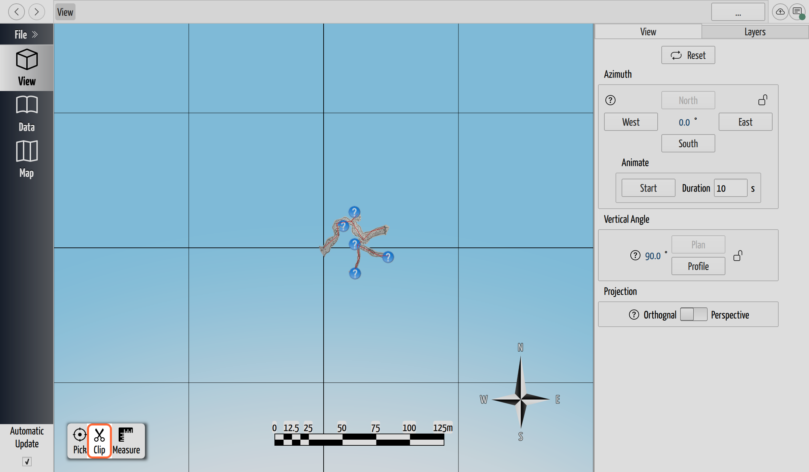

# Clip a Point Cloud

## Why / when you need this

An aerial LiDAR scan is flown for a whole area, not for your cave. It can cover
square kilometers and run to tens of millions of points, when all you care about is
the strip of surface directly over the survey. Carrying the whole thing makes the 3D
view heavy and the project large, and it buries the part you actually want.

**Clipping** trims a cloud to a region you draw: keep the points over the cave and
drop the rest, or cut a piece out. The result is a new, smaller layer you can work
with and share, while the full scan stays put in case you need it again.

## Open the clip tool

Clipping happens in the **3D view**, on the cloud as it's drawn. In the toolbar at
the bottom of the view, click **Clip** (the scissors, tooltipped *Clip point
cloud*). The tool works on the point-cloud layers currently **shown** in the view,
so if you want to clip just one of several, hide the others first with the
[Layers tab](../view-3d/the-3d-view.md#focus-on-part-of-the-cave-layers) (or
[Disable](add-a-point-cloud.md#hide-archive-or-remove-a-layer) them on the
Geospatial Layers page).

*The Clip tool sits in the 3D view's toolbar, alongside the coordinate picker and
the measurement tool.*

## Draw the region

**Orient the view before you start.** The polygon you draw is a shape on your
**screen**, and CaveWhere extrudes it straight back along your current line of sight
into a **clip volume** — a prism cutting through the whole cloud. A point is kept or
dropped by whether it falls inside that outline *as seen from your current angle*, at
any depth. So the viewpoint you draw from *is* the clip: look straight down and
you're selecting a map-like footprint; look from the side and you're taking a profile
slice. Because the selection is tied to that viewpoint, CaveWhere **locks the view's
rotation and tilt** while you draw — a swing would change which points fall inside
your outline. Frame the area you want first, *then* pick up the tool.

Now trace the region:

1. **Click to drop each corner** of the polygon. A running help box guides you:
   *"Click to add more vertices. 3 minimum."* You need at least three corners.
2. **Close the loop** once you have three or more: click near the first corner (it
   shows a snap indicator) or **double-click** anywhere. The help box switches to
   *"Choose **Crop** or **Erase**, or cancel."*

Pressing **Esc** at any point cancels and leaves the tool.

## Keep or remove — Crop vs. Erase

With the polygon closed, a small toolbar offers two ways to apply it, plus a way
out:

- **Crop** — *keep the points inside the polygon*, discard everything outside. This
  is the common case: draw a box around the cave and crop the scan down to it.
- **Erase** — *remove the points inside the polygon*, keep everything outside. Use
  it to cut away a distracting feature — a building, a spoil heap — from an
  otherwise-good scan.
- **Cancel** — discard the polygon and leave the tool without changing anything.

## What clipping produces

Clipping doesn't edit the scan you drew on. It **writes a new layer** — named
`clip_1`, `clip_2`, and so on — holding just the kept points, and then
**automatically disables the source layer(s)** so only the fresh clip is drawn. The
originals are still in the project, dimmed and marked *Disabled* on the Geospatial
Layers page; right-click and **Enable** one to bring it back, or **Remove** it once
you're happy with the clip.

A few things the new layer carries over, so you lose nothing that mattered:

- **Every point attribute** — intensity, color, GPS time, classification — is passed
  straight through to the clip.
- **The project coordinate system** is stamped on the output, so the clip is
  georeferenced exactly like its source.
- If several layers were visible, they're **merged** into the one clipped layer.

Because the clip reads the source files **from disk**, point by point, rather than
from what's loaded in memory, it works on a cloud far too large to hold all at once.

## Next steps

- [Add a Point Cloud](add-a-point-cloud.md) — import, coordinate systems, and
  showing or hiding layers.
- [Georeference a Cave](../georeferencing/georeference-a-cave.md) — put the cave on
  the same grid as the cloud.
