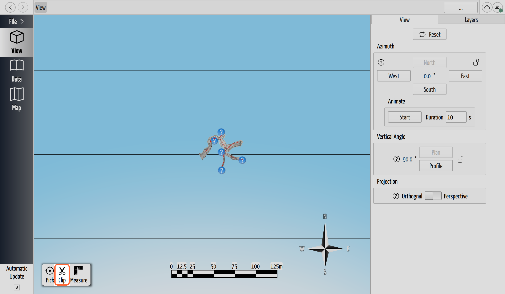

# Clip a Point Cloud

## Why / when you need this

An aerial LiDAR scan is flown for a whole area, not for your cave: square
kilometers and tens of millions of points, when all you want is the strip of
surface over the survey. The rest only makes the 3D view heavy and the project
large.

**Clipping** trims a cloud to a polygon you draw. It never edits the file you
drew on: CaveWhere streams the source off disk and writes the kept points into a
new `.laz`, leaving the original untouched. There's no undo for a clip, because
nothing gets overwritten.

## Open the clip tool

Clipping happens in the **3D view**. Click **Clip**, the scissors in the floating
toolbar at the bottom left, between **Pick** and **Measure** (ringed, see below).

*Clip sits between Pick and Measure in the 3D view's toolbar.*

Every point-cloud layer currently **shown** gets clipped, and they all merge into
one output file. I recommend hiding all but the layer you want first, with the
[Layers tab](../view-3d/the-3d-view.md#focus-on-part-of-the-cave-layers) or
[Disable](add-a-point-cloud.md#hide-archive-or-remove-a-layer) on the Geospatial
Layers page.

## Draw the region

**Orient the view before you start.** The polygon is a shape on your **screen**,
and CaveWhere extrudes it straight back along your line of sight into a prism
through the whole cloud. A point survives if it lands inside that outline *as
seen from your current angle*, at any depth. Look straight down for a map
footprint, from the side for a profile slice.

So the tool freezes the angle: right-drag rotate stops responding and the **Plan**
and **Profile** buttons gray out. Wheel zoom stays live, since it moves polygon
and points together. Panning does not: left-drag draws. The azimuth controls are
the gap. **North**, **South**, **East**, **West** and azimuth **Animate** still
turn the view while you draw, and that skews the outline you already drew. Leave
them alone until you commit.

Then trace it:

1. **Click to drop each corner.** Below 3 corners the help box reads *"Click to
   add more vertices. 3 minimum."*
2. **Close the loop.** At 3 corners it switches to *"Click near the first vertex
   (or double-click) to close."* Near means within 12 px of the first corner; a
   snap indicator appears inside that radius.

**Esc** cancels and leaves the tool.

## Keep or remove — Crop vs. Erase

A closed polygon brings up a 3-button toolbar.

- **Crop** keeps the points inside the polygon and discards everything outside.
  The common case: box the cave, crop the scan down to it.
- **Erase** removes the points inside and keeps everything outside, for cutting a
  building or spoil heap out of an otherwise-good scan. The output holds
  everything outside the polygon, so Erase rarely shrinks anything.
- **Cancel** drops the polygon and exits.

The tool closes the instant you press **Crop** or **Erase**, leaving no banner to
report trouble. Failures go to the project's error list instead: an
empty view gives *"No visible LAZ layers to clip."* and a full disk gives
*"Failed to write LAZ point (disk full or I/O error)."* CaveWhere then deletes the
half-written file, as it does if you cancel the running job (*Cropping 1 LAZ
layer(s)*).

## What clipping produces

CaveWhere writes `clip_001.laz` into the project's `GIS Layers` folder, padding the
index to 3 digits and taking one past the highest there, then rescans so the layer
appears in the table. It also **disables every source layer** that fed the clip,
and saves that flag with the project, so reopening shows the clip alone.
Right-click a dimmed row and **Enable** to bring one back.

What carries over:

- **Standard LAS attributes** (intensity, color, GPS time, return number,
  classification) all survive. Custom extra-byte attributes survive only when
  every source shares one point format; a mixed merge falls back to the richest
  standard format and drops them, along with any waveform payload.
- **The project's frame**, written into the output as an OGC WKT record. Each
  source is reprojected into it on the way, so the clip is in the same system
  CaveWhere draws the cave in rather than whatever grid the scan arrived on.
- **XYZ re-encoded at a scale of 0.001**, millimeter precision.

Points stream off disk, never as one in-memory copy, so a multi-gigabyte scan
clips fine on a laptop.

## Next steps

- [Add a Point Cloud](add-a-point-cloud.md): import, coordinate systems, showing
  and hiding layers.
- [Georeference a Cave](../georeferencing/georeference-a-cave.md): the cave on the
  same grid as the cloud.
