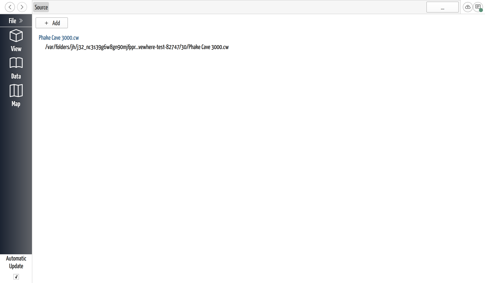

# Open a Project

## Why / when you need this

CaveWhere holds **one project at a time**. Opening a cave means putting down the
one you have, so every route into a project passes through the same question first
— what about the work that's already open? That's why New and Open both stop and
ask you before they do anything.

## Start a new project

**File → New** (`Ctrl+N`) puts the current project away and gives you a fresh one.

The new project is real and already on disk, but it's temporary and unnamed — see
[Your project already exists](save-a-project.md#your-project-already-exists) for
what that means and why saving it early is worth the ten seconds.

## Open a project

**File → Open…** (`Ctrl+O`) brings up a file picker filtered to
**CaveWhere Project (`*.cwproj` `*.cw`)**.

Both formats — and old `.cw` files going back to CaveWhere v6 — open through this
one dialog, and CaveWhere works out what it's looking at by reading the file rather
than trusting its extension. That matters for `.cw`, which is used by two
completely different formats: a modern
[bundle](project-formats.md#bundle-cw) and a
[legacy database](project-formats.md#legacy-cw-files-v6-and-older). You don't have
to know which one you have.

**Pick the `.cwproj` file, not the folder.** A directory project is a folder with
the project file inside it, so the folder itself isn't what you select — open it
and choose the `.cwproj` within. (The folder and the file share a name, which makes
this less confusing in practice than it sounds.)

If you open an old `.cw`, read
[Legacy `.cw` files](project-formats.md#legacy-cw-files-v6-and-older) before you
save it. The conversion is automatic and silent, and the first save changes the
file's format while keeping its name.

## Reopen a recent project

CaveWhere keeps a list of the projects you've opened, saved, or downloaded. Get to
it by clicking **Source** in the breadcrumb trail at the top of the window — it's
the page that sits above **Data**, so from anywhere in your survey data, **Source**
is one click up.

*The recent projects list. Entries are labelled by file name — extension and all —
rather than by the project name you set on the Data page.*

Each entry is a link labelled with the project's **file name**, with the file's
full path underneath. Click the name to open it. Right-click the path for **Show in
Finder** (**Show in Explorer** on Windows) if what you actually want is the file
itself — to copy it, back it up, or send it to someone.

The list maintains itself. Projects are added when you open, save, or download one,
and entries whose files have gone missing are cleaned out the next time CaveWhere
starts. Until you've opened anything, the page says so: *"No caving areas created
or opened yet."*

The **Add** button on that page repeats the same three routes into a project — **New
Project**, **Open**, and **Online Project** — so you can do everything from here
without going back to the File menu.

## Open a project from online

**File → Open from Online…** (`Ctrl+Shift+O`) downloads a project shared by your
team rather than opening one from your disk, and **File → Open from Link…** opens
one from a link someone sent you. Both belong to CaveWhere's collaboration
features — see [Open a Shared Project](../collaboration/open-a-shared-project.md).

## What happens to the project you had open

Whichever route you take, CaveWhere deals with the open project first, and what it
asks depends on where that project stands:

- **Nothing unsaved** — it doesn't ask. It just switches.
- **A saved project with unsaved changes** — **Discard**, **Cancel**, or **Save**
  (plus **Save & Sync** if the project has a remote).
- **A temporary project that has never been saved** — **Delete**, **Cancel**, or
  **Save**. There's no Discard, because there's no earlier save to return to;
  **Delete** removes the project along with its temporary folder.
- **A brand-new empty project** — it doesn't ask either. Nothing has been put in it.

[When you quit](save-a-project.md#when-you-quit) covers these buttons in full; they
are the same ones you get on the way out of the app.

## Next steps

- [Save a Project](save-a-project.md) — the first save, and what Save is really for.
- [Choose a Project Format](project-formats.md) — directory versus bundle.
