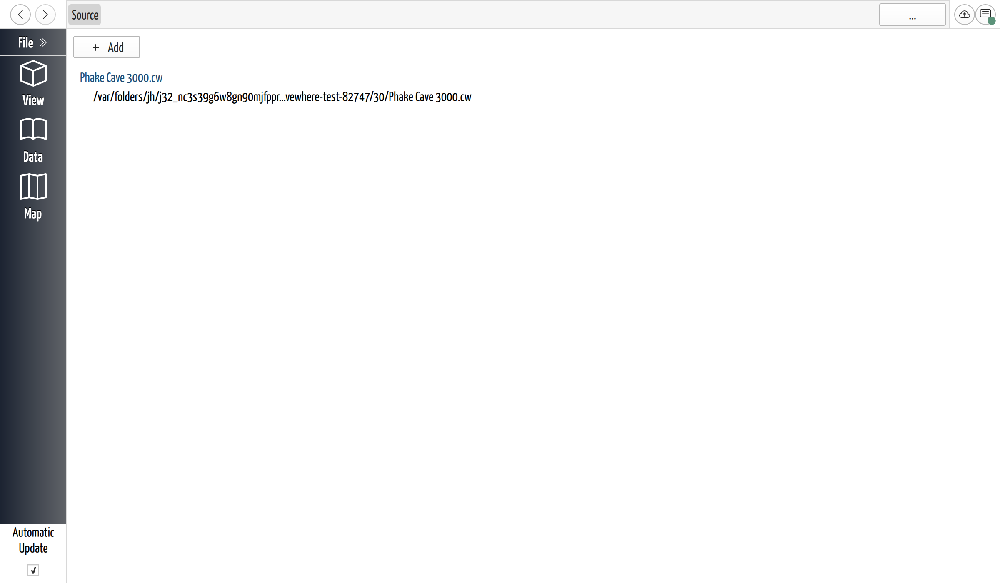

# Open a Project

## Why / when you need this

CaveWhere holds **one project at a time**. Opening a cave means putting down the
one you have, so New and Open stop and ask about the work already open. Open from
Online and Open from Link ask later, after the download.

## Start a new project

**File → New** (`Ctrl+N`) puts the current project away and gives you a fresh one.
It's real and already on disk, but temporary; see
[Your project already exists](save-a-project.md#your-project-already-exists).

## Open a project

**File → Open…** (`Ctrl+O`) brings up a file picker filtered to
**CaveWhere Project (`*.cwproj` `*.cw`)**.

A `.cwproj` gets taken at its word: the extension decides it. A `.cw` gets read
instead, because that one extension covers two unrelated formats. CaveWhere opens
it as a zip first, and if that works you have a modern
[bundle](project-formats.md#bundle-cw). If not, it opens the file as a SQLite
database and looks for an `ObjectData` table, which marks a
[legacy project](project-formats.md#legacy-cw-files-v6-and-older) from CaveWhere v6
or older. Fail both tests, or hand it a zero-byte file, and you get:

> Couldn't open '…/Phake Cave.cw' because it has a unknown file type. Is it corrupted!?

**Pick the `.cwproj` file, not the folder.** A directory project is a folder with
the project file inside, so open the folder and choose the `.cwproj` within.

Before you open a legacy `.cw`, know what the first save does to it. CaveWhere
unpacks the old database into a temporary folder, then writes back over the
original path, so the file keeps its name and quietly becomes a bundle. I recommend
copying the original somewhere else first. If the `.cw` is read-only, the
write-back is off and Save falls through to Save As.

## Reopen a recent project

CaveWhere keeps a list of the projects you've opened, saved, or downloaded. Click
**Source** in the breadcrumb to reach it; **Source** sits above **Data**, so from
your survey data it's one click up.

*The recent projects list, one entry per project.*

Each entry, like the one above, is a link carrying the project's **file name**,
extension and all, not the project name you set on the Data page. The full path
sits underneath. Click the name to open it; right-click the path for **Show in
Finder**, **Explorer**, or **File Manager**.

New entries go on the end, so the list reads oldest first and reopening a cave
never floats it back to the top. Nothing removes a single entry either: the only
pruning happens at startup, when CaveWhere drops every entry whose file has gone
missing. Until you open something, the page says
*"No caving areas created or opened yet."*

If clicking an entry does nothing, the file moved or vanished after startup. That
warning goes to the console rather than to you.

The **Add** button repeats the same 3 routes: **New Project**, **Open**, and
**Online Project**.

## Open a project from online

**File → Open from Online…** (`Ctrl+Shift+O`) jumps to the Remote page;
**File → Open from Link…** takes a link someone sent you. Neither asks about your
open project on the way in. The download runs first, and the question arrives only
once a cloned repository sits waiting. See
[Open a Shared Project](../collaboration/open-a-shared-project.md).

## What happens to the project you had open

For New, Open, and recent entries, CaveWhere settles the open project first, and
what it asks depends on where that project stands:

- **Nothing unsaved.** It doesn't ask, it just switches.
- **A saved project with unsaved changes.** **Discard**, **Cancel**, or **Save**,
  plus **Save & Sync** when the project has a remote.
- **A temporary project that has never been saved.** **Delete**, **Cancel**, or
  **Save**, under *"This project lives in a temporary folder. Save to move it
  somewhere permanent"*. No Discard, because no earlier save exists to return to.
- **A brand-new empty project.** It doesn't ask either.

One case skips the question and costs you work: a project written by a newer
CaveWhere than yours. This build reads and writes file version 9, shipped as
2026.4; anything above that opens read-only. Because it can't be saved, CaveWhere
never prompts, and whatever you typed goes when the next project loads.

## Next steps

- [Save a Project](save-a-project.md): the first save, and what it really does.
- [Choose a Project Format](project-formats.md): directory versus bundle.
