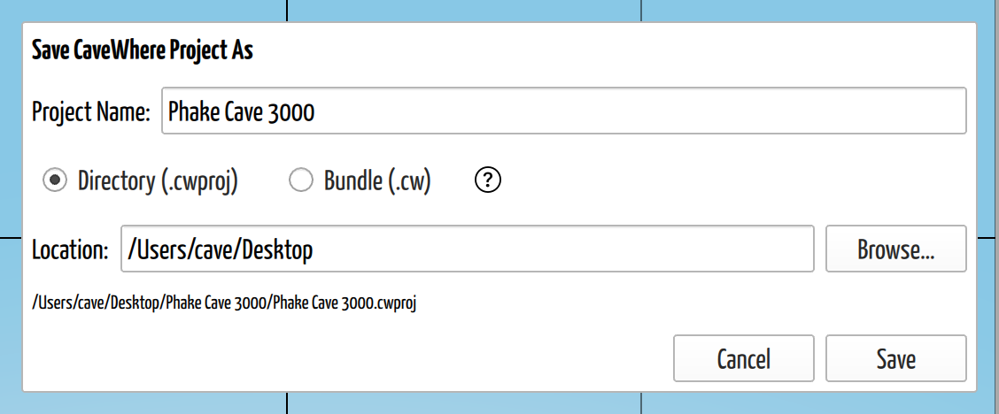

# Save a Project

## Why / when you need this

In most apps what you type lives in memory until you save it, and memory does not
survive accidents. The app crashes. The battery dies. The generator at camp cuts
out. Each one takes everything since your last save. Most apps leave you one
defense: press `Ctrl+S` often enough that an accident only costs a little. That is
a bet, and you re-make it every few minutes of an evening spent typing up a trip.

**CaveWhere never asks you to make that bet.** A survey costs too much to collect,
days underground across years, to sit in RAM waiting for you to remember it.
CaveWhere queues every edit to disk as you make it, from the moment the app opens.

So Save does not rescue your data. It does something more useful, and the rest of
this page covers what.

## Your project already exists

Open CaveWhere and you already have a project. Not a blank to fill in: a real one,
on disk, already recording every change you make.

It lacks a home. Until you save it, it sits in a temporary folder under a
placeholder name CaveWhere picks, *Misty Cavern* or *Thunder Ridge*, so you have
something to call it meanwhile.

Saving gives it a permanent place and a real name. Do it early, not because the
project might break but because everything afterward gets easier once it sits where
you would look for it and answers to the name you would call it. The first save
also starts the history that every later save adds to.

The temporary state will not catch you out. Quit, or open something else, with work
in a temporary project and CaveWhere stops to ask, saying plainly where things
stand: *"This project lives in a temporary folder. Save to move it somewhere
permanent"*. A temporary project only goes away if you choose to delete it.
CaveWhere skips the question when you never put anything in it: no caves, no saved
versions, nothing to keep.

## What Save actually does

Once a project has a permanent home, **Save** (`Ctrl+S`) no longer means getting
your data onto disk. CaveWhere already wrote it there as you typed.

Save **marks a version**. It gathers everything that changed since the last one and
records it as a point in the project's history you can return to, compare against,
and roll back to. Every save carries the same subject, *"Save from CaveWhere"*.
The description reads *"Automatic commit at"* plus the UTC time in ISO 8601. So the
date and the changed-file list tell two saves apart. Reading them, comparing them,
restoring one: that gets a chapter of its own,
[Review Project History](../collaboration/review-history.md).

That reframes 2 habits other apps taught you:

- **Forgetting to save costs you the checkpoint, not the work.** In a
  [directory project](project-formats.md#directory-cwproj) the edits already sit on
  disk, so an unexpected shutdown takes the marker, not the survey.
- **Discard means far more than "don't save".** It hard-resets the project to your
  last save, which throws away work CaveWhere had already written for you! Save at
  the points you'd want to return to and Discard has somewhere sensible to land.

A Save can quietly do nothing in 2 ways. When no file on disk actually changed,
CaveWhere records no version at all. And when you haven't set your name and email,
it stops with *"Git account is not configured. Please set your name and email in
CaveWhere."*

The exception to all of this is a [bundle](project-formats.md#bundle-cw). A `.cw`
gets unpacked into a temporary folder while you work, so the running auto-saves
land *there* and Save repacks them into the file you named. The repack guards the
old file: CaveWhere zips to `.cw.tmp`, renames your existing `.cw` to `.cw.bak`,
swaps the new one in, and deletes the backup only then. A save interrupted halfway
leaves the old bundle intact.

## Save it for the first time

**Save** (`Ctrl+S`) and **Save As** open the same dialog, shown below, because
nothing exists to save over yet.

*Three decisions in one dialog. Read the path underneath before committing to it:
your project name became the folder, and Location names only its parent.*

### Name the project

The **Project Name** field arrives pre-filled with the random stand-in. Replace it
with the cave, the area, or whatever you'd search for in 2 years.

The name does real work. It names the folder the project goes into, the data folder
inside that, and the `.cwproj` file itself, so type it rather than accept it.
Characters a filesystem won't take become underscores.

**This field appears on the first save only.** Afterward, renaming happens by
double-clicking the name at the top of the **Data** page, never here. See
[Save a copy](#save-a-copy-of-a-project) for why that matters.

### Choose the format and where it goes

Pick **Directory (`.cwproj`)** or **Bundle (`.cw`)**; check out the comparison
table behind the **?** button beside them, and
[Choose a Project Format](project-formats.md) covers the decision. The picker
preselects whatever the project already is, so a fresh project starts on Directory
while a legacy or bundled one starts on Bundle. **I recommend Directory for any
cave you are still surveying**: a bundle Save re-zips the entire project folder
every time, where a directory save writes only what changed.

Then set **Location**, by typing it or with **Browse…**. The choice differs by
format, which trips people up. In directory mode you pick the **parent folder**;
CaveWhere creates a folder named after the project inside it and shows the
resulting full path underneath, as shown above. In bundle mode you pick the
**whole path**, filename included. Trailing `.cw` and `.cwproj` extensions get
stripped and a single `.cw` added, so `cave.cwproj.cw` cannot happen.

Under the path, 3 messages can appear, and they do not mean the same thing:

- **"A folder … already exists in this location. Choose a different name or
  location."** Red, and it **blocks Save**. CaveWhere will not merge a project into
  an existing folder.
- **"The destination folder does not exist. Choose an existing folder or browse to
  one."** Also red, also blocks Save. Usually a typo in a hand-edited path.
- **"An existing bundle will be overwritten."** Orange, and it **allows Save**.
  Intentional when you are re-saving, worth a second look when you are not.

One thing happens on a first directory save and never again: CaveWhere **moves**
the temporary folder to the place you chose instead of copying it. On a
cloud-synced volume that move sometimes fails and falls back to a copy. If the
temp folder then can't be deleted, you get a warning saying so, not an error.

## Save again later

After the first save, `Ctrl+S` just saves. No dialog, no questions, one more
version whenever something changed.

No rule governs how often. I save at the point I'd want to come back to: after
entering a trip, after finishing a scrap, before trying something I'm unsure about.

## Save a copy of a project

**Save As** on an already-saved project makes a **copy** and leaves the original
where it sits. You carry on in the **new** copy.

### It's also how you change format

The dialog's format picker applies to the copy, so **Save As turns a directory
project into a bundle, or a bundle back into a directory**. No separate Export
exists, and nothing gets lost either way. Two moments to reach for it:

- **A cave is finished.** You surveyed it as a `.cwproj`, you are not going back,
  and now you want one file for the survey archive or the landowner. Save As →
  **Bundle (`.cw`)**.
- **A `.cw` someone sent you turns into real work.** It arrived as a bundle, you
  have started adding trips, and it keeps growing. Save As → **Directory
  (`.cwproj`)**, so saves stop recompressing the whole cave.

Either direction, the copy carries the full history, because the entire project
folder goes across with the Git repository inside it. A bundle leaves out only
the `.cw_cache` scratch folder and `.DS_Store`.

### It doesn't rename anything

The part that surprises people:

> **Save As does not rename your project.** It copies it. The copy is still called
> what the original was called, and CaveWhere still shows that name.

That explains the missing name field, and why a directory Save As only offers the
parent folder: the folder it creates takes its name from the project, not from
anything typed here. Look inside a bundle saved under a new file name and the data
folder still carries the old project name. Nothing broke. The copy kept its
identity.

**To actually rename a project**, double-click its name at the top of the **Data**
page. That renames the data folder and the `.cwproj` file, not the outer folder.

## When you quit

CaveWhere asks before closing whenever something sits unsaved, and the buttons
depend on where the project lives. The title reads *"Save before quiting?"*, or
*"Save temporary project before quiting?"* when the project has no saves yet.
The same prompt covers creating a new file, opening a project, and opening a cloned
repository, with the wording swapped to match.

**A saved project** offers **Discard**, **Cancel**, and **Save**, under *"Do you
want to save your changes before quiting?"*

**A project set up to sync** gets a 4th button, **Save & Sync**, which saves and
then syncs before letting the app close. Reach for it when someone else waits on
your data. It shows up only when the project has a remote. If the push fails you
get *"Sync failed: …"* followed by *"Your changes are saved locally."*, or, when
your GitHub token has expired, *"GitHub access has expired.
Your changes are saved locally."* Either way the buttons become **Close anyway**
and **Stay open**. Your work survived; only the push didn't happen.

**A temporary project** offers **Delete**, **Cancel**, and **Save**. No Discard,
because no earlier save exists to roll back to: give the project a home or let it
go. **Delete** drops the temporary folder and the project in it, the button for
when you were only trying something out. **Save** here opens the Save As dialog,
and canceling that dialog cancels the quit along with it rather than returning you
to the 3 buttons.

CaveWhere won't ask at all when nothing changed since your last save, or when the
project sits empty and never saved.

## Read-only projects

A project written by a newer CaveWhere than yours opens read-only. This build reads
and writes file version 9, shipped as 2026.4; anything above that gets a
**Read-only** banner telling you to upgrade, and **Save** and **Save As** both go
gray. The banner names no version; it cannot read a format it has never seen, so
it says *"Upgrade to CaveWhere vUnknown Version to edit"*.

Deliberate protection, not a limitation. A newer CaveWhere may store things this
one cannot represent, and saving would quietly drop them, so it refuses rather than
damaging a survey someone else depends on. Look around all you like. To edit,
install a newer CaveWhere.

The banner's **Dismiss** button hides the banner and nothing else, so Save stays
disabled. And because you can't save, CaveWhere never prompts on the way out, so
whatever you typed goes when the next project loads. See
[Open a Project](open-a-project.md#what-happens-to-the-project-you-had-open).

## Next steps

- [Choose a Project Format](project-formats.md): directory versus bundle, and what
  happens to a legacy `.cw` from CaveWhere v6 or older.
- [Open a Project](open-a-project.md): the Open dialog and the recent projects list.
