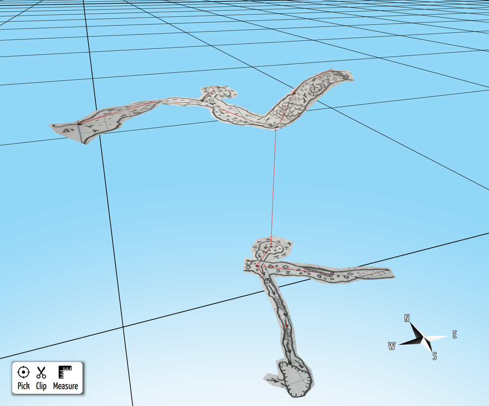
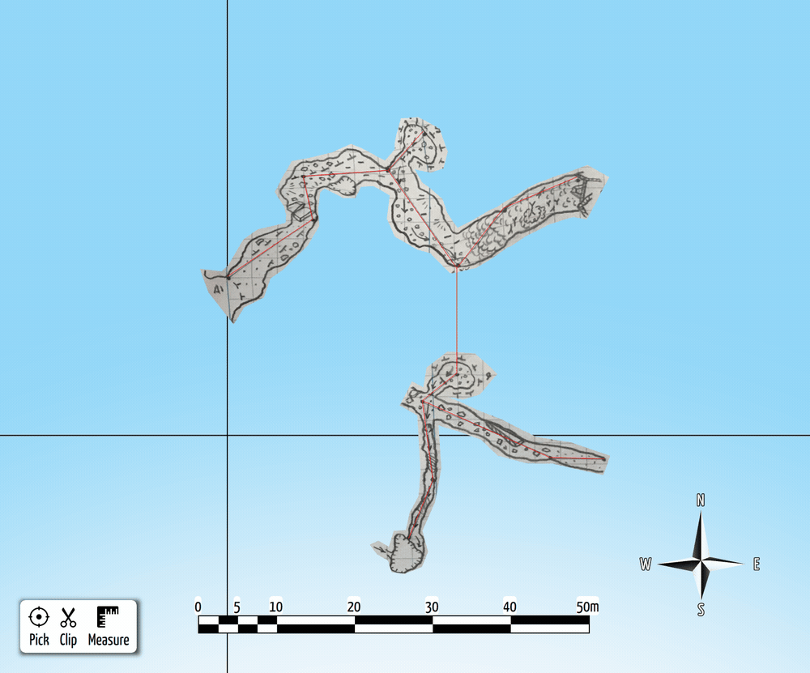
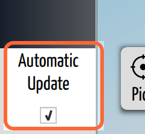

# Scraps and Carpeting

## Why / when you need this

*The payoff. Flat passage sketches (scraps) morphed onto the 3D survey and draped
like carpets, holding their place on the survey line. Everything else in this
chapter builds toward this.*

Play the orbit animation

A surveyor's sketch is a flat drawing of a passage that actually twists, climbs,
and drops in three dimensions. Traditionally that sketch stays 2D forever, and
the finished map has to be redrawn by hand every time the survey data changes.
**Carpeting** is CaveWhere's answer: you trace pieces of your sketch as
[scraps](../concepts/glossary.md#scrap), tie them to survey
[stations](../concepts/glossary.md#station), and CaveWhere deforms each scrap
onto the 3D survey line so the drawing drapes over the real passage like a
carpet. The result is a 3D cave model built from the drawings you already make —
and it re-drapes itself automatically whenever the survey moves. (For the
product-level version of this idea, see
[Why CaveWhere](../concepts/why-cavewhere.md#from-a-2d-sketch-to-a-3d-cave).)

> **A note on names.** The toolbar button that opens this workflow is labelled
> **Carpet** (the pencil icon), and inside it you draw **scraps**. This manual
> uses *Carpet mode* for the tool and *scrap* for one traced piece of the map.

## What carpeting actually does

Carpeting scales, rotates, grids, and warps a flat scrap so it matches the 3D
survey line plot. It runs in three stages:

1. **Scale and rotate.** Each scrap carries a scale (how many meters per inch of
   drawing) and a north/up direction. These two values matter most: a wrong
   scale makes the passage come out unnaturally thin or fat, and a rotation
   error of more than about ten degrees visibly twists the sketch off the
   survey. CaveWhere can auto-calculate both from the stations you place, but a
   value you set by hand is usually more accurate.
2. **Grid.** CaveWhere lays a regular grid of squares over the scrap and clips
   it to the scrap's outline. The grid is the mesh that actually gets bent.
3. **Morph.** CaveWhere bends the grid onto the survey — and this step is more
   involved than "pin the stations and stretch." It anchors the sketch not only to
   the stations you placed but to extra control points interpolated *along* each
   survey shot, so the whole passage line steers the deformation, not just its
   endpoints. Each grid point is then placed in 3D relative to the nearest handful
   of those control points, and a final smoothing pass softens abrupt depth changes
   between neighbours. The traced note image is textured onto the bent mesh — the
   carpet.

   How this stage behaves is governed by the
   [warping (morphing) settings](warping-settings.md): the grid's density, how
   finely each shot is interpolated into control points, how many nearby control
   points steer each grid point, and the smoothing radius. The defaults suit most
   caves — reach for these knobs only when a carpet comes out too coarse, too stiff,
   or too noisy.

The same engine morphs [LiDAR notes](../concepts/glossary.md#lidar-note) and
photogrammetry models into the cave, not just hand-drawn scraps.

## Carpeting is automatic

You do not normally trigger carpeting. CaveWhere marks a scrap "dirty" whenever
you edit its outline, move a station, or change its type, and re-morphs the
affected scraps in the background. Because the survey re-solves on every edit,
**closing a loop or fixing a blunder re-drapes every affected carpet on its own**
— the map keeps up with the data instead of going stale. This is the core reason
carpets are worth building: correct the survey once, and the drawings follow.

This automatic recomputation is controlled by the **Automatic Update** checkbox in
the **lower-left corner** of the window.

*The Automatic Update checkbox (lower-left), on by default. Turning it off
suspends the survey solve and carpet re-morphing alike.*

Leave it on (the default) and the map keeps up with your edits as described above.
**Turn it off and CaveWhere stops recomputing automatically** — and this covers
more than carpeting. The switch also suspends the **survey solve**, so **loop
closure stops running** too: edit a shot with Automatic Update off and neither the
line plot nor the carpets change. That is useful on a very large project where you
don't want every keystroke to trigger a full recompute, but while it's off both
your line plot and your carpets drift out of sync with the data. Turning it back on
catches everything up at once — CaveWhere re-runs the survey solve and re-morphs
every scrap that changed in the meantime.

## The workflow at a glance

Building a carpet is four short tasks, each covered on its own page:

1. **[Digitize a scrap](digitize-a-scrap.md)** — enter Carpet mode, trace the
   passage outline, and place the survey stations that fall inside it.
2. **[Choose the scrap type](scrap-types.md)** — tell CaveWhere whether the
   drawing is a plan, a running profile, or a projected profile so it projects
   the sketch the right way.
3. **[Troubleshoot the carpet](troubleshoot-carpeting.md)** — if a carpet comes
   out distorted, work through the usual causes (scale, rotation, station
   labels, scrap type).
4. **[Tune the warping settings](warping-settings.md)** — adjust grid density
   and smoothing when you need finer or coarser results.

The carpets appear in the [3D view](../view-3d/the-3d-view.md) draped over the
survey line plot, and you can hide or show them with keyword layers like any
other part of the scene.

## Advanced: recompute and visibility toggles

Two developer-oriented controls live under **File ▸ Debug**:

- **Compute Scraps** forces a full recompute of every scrap. You rarely need it
  — carpeting is automatic — but it is a way to re-run everything if a carpet
  looks stale after an unusual edit.
- **Scraps Visible** toggles the carpets in the 3D scene as a whole. For normal
  work, control scrap visibility through
  [keyword layers](../view-3d/the-3d-view.md#focus-on-part-of-the-cave-layers)
  instead.

## Where to go next

- Start building: [Digitize a scrap](digitize-a-scrap.md).
- New to the terms (station, shot, scrap, line plot)? See the
  [glossary](../concepts/glossary.md).
- Want the reasoning behind the living 3D map? Read
  [Why CaveWhere](../concepts/why-cavewhere.md).
