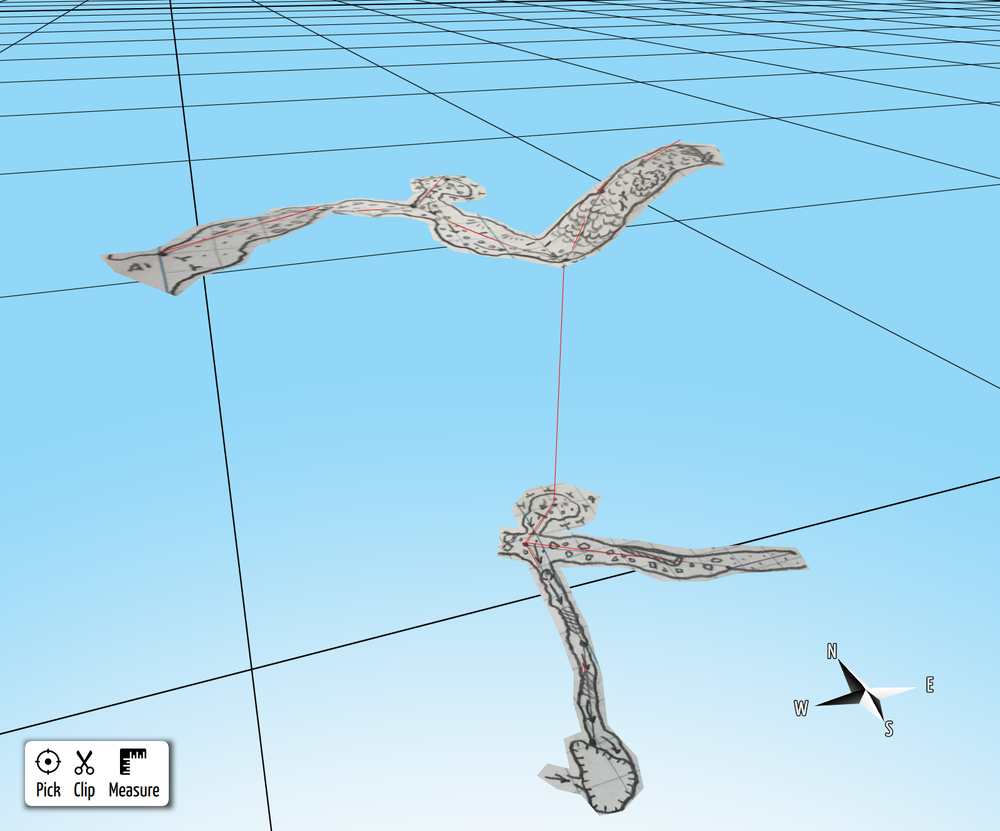
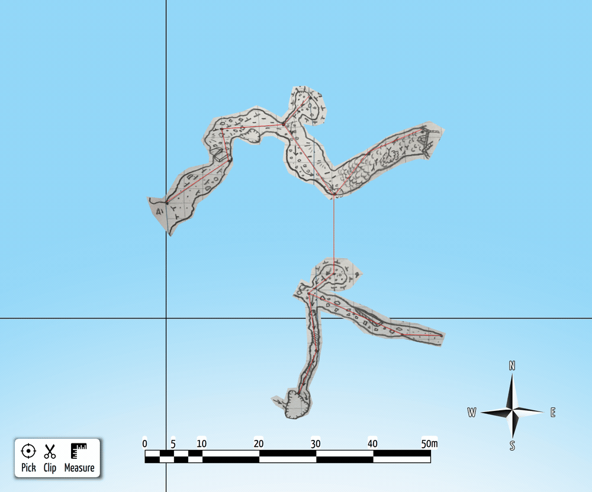
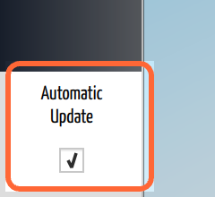

# Scraps and Carpeting

## Why / when you need this

*The payoff. Flat passage sketches (scraps) morphed onto the 3D survey and draped
like carpets, holding their place on the survey line. Everything else in this
chapter builds toward this.*

Play the orbit animation

A surveyor's sketch is a flat drawing of a passage that twists, climbs, and
drops in three dimensions. Traditionally that sketch stays 2D forever, and
somebody redraws the finished map by hand every time the survey data changes.
**Carpeting** is CaveWhere's answer.

You trace pieces of your sketch as
[scraps](../concepts/glossary.md#scrap) and tie them to survey
[stations](../concepts/glossary.md#station). CaveWhere then bends each scrap
onto the 3D survey line, so the drawing drapes over the real passage like a
carpet, as shown in the orbit animation above. Every carpet shown above started
life as a flat drawing. Better still, the carpet rebuilds itself whenever the
survey moves. (For the product-level version of this idea, see
[Why CaveWhere](../concepts/why-cavewhere.md#from-a-2d-sketch-to-a-3d-cave).)

> **A note on names.** The toolbar button that opens this workflow is labeled
> **Carpet** and carries a pencil icon, and inside it you draw **scraps**. This
> manual uses *Carpet mode* for the tool and *scrap* for one traced piece of the
> map.

## What carpeting actually does

Carpeting crops, scales, grids, and warps a flat scrap until it matches the 3D
survey line plot. Four stages:

1. **Crop.** CaveWhere crops the note image down to the outline's bounding box
   and builds mipmaps from the result. That cropped image becomes the carpet's
   texture. A scrap therefore costs texture memory for its bounding box, not for
   the whole note.
2. **Scale and rotate.** Every scrap carries a scale and a north (plan) or up
   (profile) direction. A new metric scrap starts at 1 cm = 2.5 m, the round
   1:250 sketching scale; an imperial one starts at 1 in = 20 ft, or 1:240. A
   wrong scale makes the passage come out thin or fat. A wrong rotation twists
   the sketch off the survey. **Auto Calculate** derives both from the stations
   you place. On a projected profile it hunts for the plane's azimuth as well,
   sweeping 0° to 360° at 10°, then narrowing 3 more times at 2°, 0.4°, and 0.1°
   around the best answer so far.
   [Choose the scrap type](scrap-types.md#auto-calculate-and-what-it-hides) covers
   when to switch it off.
3. **Grid.** CaveWhere lays a square grid over that bounding box at the grid
   resolution, which defaults to 0.5 m of cave. It adds 2 points to each axis so
   the grid overhangs the bounding box rather than stopping short of it, then
   throws away every grid point outside your outline. Squares wholly inside the
   outline become 2 triangles
   apiece. Squares straddling the outline get clipped against it and
   triangulated separately, which is why a carpet ends on your traced line
   rather than on a staircase of grid squares.
4. **Morph.** Here is the stage that does the real work, and it takes more than
   pinning the stations and stretching. CaveWhere anchors the sketch to the
   stations you placed *and* to control points interpolated along every shot
   that runs between two of them, stepping at 0.5 m by default, so the surveyed
   line inside the scrap steers the deformation. A shot no longer than that
   spacing gets none of them; it already has a station at each end. For each
   grid point CaveWhere then keeps the 10 nearest control points, measured on
   the page, and weights each one by the inverse square of its distance. A
   point landing exactly on a station snaps to
   that station's surveyed position. Last, a Gaussian pass smooths the heights
   over a 2.0 m radius, with the bell curve's sigma set to half that, 1.0 m.

Those 4 numbers are the [warping settings](warping-settings.md): grid
resolution, shot interpolation spacing, max closest stations, and smoothing
radius. The defaults suit most caves. Reach for the knobs only when a carpet
comes out too coarse, too stiff, or too noisy.

The same engine morphs [LiDAR notes](../concepts/glossary.md#lidar-note) and
photogrammetry models into the cave, not only hand-drawn scraps. One difference
matters: a LiDAR mesh has no warping settings attached to it. It always morphs
at the built-in interpolation spacing, 0.5 m in a release build, it uses *every*
interpolated control point instead of the 10 nearest, and it never gets the
smoothing pass. Changing the
warping settings will not change how a LiDAR note lands.

## Why does a carpet come out bumpy?

Weighting by inverse distance is a blunt instrument, and plan scraps are where
you see it. Each grid point's height is a weighted average of the heights of the
control points around it. So a station sitting a couple of meters above its
neighbors lifts the carpet near it, and what you get is localized vertical
bumps. The whole thing is approximate by construction: the morph has no idea
where the passage floor runs between stations, only where the stations landed
and where the straight line between them runs.

Nobody wants the bumps. Today the fix is to constrain the morph rather than to
trust it: lower **Max closest stations** so each point is fitted to a shorter run
of line around it, raise the smoothing radius, or split the sketch into smaller
scraps.
[Troubleshoot the carpet](troubleshoot-carpeting.md#choose-the-right-scrap-type)
works through that.

Five more rough edges worth naming:

- **A running profile is never smoothed.** The Gaussian pass hands a running
  profile back untouched, so the smoothing radius does nothing to one. A running
  profile also warps between exactly 2 stations, the pair your point falls
  between along the page. Give it fewer than 2 and it has nothing to warp
  between. Every point in the scrap collapses onto the survey's origin, so the
  carpet vanishes rather than landing wrong.
- **A degenerate scale can ask for a grid of hundreds of millions of cells.**
  The classic cause is a note scale off by the 39.37 inches-per-meter factor.
  CaveWhere clamps the grid at 2048 points per axis and logs `clamping
  pathological point grid` when that trips. Without the clamp, one bad scrap
  pins every core on your machine for minutes!
- **Smoothing cost rises with the square of the point count**, because it
  compares every point in a scrap against every other point. Halving the grid
  resolution roughly quadruples the points, which multiplies the smoothing work
  by about 16. That, more than the triangle count, is why a fine grid may get
  slow on a large scrap.
- **A carpet whose texture won't load comes back empty.** If the crop step
  fails, CaveWhere logs `Problem cropping image, does it not exist` and returns
  an empty result. The scrap simply never appears in the 3D view, with no
  warning banner anywhere in the UI.
- **Debug builds do not run the shipped defaults.** They set both the grid
  resolution and the shot interpolation to 2.5 m, because the test cases run
  really slowly at 0.5 m. The header comment calls that "likely a bug", and it
  probably is. A release build uses 0.5 m, and the Windows and Linux downloads
  are built that way.

## Carpeting is automatic

You do not normally trigger carpeting. CaveWhere marks a scrap dirty and
re-morphs it in the background on its own. The triggers: you edit the outline,
you add or move or rename one of its stations, you change its scale or its
north/up direction, you change its type, or you move a lead.

A scrap you have open for editing sits the round out. The recompute skips it,
then fires once you finish. And because the survey re-solves on every edit as
well, **closing a loop or fixing a blunder re-carpets
everything affected on its own**. Correct the survey once, and the drawings
follow. That is the reason carpets are worth building at all.

One checkbox governs the whole arrangement: **Automatic Update**, at the bottom
of the sidebar. See below.

*The Automatic Update checkbox (lower-left), on by default. Turning it off
suspends the survey solve and carpet re-morphing alike.*

I recommend leaving it checked, as shown above, and clearing it only when a
recompute is genuinely in your way. **Turn it off and CaveWhere stops
recomputing** — and that covers a great deal more than carpeting. The same
switch feeds the line plot manager and the scrap manager together, so the
**survey solve stops too** and **loop closure stops running** with it. Edit a
shot with Automatic Update off and neither the line plot nor the carpets move.

That helps on a very large project, where you may not want every keystroke
triggering a full recompute. While it is off, though, your line plot and your
carpets both drift out of step with your data. Turn it back on and CaveWhere
catches up at once, re-solving the survey and re-morphing every scrap that went
dirty in the meantime. The setting lives in your per-machine preferences and
survives a restart, so a box you cleared last week is still clear today.

## The workflow at a glance

Building a carpet is 4 short tasks, each covered on its own page:

1. **[Digitize a scrap](digitize-a-scrap.md)**: enter Carpet mode, trace the
   passage outline, and place the survey stations that fall inside it.
2. **[Choose the scrap type](scrap-types.md)**: tell CaveWhere whether the
   drawing is a plan, a running profile, or a projected profile, so it projects
   the sketch the right way.
3. **[Troubleshoot the carpet](troubleshoot-carpeting.md)**: if a carpet comes
   out distorted, work through the usual causes (scale, rotation, station
   labels, scrap type).
4. **[Tune the warping settings](warping-settings.md)**: adjust grid density and
   smoothing when you need finer or coarser results.

The carpets appear in the [3D view](../view-3d/the-3d-view.md) draped over the
survey line plot, as shown above, and you can hide or show them with keyword
layers like any other part of the scene.

## Advanced: recompute and visibility toggles

Two developer-oriented controls live under **File → Debug**:

- **Compute Scraps** walks every cave, trip, and note in the project, marks all
  of their scraps dirty, and recomputes the lot. You rarely need it, and its own
  doc comment says it exists for testing, but it will re-run everything if a
  carpet looks stale after an unusual edit.
- **Scraps Visible** toggles the carpets in the 3D scene. The name undersells
  the switch: carpets and morphed LiDAR meshes share one render list, so this
  hides your LiDAR notes as well. For normal work, control scrap visibility
  through
  [keyword layers](../view-3d/the-3d-view.md#focus-on-part-of-the-cave-layers)
  instead.

## Where to go next

- Start building: [Digitize a scrap](digitize-a-scrap.md).
- New to the terms (station, shot, scrap, line plot)? See the
  [glossary](../concepts/glossary.md).
- Want the reasoning behind the living 3D map? Read
  [Why CaveWhere](../concepts/why-cavewhere.md).
