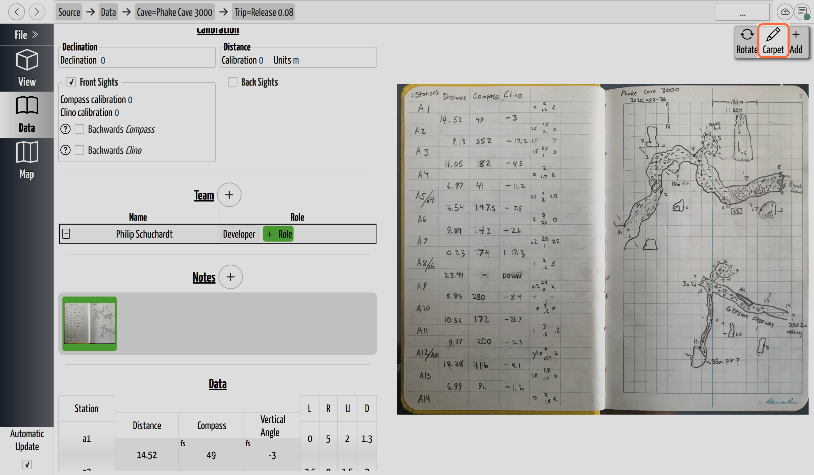
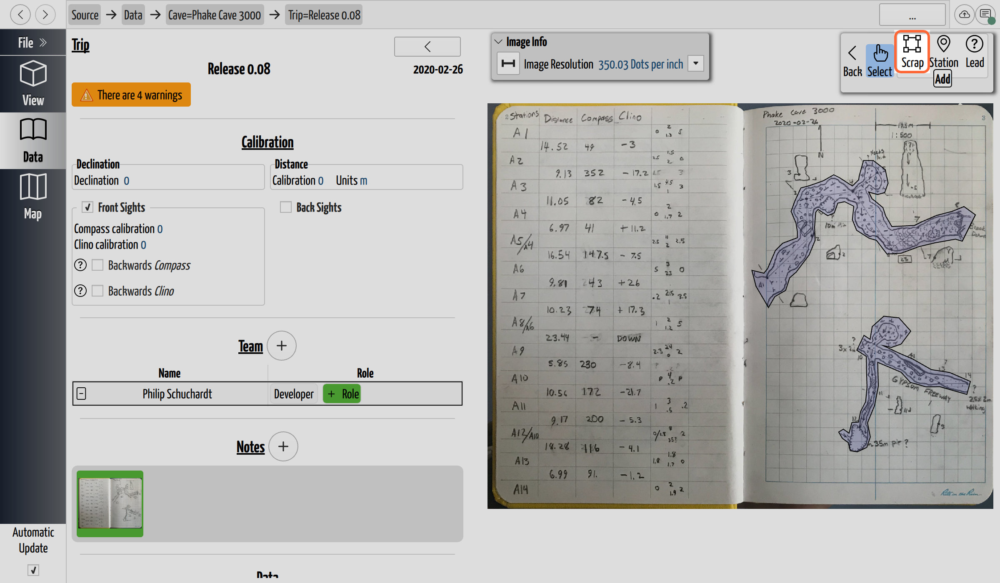
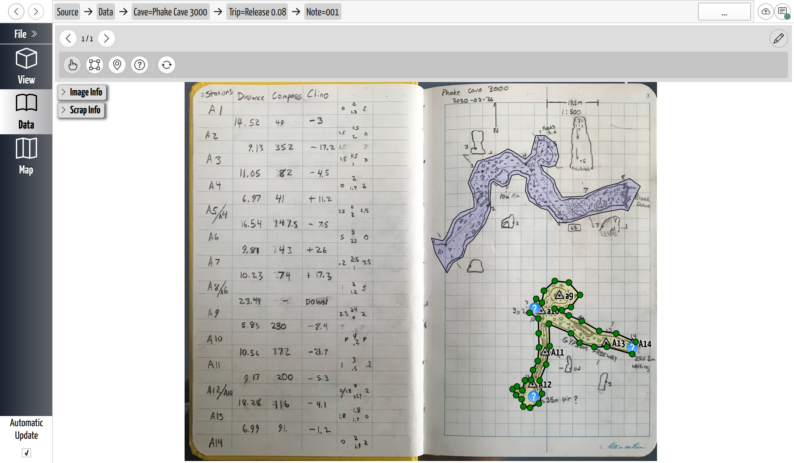
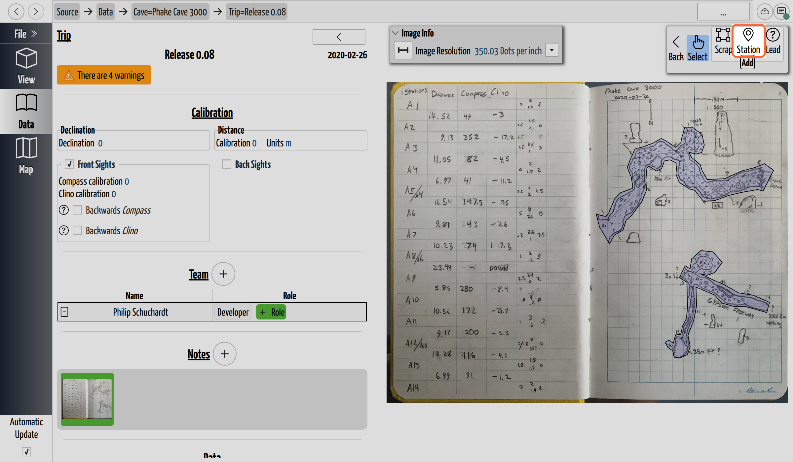
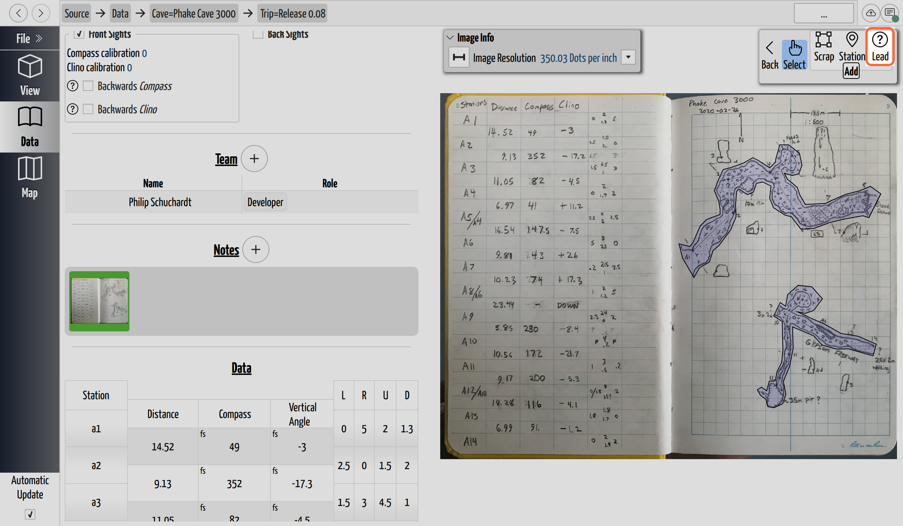

# Digitize a Scrap

## Why / when you need this

Before CaveWhere can drape a sketch over the 3D survey, it needs two things from
you: the **shape** of the passage (an outline traced on the note) and a few
**anchor points** (the survey stations that appear in that drawing). Tracing the
outline defines what gets morphed; placing the stations tells CaveWhere where the
drawing attaches to the real, measured cave. A scrap without stations has nothing
to morph onto, so both steps matter.

You do this once per piece of passage. A single note is usually broken into
several scraps — see [Troubleshoot the carpet](troubleshoot-carpeting.md) for
why splitting a drawing into smaller scraps often gives a cleaner result.

## Enter Carpet mode

Open the [trip](../concepts/glossary.md#trip) whose notes you want to draw on,
then click **Carpet** (the pencil icon) in the note's toolbar. The note switches
into the scrap-editing tools: **Back**, **Select**, and an **Add** group with
**Scrap**, **Station**, and **Lead**.

*On a trip's page, click **Carpet** (the pencil icon, highlighted at the top of
the note) to enter Carpet mode. The note then swaps its toolbar for the
scrap-editing tools.*

## Trace the outline

Click **Scrap** in the Add group, then trace the passage: **click a point at a
time around the passage edge**. CaveWhere's own prompt says it plainly — *"Trace
a cave section by clicking points around it."* Keep clicking around the outline;
when you come back near the first point, CaveWhere snaps to it so you can close
the loop. A closed outline is what gets gridded and morphed.

*In Carpet mode, click **Scrap** (highlighted) in the **Add** group to start a new
outline, then click your way around the passage.*

- To **remove a point**, select it and press **Delete**.
- To **start another scrap** on the same note, click **Scrap** again and trace a
  new outline. Break the drawing wherever the passage changes character (a plan
  floor vs. a profile of a pit) — each piece can then carry its own
  [scrap type](scrap-types.md).

Trace the actual passage walls, not the whole page. Everything inside the outline
is textured onto the carpet, so a tight outline keeps stray marks and adjacent
passages out of the morph.

*A finished scrap in Carpet mode. The outline follows the passage walls; the small
points are its draggable vertices. (The numbered markers are survey stations —
placed next.)*

## Place the stations

Click **Station** in the Add group, then **click on the note where each survey
station sits in the drawing** — CaveWhere prompts *"Click to add new station."*
Type the station's name (the same name it has in the survey data) so CaveWhere
can match the drawn point to its measured 3D position.

*Click **Station** (highlighted) in the **Add** group, then click each station's
spot on the drawing and name it.*

Stations are the control points of the morph: each one pins a spot on the flat
drawing to a known 3D location, and the warp bends the scrap so the drawn
stations land on the real ones. That is why **a station has to sit inside a
scrap** — CaveWhere warns *"Stations must be placed inside a scrap"* if you drop
one outside the outline, because a control point with no surrounding mesh to bend
has nothing to act on.

A few practical notes:

- **How many you need depends on the [scrap type](scrap-types.md).** A **plan** or
  **projected profile** scrap needs only **one** station. A **running profile**
  needs **at least two**, because it warps each point between the two stations it
  falls between — with only one there's nothing to warp between.
- **A single station means setting the scale and rotation yourself.** One station
  fixes *where* the scrap sits, but **Auto Calculate** derives the scale and
  direction *from* the stations, so it needs two or more. A one-station scrap works
  fine — just turn Auto Calculate off and enter the scale and the north/up
  direction by hand (see
  [North or up](scrap-types.md#north-or-up-orient-the-drawing)).
- **Name stations exactly** as they appear in the survey. CaveWhere matches by
  name across the *whole* cave, so a typo or a name that belongs to a different
  passage will drag the carpet toward the wrong place — a common cause of
  distortion covered in [Troubleshoot the carpet](troubleshoot-carpeting.md).

## Mark leads

While you're carpeting, record the passages you *didn't* survey. A
[lead](../concepts/glossary.md#lead) is a "go" — an unexplored continuation —
noted on the drawing so a future trip knows where there's more cave.

Click **Lead** in the Add group, then click the spot on the note where the passage
carries on. As with stations, **a lead has to sit inside a scrap**; trace the
outline first, or CaveWhere tells you *"Create a scrap first, then add stations or
leads."*

*Click **Lead** (highlighted) in the **Add** group, then click where the passage
continues.*

Give the lead a **description** and, where you can, a **size** estimate. Because a
lead is anchored inside a scrap, it is morphed onto the survey along with the
carpet — so leads appear in the [3D view](../view-3d/the-3d-view.md) as
question-mark markers sitting where the passage actually is, not on a flat page.

Each cave then collects its leads on its **Leads** page: they're listed by
**description**, **size**, and **trip**, with each lead's line-of-sight
**distance** from a station you pick. From there you can **Goto** a lead in the 3D
view, tick it **Done** once it's been pushed, and **Export CSV** to take a
trip-planning list into the field.

## Where to go next

- **[Choose the scrap type](scrap-types.md)** — plan, running profile, or
  projected profile — so CaveWhere projects the drawing correctly.
- If the carpet comes out distorted, see
  [Troubleshoot the carpet](troubleshoot-carpeting.md).
