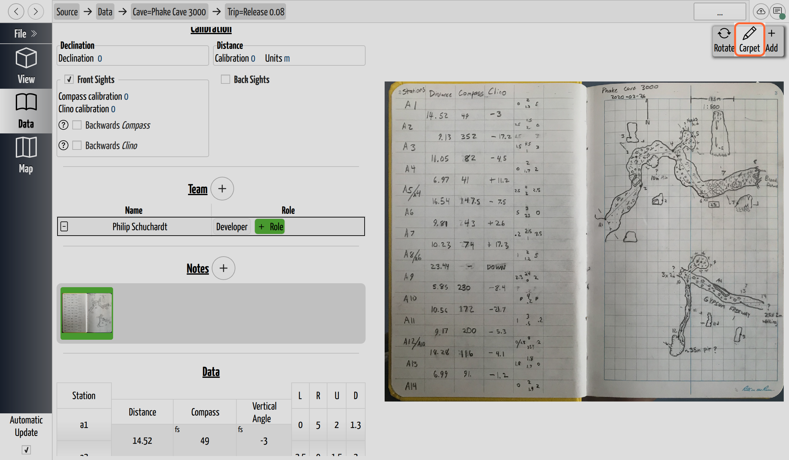
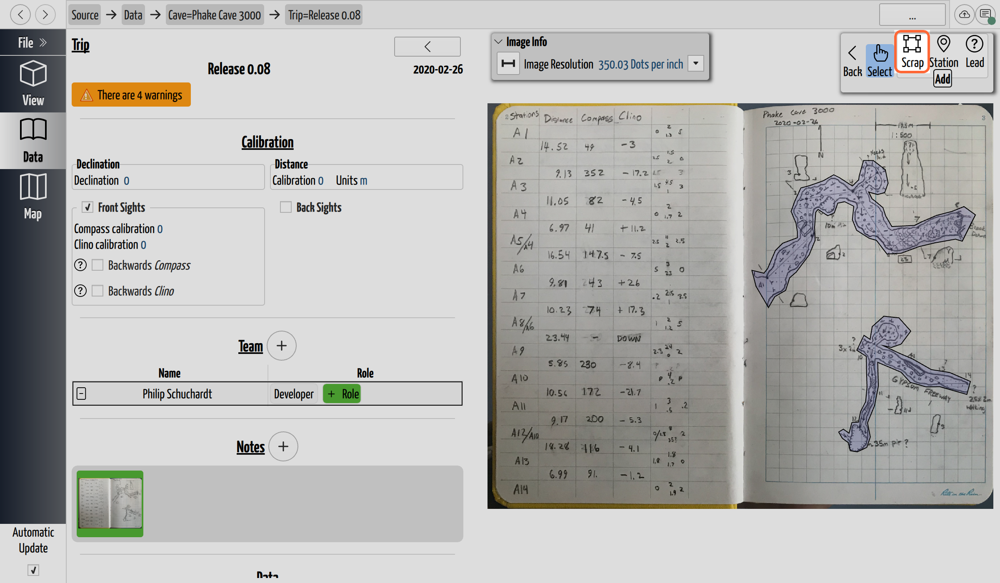
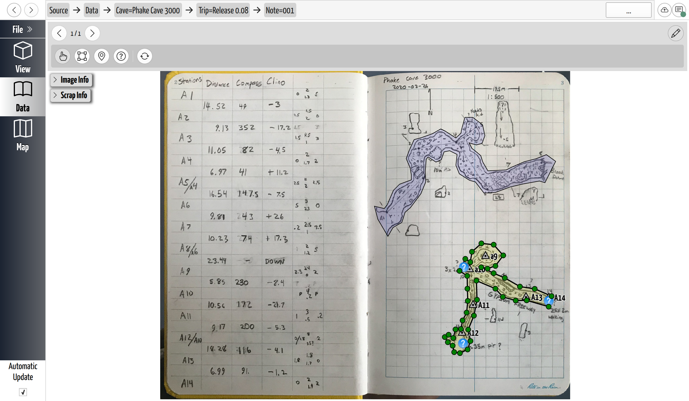
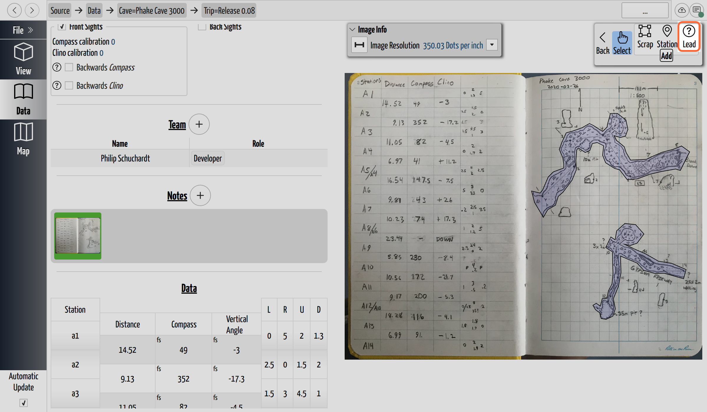

# Digitize a Scrap

## Why / when you need this

[Carpeting](../concepts/glossary.md#carpeting) a sketch onto the 3D survey takes
2 things: the **shape** of the passage, traced as an outline on the note, and the
**survey stations** drawn inside it.
CaveWhere carpets a scrap once it holds 1 of each. A note usually breaks into
several scraps, and [Troubleshoot the Carpet](troubleshoot-carpeting.md) explains
why the smaller pieces morph cleaner.

## Enter Carpet mode

Open the [trip](../concepts/glossary.md#trip) whose notes you want to draw on and
click **Carpet**, the pencil icon shown below, second of 3 after Rotate.

*The toolbar swaps for **Select** and an **Add** group of **Scrap**, **Station**
and **Lead**; on a [LiDAR note](../notes/lidar-notes.md) Scrap and Lead never
appear.*

Carpet mode belongs to the note: click a different note, or navigate away, and
CaveWhere drops back to the plain toolbar.

**Esc doesn't leave the Scrap, Station or Lead tool.** It backs out of the north,
scale and resolution tools, but not these 3. Click **Select** to disarm.

## Trace the outline

Click **Scrap**, then click around the passage edge. The prompt reads
*Trace a cave section by **clicking** points around it.* Points land on
**mouse-down**, not release, so you can't nudge one before letting go.

*Only the selected scrap draws its points, and none is selected here.*

### Snapping inserts, it doesn't append

Come within **7.5 pixels** of an outline edge, in the note image's own pixels,
and a dot appears. Click while it shows and the point drops **into that edge**,
between its 2 ends, not onto the tail of the outline. That refines a coarse
stretch; it also means a stray click near your line lands mid-outline.

### Close the loop

Click your first point and CaveWhere repeats it at the end. Closing needs
**3 points**; with fewer the click does nothing and nothing says why. After a
close, the next click that misses the line starts a **new scrap**. The morph
doesn't care; the triangulator joins last point to first either way.

### Fix and remove points

Drag a point to move it; **Delete** or **Backspace** removes it.

**Remove the last point and the scrap goes with it**, stations, leads and all.
Nothing undoes that: no Edit menu and no Ctrl+Z reaches CaveWhere's undo stack,
which never covered scraps. On a `.cwproj` project,
[Restore to here](../collaboration/review-history.md#restore-back-to-an-earlier-version)
reaches past the deletion; a bundled `.cw` has no such fallback.

Trace the walls, not the page: everything inside gets textured onto the carpet.
A new scrap is a **Plan** with **Auto Calculate** on, unless the last one you
drew in the trip had it off; then it inherits that scrap's scale and orientation.

*The selected scrap fills yellow at 15% behind a 2 px outline; every other fills
blue at 10% and hides its points.*

## Place the stations

**Station** comes next. Armed, every click drops a station where you say a
surveyed one sits; the prompt reads *Click to add new station*.

**CaveWhere guesses the name.** It takes whichever neighbor of the selected
station lands nearest your click, so working in survey order gets most names
free. Read the label anyway; a station between 2 shots can come out wrong.
The first station on a scrap arrives named `Station Name`, editor open.

Matching runs across the **whole cave**, not just the trip, and ignores case: the
`a9` shown above carpets fine against a survey table reading `A9`.

A name that matches nothing is **dropped without a word**. The cue is indirect:
select the station, and a name the cave knows draws leader lines to its
neighbors; one it doesn't draws none. A typo landing on a real station elsewhere
drags the carpet across the cave;
[Troubleshoot the Carpet](troubleshoot-carpeting.md) covers finding it.

Drop a station outside every outline and a red box reads **"Stations must be
placed inside a scrap"** for 4 s.

### How many stations you need

- **Auto Calculate needs 2, with a shot between them.** It averages the shots
  among your drawn stations for the scale and the north or up direction. A pair
  counts only if the network lists each as the other's neighbor.
- **With nothing to average, the scale collapses** to a 0 denominator, and
  Scrap Info warns that a scale of 1:1 or smaller is bad. The first station on a
  fresh scrap triggers this, overwriting the seeded 1 cm = 2.5 m metric or
  1 in = 20 ft imperial.

**I recommend 2 connected stations on every scrap you can**, even where the
drawing really shows one: it saves typing the scale and the orientation in by
hand. Where one station is all there is, a cross-section most often, uncheck
**Auto Calculate** and set both yourself. [Carpeting](carpeting.md) is right that
a hand-set value is usually more accurate. See
[North or up](scrap-types.md#north-or-up-orient-the-drawing).

## Mark leads

Record the passage you did not survey. A [lead](../concepts/glossary.md#lead) is
a "go", an unexplored continuation marked so a future trip knows where more cave
waits. **Lead** works like Station: arm it, click where the passage carries on.

*Leads carry a question mark wherever they turn up: the button, the note, the
3D view.*

Leads live inside scraps too; missing the outline earns the same 4 s warning. On
a note holding no scrap at all, a callout points at **Scrap** instead, reading
**"Create a scrap first, then add stations or leads"**.

Selecting a lead opens **Lead Info**: a **Completed** checkbox, a **Size** of
width, height and unit, and a **Description**. An omitted dimension stores as -1,
shown `?` here and `-1` on the Leads page.

A lead rides the morph onto the survey with the carpet, turning up in the
[3D view](../view-3d/the-3d-view.md) as a question mark where the passage really
is. Each cave collects its leads on a **Leads** page: see
[Track and Export Leads](../leads/track-and-export-leads.md).

## Where to go next

- **[Choose the scrap type](scrap-types.md)**: every scrap starts as a plan, and
  a profile left that way warps.
- [Troubleshoot the Carpet](troubleshoot-carpeting.md) when it comes out
  distorted.
