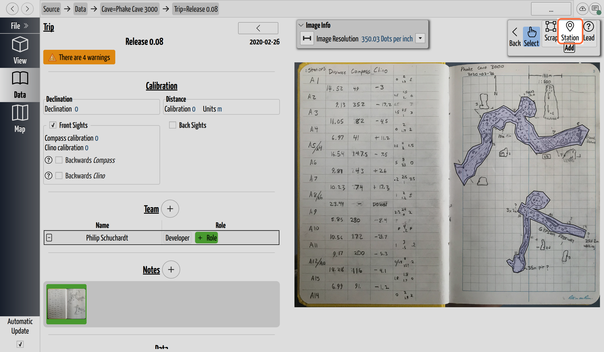

# Digitize a Scrap

## Why / when you need this

Draping a sketch over the 3D survey takes 2 things from you. The **shape** of the
passage, traced as an outline on the note. And a few **anchor points**, the
survey stations that appear in that drawing.
CaveWhere carpets a scrap only once it holds at least 1 station and 1 outline
point, so a shape on its own never reaches the 3D view.

You do this once per piece of passage. A single note usually breaks into several
scraps, and [Troubleshoot the Carpet](troubleshoot-carpeting.md) explains why the
smaller pieces morph cleaner.

## Enter Carpet mode

Open the [trip](../concepts/glossary.md#trip) whose notes you want to draw on,
then click **Carpet** (the pencil icon). It sits second in a row of 3, after
Rotate and before Add. See below.

*The **Carpet** button, shown above with a ring around it. Clicking it swaps the
note's toolbar for the scrap-editing tools.*

The toolbar swaps for the carpet tools: **Back**, **Select**, then an **Add**
group holding **Scrap**, **Station** and **Lead** (5 buttons, 21 px icons). On a
[LiDAR note](../notes/lidar-notes.md) the Scrap and Lead buttons never appear,
leaving 3.

Two panels open at the top left. **Image Info** holds the note's
[resolution](../notes/note-resolution.md). **Scrap Info** holds the
[scrap type](scrap-types.md) and shows up only for the selected scrap. Below
600 px of trip-page width both open collapsed to their title bars.

That same 600 px changes the toolbar's shape. Under it the trip page hands you a
narrow row of round buttons instead. The pencil toggles carpet mode on and off,
and a second row appears carrying Select, Scrap, Station, Lead and Rotate. A
trash button joins them, but only in Select mode with something selected. A note
opened on its **own page** counts as narrow whatever the window width, so it gets
the round buttons too. The finished scrap shown below was shot that way.

Carpet mode belongs to the note, not the trip. Click a different note in the
gallery and CaveWhere drops back out to the plain Rotate / Carpet / Add toolbar.
Navigating to another page does the same.

**Esc doesn't leave the Scrap, Station or Lead tool.** It backs out of the north, scale and resolution tools,
which all listen for it, but the 3 Add tools never do. Click **Select**, or
another tool button, to disarm the pointer.

## Trace the outline

Click **Scrap** in the Add group, as shown below, then click your way around the
passage edge. The prompt at the foot of the note reads *Trace a cave section by
**clicking** points around it.*

*In Carpet mode, **Scrap** starts a new outline. With no scrap selected here,
none of them draws its points and Scrap Info stays hidden.*

Points land on **mouse-down**, not on release, so you can't nudge one into place
before letting go. Right-drag pans while you trace. Left-drag doesn't, because
the Scrap tool gives the left button to the point placer and moves panning onto
the right. The wheel zooms 1.1x per notch around the pointer.

### Snapping inserts, it doesn't append

Bring the pointer within **7.5 pixels** of an outline edge and a translucent dot
appears on that edge. CaveWhere counts those 7.5 pixels in the note image's own
pixels rather than on screen, so the band feels wider the further you zoom in.
Click while the dot shows and the point drops **into that edge**, between its 2
ends, instead of onto the tail of the outline. That is how you refine a stretch
you traced too coarsely. It is also how a stray click near your own line drops a
point into the middle of the outline instead of onto its end.

### Close the loop

Click the first point you placed and CaveWhere closes the polygon by repeating
that point at the end. Closing needs **3 points**. With fewer, the click does
nothing at all and nothing says why.

Once the outline closes, the next click that misses the line starts a **new
scrap** by itself.

The reverse catches people. Pressing **Scrap** on an outline of fewer than 3
points fails to start a fresh one, because that button only asks the current
scrap to close, and a stub of 2 points cannot. Your next click extends the stub.

A closed outline isn't a requirement for the morph. The triangulator joins the
last point back to the first whether you closed it or not.

### Fix and remove points

Only the **selected** scrap draws its points, so a note carrying several outlines
shows one set at a time. A selected scrap fills yellow at 15% opacity behind a
2 px outline; every other scrap on the note fills blue at 10% behind a 1 px line.
The screenshot below shows both.

- Drag a point to move it. The drag begins after **3 px** of travel, so a twitch
  still reads as a click.
- Select a point and press **Delete** or **Backspace** to remove it. The dots run
  10 px across on a desktop build and 20 px on mobile, green normally and red
  when selected. Their click target reaches 3 px further down and right than the
  circle does.
- Removing the first or last point of a closed outline drops both copies and
  re-closes what is left, provided more than 2 points remain.

**Remove the last point and the scrap goes with it**, stations, leads and all.
Nothing in CaveWhere undoes that. There is an undo stack, but as
[Organize Caves and Trips](../survey-data/caves-and-trips.md) says, nothing in
the UI reaches it: no Edit menu, no Ctrl+Z. It never covered anything inside a
scrap either. On a `.cwproj` project,
[Restore to here](../collaboration/review-history.md#restore-back-to-an-earlier-version)
reaches back past the deletion; a bundled `.cw` file has no such fallback.

Trace the passage walls, not the whole page. Everything inside the outline gets
textured onto the carpet, so a tight outline keeps stray marks and the
neighboring passage out of the morph. Break the drawing wherever it changes
character (a plan floor against a profile of a pit), since each piece then
carries its own [scrap type](scrap-types.md). A new scrap starts as a **Plan**
with **Auto Calculate** on, unless the last scrap you drew in the trip had Auto
Calculate off. Then it inherits that scrap's scale and orientation, Auto
Calculate still off.

*A finished scrap, shot on a note page and so using the round-button toolbar. The
selected scrap fills yellow and shows its green vertices; the scrap above it
fills blue and shows none.*

## Place the stations

**Station** comes next in the Add group, shown below. With it armed, every click
on the drawing drops a station where you say a surveyed one sits. The prompt
reads *Click to add new station*.

*The **Station** button, ringed above. This is the trip page's wide toolbar; on
a note page the same tool is a round button.*

**CaveWhere guesses the name for you.** It starts from whichever station the
scrap currently has selected, and asks the cave's survey network for that
station's neighbors. Then it predicts where each neighbor would land on the page
(through the scrap's own transform) and takes the prediction nearest your click.
Work in survey order and most names arrive free. A guess is still a guess: a
station drawn near the middle of 2 shots may come out with the wrong name, so
read the label before moving on.

The first station on a scrap has no selected neighbor to work from, so it lands
named `Station Name` with the editor already open. Double-click a station icon to
reopen that editor later.

Matching runs across the **whole cave**, not just the trip, and it ignores case:
CaveWhere lowercases both names before comparing. The scrap shown above carries
`a9` and `a10` against a survey table reading `A9` and `A10`, and it carpets
fine.

A drawn name that matches nothing is **dropped without a word**. CaveWhere keeps
only the stations the cave can give a position to, so a typo stops anchoring and
no message says so. The cue is indirect: select the station, and a name the cave
knows draws leader lines out to its neighbors. A name it doesn't know draws
none. A typo that lands on a real station somewhere else is
worse, because it drags the carpet across the cave. [Troubleshoot the
Carpet](troubleshoot-carpeting.md) covers hunting one down.

Drop a station outside every outline and a red box reads **"Stations must be
placed inside a scrap"**, then hides itself after 4 s. CaveWhere decides inside
by the odd-even rule, so if your outline crosses itself, a patch it wraps twice
reads as outside. Dragging a station past the edge doesn't escape either.
CaveWhere drops it back onto the outline, on the edge nearest where you let go.

### How many stations you need

- **The morph needs 1.** A scrap holding 1 station and 1 outline point already
  counts as carpetable.
- **Auto Calculate needs 2, and a shot between them.** It derives the scale and
  the north or up direction by averaging the shots it finds among your drawn
  stations. A pair counts as a shot only when the survey network lists each
  station as the other's neighbor. Two stations from opposite ends of the cave
  give it nothing to average.
- **With nothing to average, the scale collapses.** The derived denominator lands
  on 0, and Scrap Info says so:

  > A scale of 1:1 or smaller is bad! You might need to add more station to
  > create a shot or enter scale manually.

  Placing the very first station on a fresh scrap is enough to trigger this,
  since 1 station makes no shots. It also overwrites the scale a new scrap starts
  seeded with (1 cm = 2.5 m on a metric project, 1 in = 20 ft on an imperial one).

**I recommend putting 2 connected stations on every scrap you can**, even where
the drawing only really shows one. It is the difference between typing the scale
and the orientation in by hand and having CaveWhere work both out. You can still
overrule it: [Carpeting](carpeting.md) is right that a value you set by hand is
usually more accurate. Where a single station is all the drawing has (a
cross-section, most often), uncheck **Auto Calculate** and enter the values
yourself: see [North or up](scrap-types.md#north-or-up-orient-the-drawing).

## Mark leads

While you are carpeting, record the passage you did not survey. A
[lead](../concepts/glossary.md#lead) is a "go" (an unexplored continuation),
marked on the drawing so a future trip knows where more cave waits.

The **Lead** tool works the same way, shown below: arm it, then click where the
passage carries on. The prompt reads *Click to add a lead*.

*The **Lead** button, ringed. Leads carry a question mark wherever they turn up:
on the button, on the note, and in the 3D view.*

Leads live inside scraps, the same as stations. Miss the outline and you get
**"Leads must be placed inside a scrap"** for 4 s. On a note holding no scrap at
all, a callout points at the **Scrap** button instead, reading **"Create a scrap
first, then add stations or leads"**.

Selecting a lead opens the **Lead Info** panel, 3 fields deep. **Status** is a
**Completed** checkbox. **Size** takes a width, a height and a unit; leave a
dimension out and it stores as -1, reads back here as `?`, and shows as `-1` on
the Leads page. **Description** is a
text area prompting *Lead's description*. Delete and Backspace remove a selected
lead, the same as an outline point, and with the same absence of an undo.

A lead sits inside a scrap, so the morph carries it onto the survey along with
the carpet. Each one turns up in the [3D view](../view-3d/the-3d-view.md) as a
question-mark marker standing where the passage really is, rather than on a flat
page. The blue question marks in the scrap shown above are those markers before
the morph.

Each cave then gathers its leads on a **Leads** page. There you can rank them by
size or by straight-line distance from a station you pick, and jump to any one in
3D. The **Done** column only shows the state; you set it on the lead itself. An
**Export CSV** button hands the list to the
next trip: see [Track and Export Leads](../leads/track-and-export-leads.md).

## Where to go next

- **[Choose the scrap type](scrap-types.md)**: plan, running profile, or
  projected profile. Every scrap starts as a plan, and a profile left that way
  warps by construction.
- If the carpet comes out distorted, work through
  [Troubleshoot the Carpet](troubleshoot-carpeting.md).
