# Choose the Scrap Type

## Why / when you need this

Cave surveyors draw the same passage in more than one **view**. Each view is a
different projection of one three-dimensional cave onto a flat page: a **plan**
looks straight down, **profiles** show the cave's vertical extent from the side,
and **cross-sections** slice across the passage. A single trip's notes usually
hold several of them.

A flat drawing on its own doesn't say which projection it is — a page of lines
looks the same either way. So CaveWhere asks you: the **scrap type** tells it
which view a scrap was drawn in, and therefore how to unfold that flat sketch
back into 3D. Set it wrong and the carpet warps, because CaveWhere is undoing a
projection you never made.

CaveWhere offers three types — **Plan**, **Running Profile**, and **Projected
Profile**. Cross-sections are drawn as projected profiles, with the limits
described [below](#cross-sections-partially-supported).

## The views, drawn from one passage

The drawings below all come from the **same piece of cave** — the breakdown-floored
chamber in the photo, surveyed by three stations, **A1 → A2 → A3**. Seeing one
passage rendered four ways is the fastest way to understand what each type means.
(Illustrations from [Cave Mapping Sketch
Projections](https://cavewhere.com/2020/12/15/cave-mapping-sketch-projections/).)

### Plan

A plan is an orthographic projection **looking down** — the cave's floor plan.

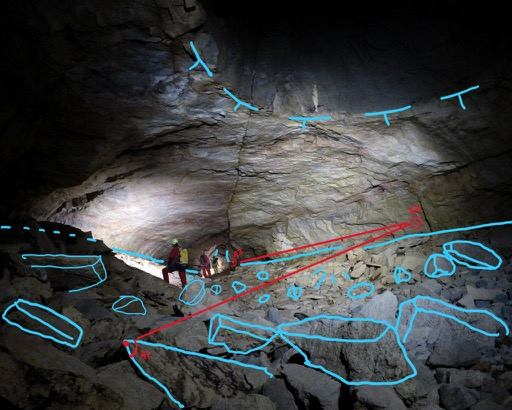
*The chamber as the surveyor sees it, with plan symbology (blue) and the survey
line A1 → A2 → A3 (red) drawn over the photo.*

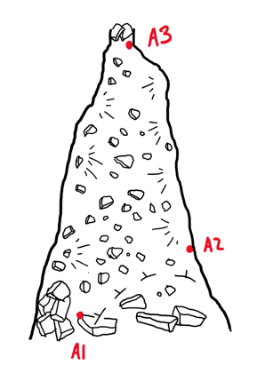
*The resulting plan sketch. This is the view you'd get looking down through the
ceiling.*

Use **Plan** for any sketch drawn looking down. On a plan scrap, the orientation
control asks for the direction of **north** on the page.

### Projected profile

A projected profile is a vertical orthographic projection: the passage is drawn
against **one flat vertical plane**, aligned on a single azimuth (compass
bearing) chosen to best represent the passage.

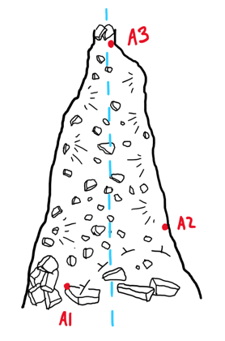
*The single vertical plane (dashed blue), seen from above on the plan. Everything
is flattened onto this one plane.*

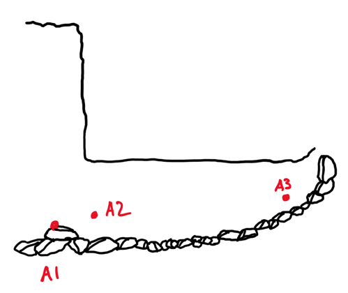
*The resulting projected profile. Because A2 sits off the plane, the A1 → A2 shot
is **squashed** — it appears shorter than it really is.*

That squashing is the trade-off: any passage running toward or away from the
plane is foreshortened. It matters little in a **vertical shaft or deep pit**,
where the cave goes mostly straight down and one plane represents it honestly —
which is what projected profiles are generally used for.

### Running profile

A running profile is the same idea, except the **azimuth changes for every survey
shot**. The plane follows the survey line instead of standing still.

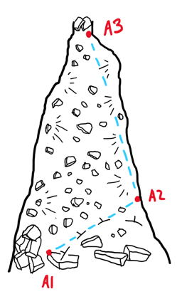
*Two planes (dashed blue), one per shot, bending at A2 to follow the passage.*

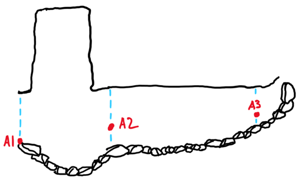
*The resulting running profile. Each shot keeps its **true length** — A1 → A2 is
not shortened — so the passage is effectively unrolled onto the page.*

Because the projection turns with the passage, a running profile **wraps around
corners** and preserves shot lengths. That makes it the usual choice for
**horizontal passage** drawn in profile: a meandering canyon stays the right
length instead of being compressed.

### Cross-sections (partially supported)

A cross-section is a vertical slice drawn **perpendicular to the passage**,
usually at a station or between two shots. It shows the passage's shape where you
cut it.

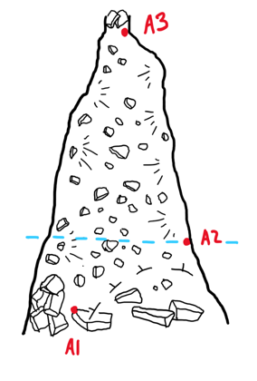
*The cross-section plane (dashed blue), cutting across the passage at A2.*

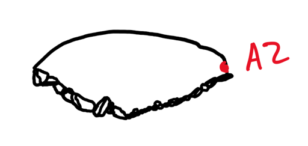
*The resulting cross-section — one small outline holding a single station.*

CaveWhere has **no cross-section type**: you digitize a cross-section as a
**Projected Profile**. It carpets, but only with help from you. As the sketch
above shows, a cross-section normally contains just **one station**, and
**Auto Calculate** derives orientation and scale *from* the stations, so it needs
two or more (see [Place the stations](digitize-a-scrap.md#place-the-stations)).
Expect to turn Auto Calculate off and enter a cross-section's azimuth, scale, and
up direction by hand.

## Set the type in the Scrap Info panel

Select a scrap in [Carpet mode](digitize-a-scrap.md) and the **Scrap Info** panel
appears. Its **Type** dropdown offers the three types.

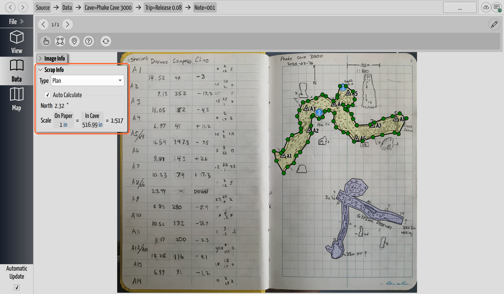
*The Scrap Info panel (highlighted). The Type dropdown — here set to Plan —
chooses how CaveWhere projects the scrap; the direction and scale controls below
refine the morph.*

Because the type is set per scrap, a single note holding a plan and a profile
side by side is digitized as **two scraps**, each with its own type — one more
reason to break a drawing into pieces, as
[Troubleshoot the carpet](troubleshoot-carpeting.md) describes.

## Auto Calculate, and what it hides

The three controls below the type — **north/up**, **scale**, and (on a projected
profile) **azimuth** — all live inside the **Auto Calculate** box. With it
**checked**, CaveWhere derives those values from the scrap's stations and the
controls go read-only: their tool buttons disappear entirely and the numbers turn
into a display of what CaveWhere worked out.

So if you mean to type a value in and the field won't take it, **uncheck Auto
Calculate first** — that's what makes the controls live. You'll need to do this
whenever CaveWhere can't derive the values for you, which is any scrap with fewer
than two stations (see [Place the
stations](digitize-a-scrap.md#place-the-stations)) — a cross-section, most often.
The screenshots below all show the box unchecked, so the manual tools are visible.

## North or up: orient the drawing

Just below the type, CaveWhere asks for the drawing's orientation as an angle in
degrees, and both the label and the button's icon change with the type:

- On a **Plan** scrap you set the direction of **north** on the page.
- On a **Running Profile** or **Projected Profile** scrap you set the direction
  of **up** (opposite gravity) on the page.

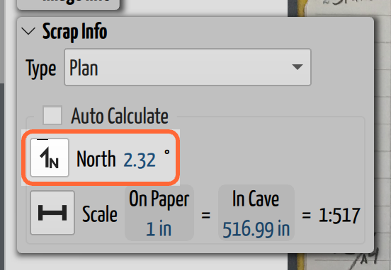
*The orientation row on a **Plan** scrap, so it reads **North**. On either profile
type the same row reads **Up** and the button's icon becomes an up arrow.*

Type the angle directly, or click the arrow button and **click two points on the
note** to point the direction out on the drawing itself — on a plan, along the
north arrow you drew in the field.

Set this to match how you drew the sketch. Getting it wrong rotates the whole
carpet, so it's one of the first things to check when a scrap warps oddly.

## Set the scale

A sketch has no inherent size — it's just marks on a page — so CaveWhere has to be
told how far a distance on the paper reaches in the cave. That's the **scale**,
and it's what makes the drawing come out the right size against the measured
survey. Get it wrong and the whole carpet is uniformly too big or too small,
which shows up as passages that look too thin or too fat.

CaveWhere states the scale as an equation — **On Paper** *length* **= In Cave**
*length* — and shows the ratio it works out to on the right.

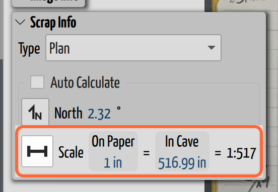
*The scale row. One inch on this note covers 516.99 inches of cave, which
CaveWhere reduces to **1:517** at the right.*

You can type both lengths (each takes its own unit), or click the measuring
button and use the **scale tool**: **draw a line on the note** between two points
whose real distance you know, then enter that **in-cave length**. CaveWhere works
the scale out from the line's length on the page and the note's **DPI** — which is
why a note imported at the wrong resolution produces an **"Invalid scale (check
DPI)"** error here rather than a wrong-looking carpet.

Two warnings worth recognizing:

- **"A scale of 1:1 or smaller is bad!"** — a scrap at 1:1 claims the paper is
  life-size. It usually means CaveWhere had nothing to derive the scale from, so
  add another station to give it a shot to measure against, or enter the scale
  yourself.
- **"Weird scaling units"** — one side of the equation carries a unit and the
  other doesn't. Give both sides real units.

## Projected profile: set the azimuth

A projected profile also needs an **azimuth** — the compass bearing of the plane
it's drawn on. This row appears **only** when the type is Projected Profile;
plans and running profiles derive their direction elsewhere, so it stays hidden.

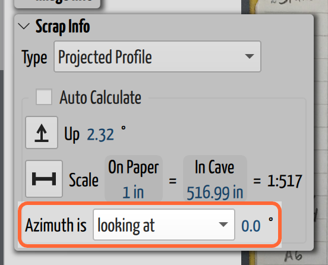
*The azimuth row, visible because this scrap is a **Projected Profile**. Note the
orientation row above it now reads **Up** rather than North.*

With **Auto Calculate** on, CaveWhere searches every orientation from 0° to 360°
for the bearing that best fits the stations (this works when the sketch is drawn
to scale). If auto-calculation can't settle on a bearing, set the **Azimuth is**
direction by hand — the dropdown says how to read the number you type:

- **looking at** (the default) — the bearing is straight through the page, normal
  to the scrap plane, as if you were looking at the drawing.
- **left → right** — the bearing runs from the left edge of the page to the
  right edge.
- **left ← right** — the same, reversed, from the right edge to the left.

## Where to go next

- Carpet still distorted after setting the type? See
  [Troubleshoot the carpet](troubleshoot-carpeting.md).
- Need finer or coarser morphing? See
  [Tune the warping settings](warping-settings.md).
