# Choose the Scrap Type

## Why / when you need this

Cave surveyors draw the same passage in more than one **view**. Each view
projects one 3D cave onto a flat page a different way. A **plan** looks straight
down, **profiles** show the cave's vertical extent from the side, and
**cross-sections** slice across the passage. A single trip's notes usually hold
several.

A flat drawing never says which projection it is. A page of lines looks the same
either way, so CaveWhere asks you. The **scrap type** tells it which view a scrap
was drawn in, and therefore how to unfold that flat sketch back into 3D. Set it
wrong and the carpet warps, because CaveWhere is undoing a projection you never
made.

The **Type** dropdown offers 3 entries and no more: **Plan**, **Running
Profile**, and **Projected Profile**. Cross-sections are drawn as projected
profiles, with the limits described
[below](#cross-sections-partially-supported).

## The views, drawn from one passage

The drawings below all come from the **same piece of cave**, the
breakdown-floored chamber in the photo, surveyed by 3 stations, **A1 → A2 → A3**.
(Illustrations from [Cave Mapping Sketch
Projections](https://cavewhere.com/2020/12/15/cave-mapping-sketch-projections/).)

### Plan

A plan is an orthographic projection **looking down**, the cave's floor plan. See
below for the chamber itself and the sketch that came out of it.

*The chamber as the surveyor sees it, with plan symbology (blue) and the survey
line A1 → A2 → A3 (red) drawn over the photo.*

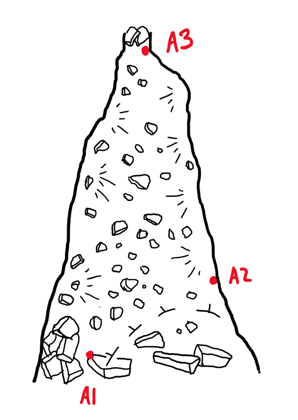
*The resulting plan sketch: the view you get looking down through the ceiling.*

Use **Plan** for any sketch drawn looking down. A plan needs no reprojection at
all: its view matrix is the identity, so the projection stage rotates nothing.
Your north angle still turns the page. On a plan scrap the orientation control
asks for the direction of **north** on the page.

### Projected profile

A projected profile is a vertical orthographic projection. The passage is drawn
against **one flat vertical plane**, aligned on a single azimuth (compass
bearing) chosen to best represent the passage. CaveWhere builds that plane by
pitching the view 90° onto its side and then yawing it to the azimuth you set.
See below for where that plane cuts.

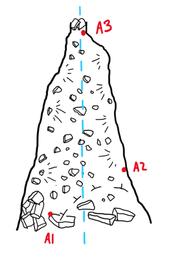
*The single vertical plane (dashed blue), seen from above on the plan. Everything
flattens onto this one plane.*

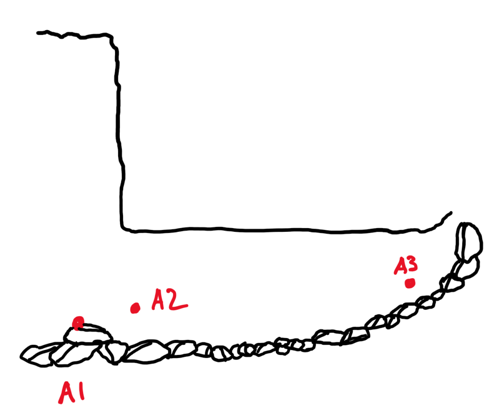
*The resulting projected profile. Because A2 sits off the plane, the A1 → A2 shot
is **squashed**: it appears shorter than it really is.*

That squashing is the trade-off, and the projected profile's main limitation. It
matters little in a **vertical shaft or deep pit**, where the cave drops mostly
straight down and one plane represents it honestly. CaveWhere's own help calls
the projected profile "generally the best for **deep pits**" for that reason.

### Running profile

A running profile is the same idea, except the **plane turns as the survey line
turns**, instead of standing still, as shown below.

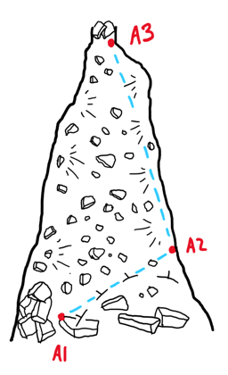
*Two planes (dashed blue), one per shot, bending at A2 to follow the passage.*

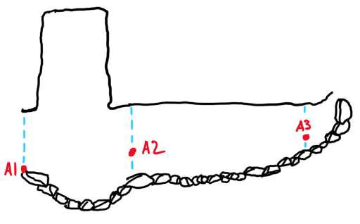
*The resulting running profile. Each shot keeps its **true length**, so A1 → A2
comes out full length and the passage unrolls onto the page.*

Compare that against the projected profile above. Because the projection turns
with the passage, a running profile **wraps around corners** and preserves shot
lengths, so a meandering canyon stays the right length instead of getting
compressed.

The mechanism costs you something, and the price is not obvious. A running
profile sorts its stations left to right along the page, then warps each part of
the drawing between the 2 stations that part falls between. Nothing else gets a
vote. Three consequences:

- **Give it fewer than 2 stations and the carpet disappears** rather than landing
  wrong. See [Nothing appears at
  all](troubleshoot-carpeting.md#nothing-appears-at-all).
- **3 of the 4 [warping settings](warping-settings.md) do nothing to it.** The
  station pair comes straight from your drawn stations. So the control points
  shot interpolation adds never get consulted, max closest stations has nothing
  to trim, and the Gaussian pass hands a running profile back untouched. Grid
  resolution is the only one of the 4 that still bites.
- **Branches and stacked stations confuse the sort**, which goes purely by
  position across the page. Results vary with how the drawing lays out.
  [Troubleshoot the
  carpet](troubleshoot-carpeting.md#choose-the-right-scrap-type) covers the
  creasing and seesawing that follows.

**I recommend Running Profile for passage that mostly runs horizontally, and
Projected Profile for anything that mostly drops.** CaveWhere gives the same
advice itself. Click the **Type** label and its help text calls a running profile
"generally the best for **horizontal passage**" and a projected profile
"generally the best for **deep pits**".

### Cross-sections (partially supported)

A cross-section is a vertical slice drawn **perpendicular to the passage**,
usually at a station or between 2 stations. It shows the passage's shape where
you cut it, as shown below.

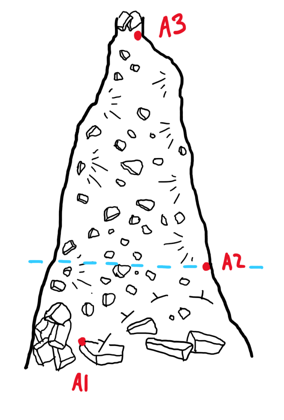
*The cross-section plane (dashed blue), cutting across the passage at A2.*

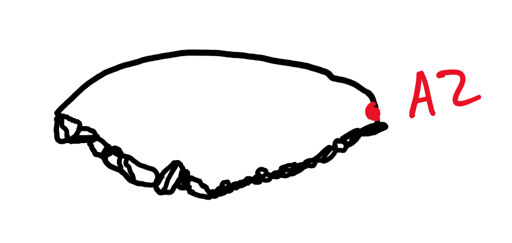
*The resulting cross-section, one small outline holding a single station.*

CaveWhere has **no cross-section type**. You digitize a cross-section as a
**Projected Profile**, and it carpets, but only with help from you. As shown
above, a cross-section normally holds just **1 station**. **Auto Calculate** works
by averaging the shots it finds among your drawn stations, so it needs 2 stations
*and a shot between them*. A pair counts as a shot only when the survey network
lists each station as the other's neighbor (see [Place the
stations](digitize-a-scrap.md#place-the-stations)). One station makes no shots at
all. Expect to turn Auto Calculate off and enter a cross-section's azimuth,
scale, and up direction by hand.

## Set the type in the Scrap Info panel

Select a scrap in [Carpet mode](digitize-a-scrap.md) and the **Scrap Info** panel
appears, as shown below.

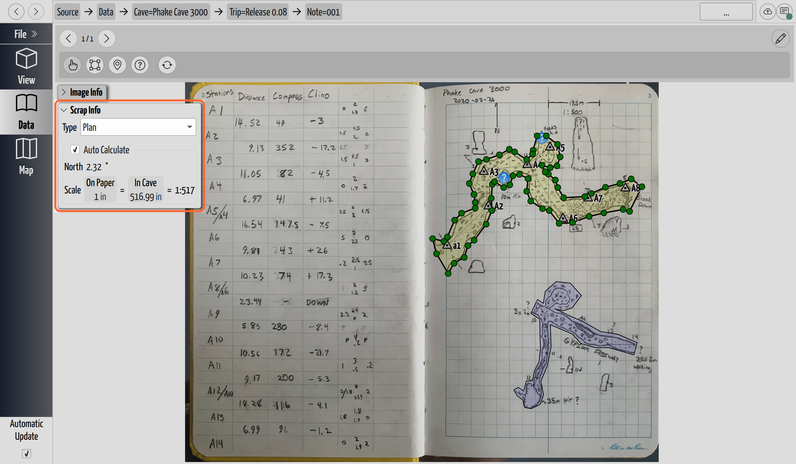
*The Scrap Info panel (highlighted). The Type dropdown, here set to Plan, chooses
how CaveWhere projects the scrap; the direction and scale controls below refine
the morph.*

Four of the labels in this panel double as buttons. **Type**, **North** or
**Up**, **Scale** and **Azimuth is** each underline and turn accent-colored on
hover, and clicking one toggles CaveWhere's own help text open underneath. That
is 3 explanations on a plan and 4 on a projected profile, hidden behind labels
that carry no help icon.

The type belongs to the scrap, so a note holding a plan and a profile side by
side becomes **2 scraps**, as [Troubleshoot the
carpet](troubleshoot-carpeting.md) describes. The type also lands on the scrap as
a keyword: `Type` takes the dropdown string, and `Orientation` reads Plan or
Profile. So you can show and hide whole projections at once from the [3D
view's](../view-3d/the-3d-view.md) keyword layers.

A 4th type lives inside CaveWhere, LiDAR, which the dropdown never offers.
CaveWhere assigns that one to [LiDAR notes](../notes/lidar-notes.md) itself.

## Auto Calculate, and what it hides

The controls below the type (**north/up**, **scale**, and azimuth on a projected
profile) all sit inside the **Auto Calculate** box, whose checkbox rides on the
box's top border. Check it and CaveWhere derives those values from the scrap's
stations. The controls then go read-only. Their tool buttons vanish outright
instead of graying out, the direction dropdown disables, and the numbers become a
display of what CaveWhere worked out.

So if you mean to type a value in and the field will not take it, **uncheck Auto
Calculate first**. Checking it back on recomputes immediately.

Uncheck it whenever CaveWhere has nothing to derive from: fewer than 2 stations,
or 2 stations with no shot between them. A cross-section is the usual case.

When the averaging comes up empty, CaveWhere hands back a scale of 1 to 0. That
surfaces in the panel as the 1:1 warning described under [Set the
scale](#set-the-scale). Nothing is logged and nothing else says why. If the
console *does* carry `No valid transfroms`, the shots exist but every one came
back with a scale of 0, which means the cave cannot place one of the stations you
drew.

## North or up: orient the drawing

Just below the type, CaveWhere asks for your drawing's orientation as an angle in
degrees, shown to 2 decimal places. Both the label and the button's icon change
with the type, as shown below:

- On a **Plan** scrap you set the direction of **north** on the page.
- On a **Running Profile** or **Projected Profile** scrap you set the direction
  of **up** (opposite gravity) on the page.

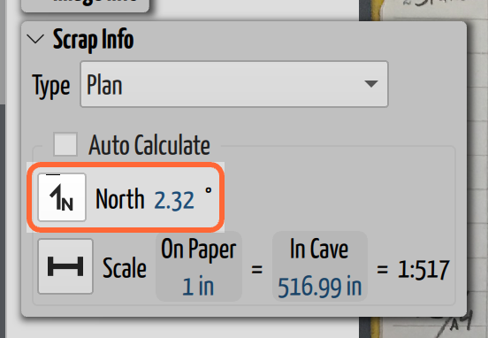
*The orientation row on a **Plan** scrap, so it reads **North**. On either profile
type the same row reads **Up** and the button's icon becomes an up arrow.*

Type the angle directly, or click the arrow button and **click 2 points on the
note** to point the direction out on the drawing itself. On a plan, that is along
the north arrow you drew in the field. The tool prompts *Click the north arrow's
first point*, then *Click the north arrow's second point*, and it substitutes
"up" for "north" on a profile scrap. A live readout follows the pointer between
the 2 clicks, shown to the whole degree, so it reads 2° where the field ends up
reading 2.32. Escape backs out.

Set this to match how you drew the sketch; getting it wrong turns the carpet by
exactly that angle. The angle Auto Calculate derives averages every shot on the
scrap, so treat it as approximate.

**Changing a scrap's type does not reinterpret the angle.** One stored number
serves both meanings. Switch a plan to a projected profile with Auto Calculate
off and 2.32° stays exactly where it was, now meaning *up* instead of *north*.
Compare the north row above with the azimuth screenshot further down: same
scrap, same 2.32, different meaning. With Auto Calculate on the type change
recomputes the angle, so the problem never appears.

## Set the scale

Your sketch has no inherent size, so you have to tell CaveWhere how far a
distance on the paper reaches in the cave. That is the **scale**, and getting it
wrong makes the whole carpet uniformly too big or too small.

CaveWhere states the scale as an equation, **On Paper** *length* **= In Cave**
*length*, and prints the ratio it works out to on the right, to 1 decimal place
with trailing zeros dropped. In the demo project that equation reads 1 in =
516.99 in, or **1:517**. See below.

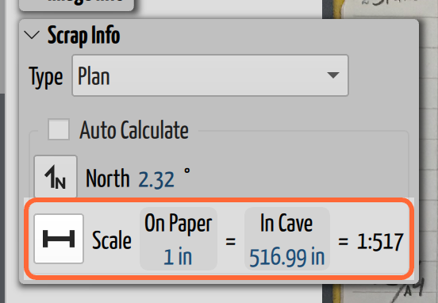
*The scale row. One inch on this note covers 516.99 inches of cave, which
CaveWhere reduces to **1:517** at the right.*

The same demo note carries a hand-written **1:500** near the top of the page, as
shown in the panel screenshot above. CaveWhere ignores what you wrote there. The
1:517 comes from the stations and nothing else.

A new scrap does not start blank. A metric project seeds 1 cm = 2.5 m, the round
1:250 sketching scale; an imperial project seeds 1 in = 20 ft, or 1:240.

Type both lengths, each with its own unit, or click the measuring button and use
the **scale tool**. It prompts *Click the length's first point*, then *Click the
length's second point*. Draw the line between 2 points whose real distance you
know, enter that **In cave length** (the box defaults to meters), and press
**Done**. Escape backs out. CaveWhere derives the scale from the line's length in
the note's own pixels and the note's **DPI**. So a note carrying no usable
resolution shows an error here. A resolution that is merely *wrong* shows
nothing: the ratio still comes out finite and positive, and the carpet is off by
the same factor the resolution is.

Three messages worth recognizing:

- **"Invalid scale (check DPI)"** replaces the ratio, in bold red italics,
  whenever the ratio stops being a finite positive number. Note what the message
  does not say: the check reads the ratio, not the DPI. A resolution of 0 is
  simply the usual way to break the ratio, and [Set the Image
  Resolution](../notes/note-resolution.md) fixes that one. The scale tool gives
  up in several ways of its own (no rendered image, 2 clicks on the same pixel,
  an in-cave length of 0), and every one arrives here as this same message.
- **"A scale of 1:1 or smaller is bad! You might need to add more station to
  create a shot or enter scale manually."** This one appears at the bottom of the
  Auto Calculate box whenever the paper length reaches or passes the cave length,
  which claims your paper is life-size. Auto Calculate with no shot to measure is
  the common
  cause: the derived in-cave length lands on 0. Add another station to make a
  shot, or enter the scale yourself.
- **"Weird scaling units"** appears when exactly 1 side of the equation carries a
  unit and the other stays unitless. Give both sides real units. If the ratio is
  broken too, "Invalid scale (check DPI)" takes the slot and this one never
  shows.

## Projected profile: set the azimuth

A projected profile also needs an **azimuth**, the compass bearing of the plane
you drew it on. This row appears **only** when the type reads Projected Profile,
as shown below. Plans and running profiles derive their direction elsewhere, so
it stays hidden on those.

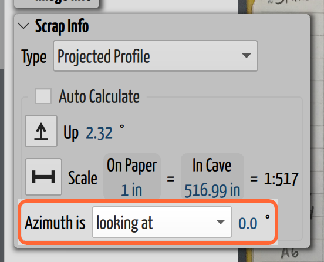
*The azimuth row, visible because this scrap is a **Projected Profile**. The
orientation row above it has switched from North to **Up**.*

The **Azimuth is** dropdown says how to read the number you type, and CaveWhere
adds a fixed offset to it before building the plane:

- **looking at** (the default) adds 0°. The bearing points straight through the
  page, normal to the scrap plane, as if you were looking at the drawing.
- **left → right** subtracts 90°. The bearing runs from the left edge of the page
  to the right edge.
- **left ← right** adds 90°, the same reading reversed, right edge to left.

The field shows 1 decimal place, and a fresh projected profile starts at **0.0°**
on **looking at**, as shown above.

With **Auto Calculate** on, CaveWhere hunts for the bearing whose shots disagree
least. It scores each candidate by the standard deviation of the angle error
across the shots on the scrap, then minimizes that in 4 passes: 0° to 360° at
10°, then 2°, then 0.4°, then 0.1°. **Only the first pass covers the whole
circle.** Each later pass searches the window one *coarse* step either side of
the best answer so far, resampled at the finer increment, so a bearing the 10°
sweep stepped over never comes back.

That scoring assumes your page scale holds across the sheet. The objective mixes
each shot's rotation and scale error together, so a sketch drawn out of scale
raises the score at every bearing and the winner stops meaning much.

Two things it cannot do, and the second one slips past easily:

- **It fails silently.** No "could not determine azimuth" branch exists anywhere
  in the search. It returns a number whatever you hand it, so a bad answer may
  look exactly like a good one in the panel.
- **It needs 2 shots before it can prefer anything.** With a single shot the
  standard deviation sits at 0 for every bearing, because one measurement never
  deviates from its own average. Nothing beats the first candidate, and the
  answer comes back as 0.0°. A cross-section, with 1 station and no shots at all,
  lands in the same place.

So an auto-calculated azimuth sitting at exactly 0.0° deserves a second look.
That is what the search returns when it had nothing to work with, so check it
against the drawing rather than trusting it.

## Where to go next

- Carpet still distorted after setting the type? See
  [Troubleshoot the carpet](troubleshoot-carpeting.md).
- Need finer or coarser morphing? See
  [Tune the warping settings](warping-settings.md).
