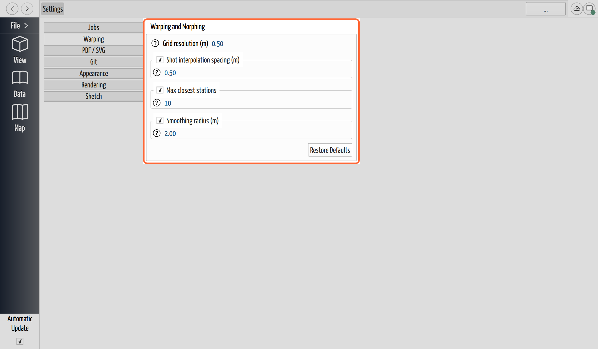
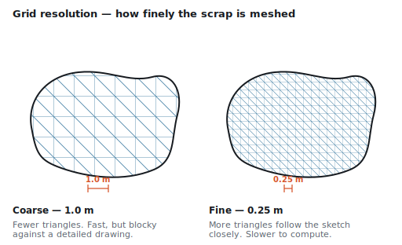
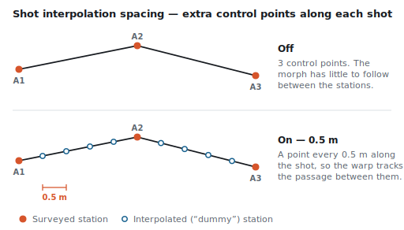
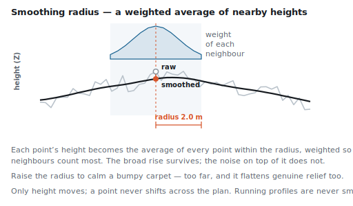

# Tune the Warping Settings

## Why / when you need this

Carpeting has knobs that trade **detail against performance and smoothness**. The
defaults suit most caves, so reach for these only when a carpet is visibly too
coarse, too noisy, or slow to recompute on a large project. All four settings
control the mesh and the morph described in
[Scraps and Carpeting](carpeting.md#what-carpeting-actually-does).

> **These settings are global.** They live in your CaveWhere preferences, not in
> the project file, and apply to every project you open on this computer. A
> change here re-morphs all scraps.

*The Warping and Morphing settings. Each control trades detail or stability
against performance.*

## Grid resolution (m)

Sets the spacing of the triangulation grid laid over each scrap. CaveWhere covers
the scrap with a grid at this spacing and morphs the resulting triangles, so the
setting decides how finely the carpet can follow your drawing.

*Grid resolution is the spacing between grid points. Halving it roughly quadruples
the triangles — detail and cost rise together.*

**Smaller values increase detail but add more triangles** (and cost performance).
Lower it when a carpet looks blocky against a highly detailed drawing; raise it to
speed up a heavy project. Default **0.5 m**.

## Shot interpolation spacing (m)

Controls how densely CaveWhere inserts extra "dummy" stations along survey shots
to guide the morph. Your surveyed stations may sit far apart, and between them the
morph has nothing to hold onto; interpolation fills that gap by stepping along
each shot at this spacing and adding a control point at every step — placed on the
drawing and in the cave alike.

*Interpolation adds control points along each shot at the chosen spacing. A shot
shorter than the spacing gets none — it already has a station at each end.*

**Smaller spacing gives smoother warps but costs performance,** because the morph
has more control points to follow. Default **0.5 m**, on by default. Turn the
checkbox off to disable interpolation entirely.

## Max closest stations

The number of nearby stations considered when warping each point. CaveWhere sorts
the control points by their distance on the page and keeps only this many nearest
ones to bend that part of the drawing.

**It counts the interpolated stations too**, not just the ones you surveyed — it
runs over the same list that [shot interpolation](#shot-interpolation-spacing-m)
just filled in. That matters more than it sounds, because interpolation normally
supplies the great majority of the candidates: with the defaults, the ten nearest
are typically nine dummy points and a surveyed station that happens to be in
range, and they can easily be *all* dummies.

*The candidates are mostly interpolated points strung along the shots, so the
nearest few are a short run of line either side of the point — not a scattering of
surveyed stations from across the cave.*

So the two settings multiply into a **reach**: at the default 0.5 m spacing, ten
points span roughly **5 m of surveyed line**, a couple of metres either side of
the point. That is the neighbourhood each part of your drawing is fitted to.
Halve the spacing to 0.25 m and the same ten points reach only about 2.5 m —
tighter and more local — so if you change one of these settings, expect the other
to change character with it.

**More stations can stabilize the warp but may flatten sharp features;** fewer
keep detail but can let a carpet wobble. This is the knob to reach for when a plan
scrap shows the "localized vertical bumps" described in
[Troubleshoot the carpet](troubleshoot-carpeting.md#choose-the-right-scrap-type).
Default **10**, on by default; turn the checkbox off and every station is used, at
whatever cost.

## Smoothing radius (m)

Applies Gaussian smoothing to the carpet's height (Z) values over this radius to
**reduce surface noise**. Every point within the radius contributes to a point's
new height, weighted so the nearest count most; anything beyond the radius is
ignored outright.

*Smoothing averages heights within the radius. Broad, real relief survives; noise
riding on top of it does not.*

Raise it to calm a bumpy carpet; lower it to preserve genuine relief. Only the
height moves — a point never shifts across the plan — and **running profiles are
never smoothed**, so this setting has no effect on them. Default **2.0 m**, on by
default.

## Restore the defaults

**Restore Defaults** resets all four settings to the values above. Use it to get
back to a known-good baseline after experimenting.

## Where to go next

- Understand what the grid and morph do: [Scraps and
  Carpeting](carpeting.md#what-carpeting-actually-does).
- Still fighting a distorted carpet? See [Troubleshoot the
  carpet](troubleshoot-carpeting.md).
